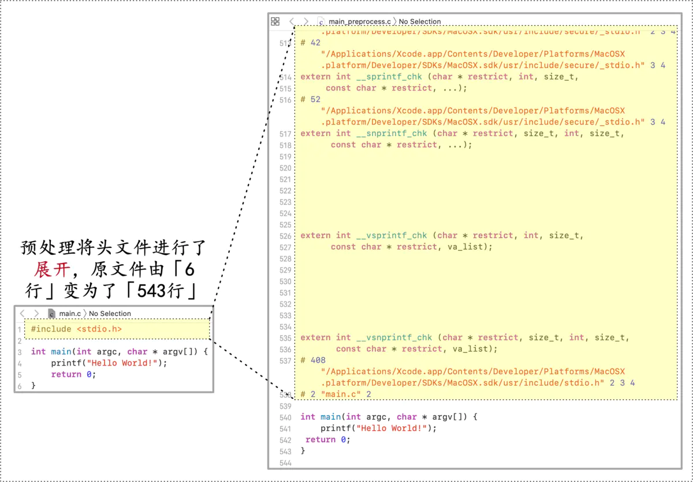
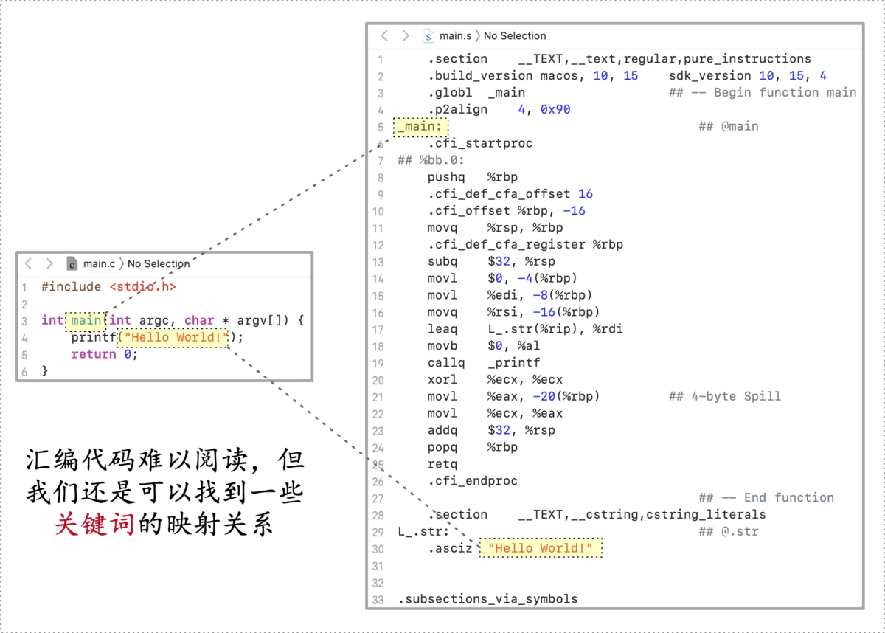
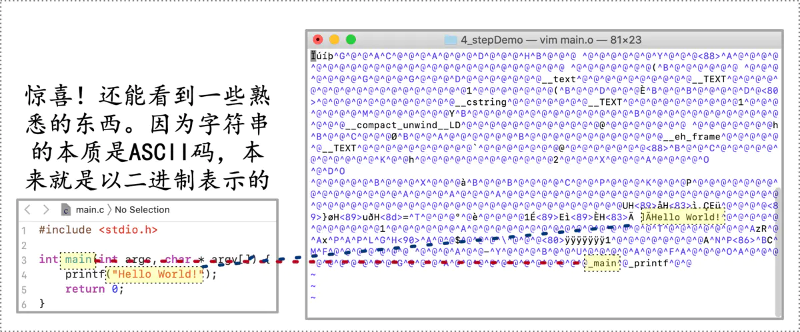
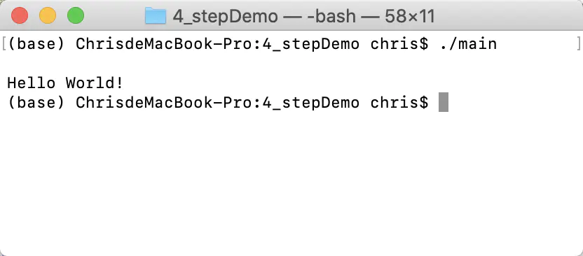
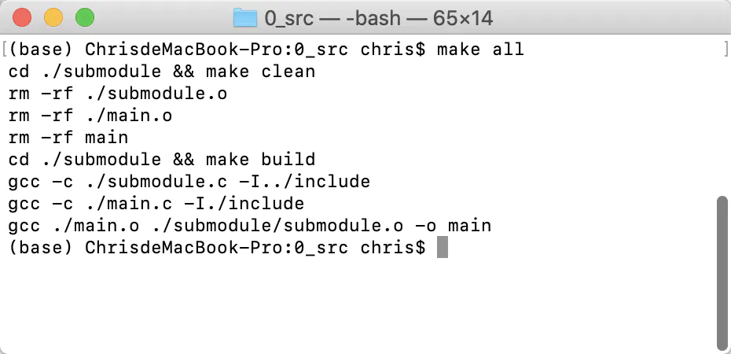
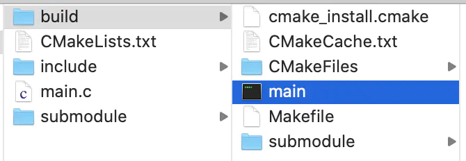

认识 **make** & **cmake**，我们先看看可执行文件是如何生成的

# 一、从 main.c 到 可执行文件 输出 Hello World

我们编辑一份最简单的 **main.c** 文件（***认真上过1节C语言课的同学该都可以看懂\***），并期望经过编译将其变为可执行文件，然后运行输出Hello World。


```cpp
#include <stdio.h>

int main(int argc, char * argv[]) {
    printf("\nHello World!\n");
    return 0;
}
```

## Step1：预处理 Preprocess

预处理即将源文件中的宏、头文件进行 **”展开“**。


```css
参考命令：
gcc -E main.c -o main_preprocess.c
```



预处理展开

## Step2：汇编 Assembly

汇编可以将预处理后的代码转换为汇编语言，看看下面的汇编语言是不是特别**「优美」**捏！


```css
参考命令：
gcc -S main_preprocess.c
```



汇编

## Step3：生成机器语言

机器语言（二进制命令语言）即计算机可以识别的语言，汇编代码可以进一步转化为机器语言


```css
参考命令：
gcc -c main.s
```




汇编

## Step4：链接

将多个二进制文件（.o文件，虽然当前只有一个main.o）链接成一个文件，根据需求，可能是一个lib，也可能是一个可执行文件。


```css
参考命令：
gcc  main.o -o main
```


链接

## Step5：执行

向世界问好吧！：）



你好世界

# 二、用gcc、make、cmake编译同一套代码

## 2.1：使用gcc编译

[GCC](https://links.jianshu.com/go?to=https%3A%2F%2Fbaike.baidu.com%2Fitem%2Fgcc%2F17570%3Ffr%3Daladdin) 是一个linux下的常用的编译工具。我们拟写了如下的源文件，并尝试用 **GCC** 对齐进行编译：


```cpp
- ./main.c -

#include "submodule.h"

int main(int argc, char * argv[]) {
    subTest(10);
    return 0;
}
```


```cpp
- ./include/submodule.h -

#include <stdio.h>

int subTest(int a);
```


```cpp
- ./submodule/submodule.c - 

#include "submodule.h"

int subTest(int a) {
    printf("\n<%s:%d> Function Called... %d \n\n", __func__, __LINE__, a);
    return 1;
}
```

gcc的命令很简单，只要如下 **4条命令** 就能完成可执行文件 **main** 的编译和调用：


```php
# 1 生成subModel的二进制文件（.o)
gcc ./submodule/submodule.c -c -I ./include -o ./submodule.o

# 2 生成main的二进制文件（.o）
gcc ./main.c -c -I ./include -o ./main.o

# 3 链接二进制文件
gcc ./submodule.o ./mian.o -o ./main

# 4 执行可执行文件
./main
```

## 2.2 构造MakeFile文件，使用make编译

我们为什么要用**MakeFile**？如果是为了封装命令，方便调用，我们完全可以将相关的编译命令放置到一个shell脚本中，**MakeFile** 有什么其他优势呢？

> 1）它封装一套简单的指定编译目标的语法，这比写shell的参数解析简单得多
>  2）藉由这套语法，make封装了编译依赖、增量编译等逻辑。即大型工程进行小范围局部改动时候，重新的编译的速度会非常快。（未涉及改动的内容不会重编）

那么，同样的 **main** 和 **submodule**，使用 **MakeFile** 我们可以编辑两个 **MakeFile** 文件


```ruby
- ./MakeFile -

INCLUDE_PATH := ./include
SRCS += $(wildcard ./*.c)
OBJS += $(SRCS:.c=.o)

SUB_DIR = ./submodule
SUB_SRCS = $(wildcard ${SUB_DIR}/*.c)
SUB_OBJS += $(SUB_SRCS:.c=.o)

TARGET := main

all: clean build linkobjs
    
linkobjs:
    gcc ${OBJS} ${SUB_OBJS} -o ${TARGET}
    
build:
    cd ${SUB_DIR} && make build
    gcc -c ${SRCS} -I${INCLUDE_PATH}
    
clean:
    cd ${SUB_DIR} && make clean
    rm -rf ${OBJS}
    rm -rf ${TARGET} 
```


```ruby
- ./submodule/MakeFile - 

INCLUDE_PATH := ../include
SRCS += $(wildcard ./*.c)
OBJS += $(wildcard ./*.o)

all: clean build

build:
    gcc -c ${SRCS} -I${INCLUDE_PATH}

clean:
    rm -rf ${OBJS}
```

然后，在 **main.c** 所在的目录执行 **make all** 就好啦



编写好MakeFile，执行make all

关于**MakeFile**，有几个 **tips** 可能对大家上手有帮助：
 1）其完成支持语法和**Shell**脚本是有些相似的
 2）各个编译目标下可以执行 **linux** 命令
 3）编译目标要执行的命令，前面要加4个空格（这个和 **python** 的函数语法有些相似）
 4）示例中的**「all : clean build」**表示**「make all」**等同于顺序执行**「make clean」「make build」**

## 2.3 构造CMakeLists.txt，使用 cmake 命令生成MakeFile，再make

**cmake** 定义了另一套语法来组织 **CMakeLists.txt** 文件，然后通过 **cmake** 命令可以结合 **CMakeLists.txt** 文件的”配置“生成 **MakeFile**，然后再……**make**……

***最终同样是使用MakeFile，干嘛加一步再让大家学习cmake的语法呢？\***

原来，不同平台**（linux、Windows、Macos……）**的编译环境是有差异的，为了应对这种差异，各平台编译所需的 **MakeFile** 文件也各不相同。而 **cmake** 抽象了一套上层的编译配置语法，并负责了将Ta针对平台进行 **MakeFile** 文件翻译的任务。

还是同样的 **main** 和 **submodule**，使用 **cmake** 我们将构造两个 **CMakeLists.txt** 文件：


```php
- ./CMakeLists.txt -

# cmake最低版本约定
cmake_minimum_required(VERSION 2.8)

# 工程名称
project(main)

# 宏开关
option(DT "Demo Test Switch" OFF)
if(DT)
add_definitions("-DDEMO_TEST=1")
endif()

# include目录
include_directories(./include)

# 子模块文件目录
add_subdirectory(./submodule)

# 查找当前文件夹源文件
aux_source_directory(. SRCS)

# 生成可执行文件
add_executable(main ${SRCS})

# 可执行文件链接静态库
target_link_libraries(main submodule)
```


```ruby
- ./submodule/CMakeLists.txt - 

# cmake最低版本约定
cmake_minimum_required(VERSION 2.8)

# include目录
include_directories(../include)

# 查找当前文件夹源文件
aux_source_directory(. SRCS)

# 生成静态链接库
add_library(submodule ${SRCS})
```

然后，我们创建一个 **build** 文件夹，并进行 **cmake**


```bash
mkdir build
cd build
cmake ../
```

**build** 目录下回生成一系列文件，我们可以理解Ta们都是为了支持 **Makefile** 存在的就好。👇


cmake生成的MakeFile

那么，在 **build** 下执行 **make** 吧！


```go
make
```

成功编译出我们的目标。👇



目标出现了

有没有发现 **cmake** 的另一点**「优雅」**：Ta能将所有的编译信息有效地管理在一个文件夹下！当我们想清理编译数据时，只需要删除build文件夹就好了


# 参考文献 #
https://www.jianshu.com/p/5c9ffb3506c0