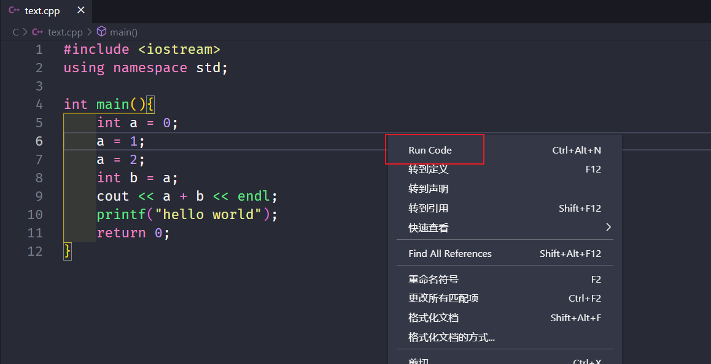

## 前期准备

### 安装VScode

[Visual Studio Code - Code Editing. Redefined](https://code.visualstudio.com/)

### 安装 MinGW64

[MinGW-w64 - for 32 and 64 bit Windows - Browse /mingw-w64/mingw-w64-release at SourceForge.net](https://sourceforge.net/projects/mingw-w64/files/mingw-w64/mingw-w64-release/)

这里本人推荐使用免安装版本，直接配置环境变量即可，下载好以后解压缩放到指定的盘符中

- 配置环境变量

例如本人的mingw64的解压包放在D盘下，所以直接在path变量添加安装包中的bin目录的路径即可


- 然后使用以下命令看是否配置成功

```cmd
复制代码
1
CMDgcc -v
```

- 成功之后显示如下


以上步骤可以参看[Visual Studio Code (vscode) 配置 C / C++ 环境 - 步平凡 - 博客园 (cnblogs.com)](https://www.cnblogs.com/bpf-1024/p/11597000.html)

### 安装C/C++插件


## 配置环境

### 创建一个简单的C++文件

```cpp
复制代码123456789101112CPP#include <iostream>
using namespace std;

int main(){
    int a = 0;
    a = 1;
    a = 2;
    int b = a;
    cout << a + b << endl;
    printf("hello world");
    return 0;
}
```

### 创建c_cpp_properties.json文件

- 按快捷键Ctrl+Shift+P调出命令面板，输入C/C++，选择“Edit Configurations(UI)”进入配置


- 然后就会生成c_cpp_properties.json文件

```json
复制代码1234567891011121314151617181920JSON{
    "configurations": [
        {
            "name": "Win32",
            "includePath": [
                "${workspaceFolder}/**"
            ],
            "defines": [
                "_DEBUG",
                "UNICODE",
                "_UNICODE"
            ],
            "compilerPath": "D:\\mingw64\\bin\\gcc.exe",
            "cStandard": "gnu17",
            "cppStandard": "gnu++14",
            "intelliSenseMode": "windows-gcc-x64"
        }
    ],
    "version": 4
}
```

### 创建tasks.json文件

- 创建此文件来告诉VS Code如何构建（编译）程序。该任务将调用g++编译器基于源代码创建可执行文件。
- 按快捷键Ctrl+Shift+P调出命令面板，输入tasks，选择Tasks:Configure Default Build Task
- 再选择 C/C++: g++.exe build active file
- 此时就会生成一个tasks.json文件


```json
复制代码12345678910111213141516171819202122232425262728JSON{
    "version": "2.0.0",
    "tasks": [
        {
            "type": "shell",
            "label": "compile",    // 任务名称，与launch.json的preLaunchTask相对应
            "command": "D:\\mingw64\\bin\\g++.exe",   // 编译器的路径
            // 编译c++文件使用g++.exe,c文件使用gcc.exe,此处编译c++文件
            "args": [
                "-g",
                "${file}",
                "-o",
                "${fileDirname}\\${fileBasenameNoExtension}.exe"
            ],
            "options": {
                "cwd": "D:\\mingw64\\bin"
            },
            "problemMatcher": [
                "$gcc"
            ],
            "group": "build"
        }
    ],
    "presentation": {
        
        "panel": "new", //这里shared表示共享，改成new之后每个进程创建新的端口
    }
}
```

### 创建launch.json

- 这个文件主要用来配置调试的相关信息
- 点击菜单栏的Debug --> Start Debugging
- 选择C++(GDB/LLDB)
- 此时就会产生launch.json的文件，上述图中有

```json
复制代码12345678910111213141516171819202122232425262728JSON{
    "version": "0.2.0",
    "configurations": [
        {
            "name": "g(gdb) Launch", // 配置名称，将会在启动配置的下拉菜单中显示
            "type": "cppdbg",
            "request": "launch",
            "program": "${fileDirname}\\${fileBasenameNoExtension}.exe",
            "args": [],
            "stopAtEntry": false,
            "cwd": "${workspaceFolder}",
            "environment": [],
            "externalConsole": false,      //修改此项，让其弹出终端
            "internalConsoleOptions": "neverOpen", // 如果不设为neverOpen，调试时会跳到“调试控制台”选项卡
            "MIMode": "gdb",
            "miDebuggerPath": "D:\\mingw64\\bin\\gdb.exe",
            "setupCommands": [
                {
                    "description": "Enable pretty-printing for gdb",
                    "text": "-enable-pretty-printing",
                    "ignoreFailures": true
                }
            ],
            "preLaunchTask": "compile" //修改此项
            // 调试会话开始前执行的任务，一般为编译程序。与tasks.json的label相对应
        }
    ]
}
```

- 这个时候就能够对C++文件进行调试了，但是调试C文件是可能会报错，这是因为在tasks.json文件中我配置的是c++的编译器，如果要编译C语言，在tasks.json文件中进行修改即可，修改的方法已在该文件中注释，请自行浏览
- 

## 使用CodeRunner插件

这里推荐使用一款非常好用的vscode插件，这个插件支持支持了 Node.js, Python, C++, Java, PHP, Perl, Ruby, Go等超过40种的语言，可以不Debug直接运行代码




# 参考文献 #

+ https://www.cnblogs.com/laomaocode/p/15097413.html

- [VSCode配置C/C++环境 - 知乎 (zhihu.com)](https://zhuanlan.zhihu.com/p/87864677)
- [Visual Studio Code 配置C/C++环境 - 别依梦雨轩 - 博客园 (cnblogs.com)](https://www.cnblogs.com/esllovesn/p/10012653.html)