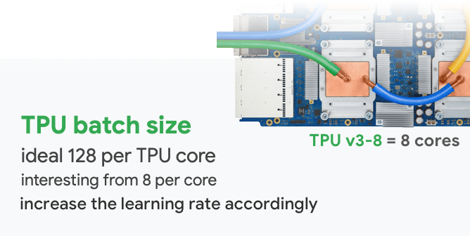

## keras 调用tpu

```
# detect and init the TPU
tpu = tf.distribute.cluster_resolver.TPUClusterResolver.connect()

# instantiate a distribution strategy
tpu_strategy = tf.distribute.experimental.TPUStrategy(tpu)

# instantiating the model in the strategy scope creates the model on the TPU
with tpu_strategy.scope():
    model = tf.keras.Sequential( … ) # define your model normally
    model.compile( … )

# train model normally
model.fit(training_dataset, epochs=EPOCHS, steps_per_epoch=…)
```

TPUs are network-connected accelerators and you must first locate them on the network. This is what `TPUClusterResolver.connect()` does. 

You then instantiate a `TPUStrategy`. This object contains the necessary distributed training code that will work on TPUs with their 8 compute cores (see [hardware section below](https://www.kaggle.com/docs/tpu#tpuhardware)).

Finally, you use the `TPUStrategy` by instantiating your model in the scope of the strategy. This creates the model on the TPU. Model size is constrained by the TPU RAM only, not by the amount of memory available on the VM running your Python code. Model creation and model training use the usual Keras APIs.


### Batch size, learning rate, steps_per_execution

To go fast on a TPU, increase the batch size. The rule of thumb is to use batches of 128 elements per core (ex: batch size of 128*8=1024 for a TPU with 8 cores). At this size, the 128x128 hardware matrix multipliers of the TPU (see [hardware section below](https://www.kaggle.com/docs/tpu#tpuhardware)) are most likely to be kept busy. You start seeing interesting speedups from a batch size of 8 per core though. In the sample above, the batch size is scaled with the core count through this line of code:

```
BATCH_SIZE = 16 * tpu_strategy.num_replicas_in_sync
```


With a TPUStrategy running on a single TPU v3-8, the core count is 8. This is the hardware available on Kaggle. It could be more on larger configurations called TPU pods available on Google Cloud.



With larger batch sizes, TPUs will be crunching through the training data faster. This is only useful if the larger training batches produce more “training work” and get your model to the desired accuracy faster. That is why the rule of thumb also calls for increasing the learning rate with the batch size. You can start with a proportional increase but additional tuning may be necessary to find the optimal learning rate schedule for a given model and accelerator.

Starting with Tensorflow 2.4, model.compile() accepts a new `steps_per_execution` parameter. This parameter instructs Keras to send multiple batches to the TPU at once. In addition to lowering communications overheads, this gives the XLA compiler the opportunity to optimize TPU hardware utilization across multiple batches. With this option, it is no longer necessary to push batch sizes to very high values to optimize TPU performance. As long as you use batch sizes of at least 8 per core (>=64 for a TPUv3-8) performance should be acceptable. Example:

```
    model.compile( … ,
                  steps_per_execution=32)
    
```

设置`steps_per_execution`可以不需要大的batch也能提高tpu性能。（正常要128， 现在32的倍数就可以了）


# 参考文献 #