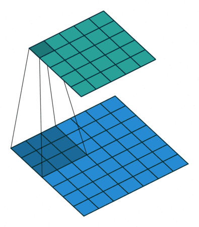

## **多卷积核**

### **2.1 卷积**

从本质上讲，卷积的计算过程其实同全连接一样，也是各个神经元之间的线性组合。只是卷积操作在进行线性组合时选择的是特定位置上的神经元。下面我们首先通过一张动图来直观感受一下卷积的过程。

图 1. 卷积计算图

如图1所示，**卷积操作其实就是每次取一个特定大小的矩阵（蓝色矩阵中的阴影部分），然后将其对输入（图中蓝色矩阵）依次扫描并进行内积的运算过程。**可以看到，阴影部分每移动一个位置就会计算得到一个卷积值（绿色矩阵中的阴影部分），当扫描完成后就得到了整个卷积后的结果（绿色矩阵）。

### **2.2 多卷积核**

注意，在上面笔者提到了卷积核的个数还可以是多个，那我们为什么需要多个卷积核进行卷积呢？在**上一篇文章**中我们介绍到：**对于一个卷积核，可以认为其具有识别某一类元素（特征）的能力**；而对于一些复杂的数据来说，仅仅只是通过一类特征来进行辨识往往是不够的。因此，通常来说我们都会通过多个不同的卷积核来对输入进行特征提取得到多个特征图，然再输入到后续的网络中。

## **3 卷积的计算**

到此为止， 对于卷积的原理和意义就算是交待完了，并且通过这些动态图片的展示，我们也有了更为直观的了解。但所谓数无形时少直觉，形少数时难入微。因此，下面我们就以单通道（灰度图）和三通道的输入来实际计算一下整个卷积的过程。

### **3.1 单通道单卷积核**

如图3所示，现在有一张形状为`[5,5,1]`的灰度图，我们需要用图3右边的卷积核对其进行卷积处理，同时再考虑到偏置的作用。那么其计算过程是怎么样的呢？

图 3. 输入与卷积

如图4所示，右边为卷积后的特征图（feature map），左边为卷积核对输入图片左上放进行卷积时的示意图。因此，对于这个部分的计算过程有：

![[公式]](https://www.zhihu.com/equation?tex=%5Cunderbrace%7B1%5Ccdot0%2B2%5Ccdot0%2B0%5Ccdot1-1%5Ccdot0%2B1%5Ccdot1%2B0%5Ccdot1%2B2%5Ccdot1-1%5Ccdot0-2%5Ccdot1%7D_%7Bkernel%7D%5Cunderbrace%7B%5C%3B%5C%3B%2B1%5C%3B%5C%3B%7D_%7Bbias%7D%3D2%5C%3B%5C%3B%5C%3B%5C%3B%5C%3B%5C%3B%5C%3B%5C%3B%5C%3B%5C%3B%5C%3B%281%29+%5C%5C)

图 4. 单通道单卷积（一）

同理，对于最右下角部分卷积计算过程有：

![[公式]](https://www.zhihu.com/equation?tex=2%5Ccdot0%2B1%5Ccdot0%2B0%5Ccdot1%2B0%5Ccdot0%2B0%5Ccdot1%2B0%5Ccdot1-1%5Ccdot1%2B0%5Ccdot0-0%5Ccdot1%2B1%3D0%5C%3B%5C%3B%5C%3B%5C%3B%5C%3B%5C%3B%5C%3B%5C%3B%5C%3B%5C%3B%5C%3B%282%29+%5C%5C)

图 5. 单通道单卷积（二）

因此，对于最后卷积的结果，我们得到的将是一个如图5右边所示形状为`[3,3,1]`的特征图。到此我们就把单通道单卷积的计算过程介绍完了。下面我们再来看单通道多卷积核的例子。

### **3.2 单通道多卷积核**

如图6所示，左边依旧为输入矩阵，我们现在要用右边所示的两个卷积核对其进行卷积处理。

图 6. 单通道多卷积（一）

同时可以看到，图6中右边的第一个卷积核就是图3里的卷积核，其结果也就是图5中计算得到的结果。对于旁边的卷积核，其计算过程如图7所示：

图 7. 单通道多卷积（二）

最后我们便能得到如图8右边所示的，形状为`[3,3,2]`的卷积特征图，其中2表示两个特征通道。

图 8. 单通道多卷

到此，对于单通道的卷积计算过程就介绍完了。但通常情况下，我们遇到得更多的就是对多通道的输入进行卷积处理，例如包含有RGB三个通道的彩色图片等。接下来，笔者就开始介绍多通道的卷积计算过程。

### **3.3 多通道单卷积核**

对于多通道的卷积过程，总体上还是还是同之前的一样，都是每次选取特定位置上的神经元进行卷积，然后依次移动直到卷积结束。下面我们先来看看多通道单卷积核的计算过程。

图 9. 多通道单卷积输入

如图9所示，左边为包含有三个通道的输入，右边为一个卷积核和一个偏置。**注意，强调一下右边的仅仅只是一个卷积核，不是三个**。笔者看到不少人在这个地方都会搞错。因为输入是三个通道，所以在进行卷积的时候，对应的每一个卷积核都必须要有三个通道才能进行卷积。下面我们就来看看具体的计算过程。

图 10. 多通道单卷积核图

如图10所示，右边为卷积后的特征图（feature map），左边为一个三通道的卷积核对输入图片左上放进行卷积时的示意图。因此，对于这个部分的计算过程有：

![[公式]](https://www.zhihu.com/equation?tex=%5Cbegin%7Baligned%7D+%26%5Cunderbrace%7B%280%5Ccdot2%2B2%5Ccdot0%2B0%5Ccdot0%2B0%5Ccdot1%2B2%5Ccdot0%2B0%5Ccdot1%2B2%5Ccdot0%2B1%5Ccdot3%2B2%5Ccdot0%29%7D_%7Bchannel+%5C%3B1%7D%5C%5C+%2B%26+%5Cunderbrace%7B%280%5Ccdot1%2B0%5Ccdot0%2B0%5Ccdot1%2B1%5Ccdot0%2B0%5Ccdot0%2B0%5Ccdot0%2B1%5Ccdot1%2B0%5Ccdot1%2B0%5Ccdot1%29%7D_%7Bchannel%5C%3B2%7D%5C%5C+%2B%26+%5Cunderbrace%7B%281%5Ccdot0%2B1%5Ccdot0%2B0%5Ccdot1%2B0%5Ccdot1%2B1%5Ccdot1%2B0%5Ccdot1%2B0%5Ccdot1%2B1%5Ccdot1%2B1%5Ccdot0%29%7D_%7Bchannel+3%7D%5C%5C+%2B%26%5Cunderbrace%7B%5C%3B%5C%3B1%5C%3B%5C%3B%7D_%7B%5C%3B%5C%3Bbias%5C%3B%5C%3B%7D%5C%5C+%3D%263%2B1%2B2%2B1%3D7+%5Cend%7Baligned%7D%5C%3B%5C%3B%5C%3B%5C%3B%5C%3B%5C%3B%5C%3B%5C%3B%5C%3B%5C%3B%5C%3B%283%29+%5C%5C)

同理，对于其它部分的卷积计算过程也类似于上述计算步骤。由此我们便能得到如图10右边所示卷积后的形状为`[3,3,1]`的特征图。

### **3.4 多通道多卷积核**

在介绍完多通道单卷积核的计算过程后，我们再来看看多通道多卷积核的计算过程。

图 11. 多通道多卷积核图

如图11所示，左边依旧为输入矩阵，我们现在要用右边所示的**两个卷积核**对其进行卷积处理。同时可以看到，第一个卷积核就是图9中所示的卷积核，其结果如图10所示。对于第二个卷积核，其计算过程也和式子(3)类似，都是将每个通道上的卷积结果进行相加，最后再加上偏置。因此，最后我们便能得到如图12右边所示的，形状为`[3,3,2]`的卷积特征图，其中2表示两个特征通道。

图 12. 多通道多卷积核结果图

同时，从上面单通道卷积核多通道卷积的计算过程可以发现：

（1）原始输入有多少个通道，其对应的**一个卷积核**就必须要有多少个通道，这样才能与输入进行匹配，也才能完成卷积操作。换句话说，如果输入数据的形状为`[n,n,c]`，那么对应每个卷积核的通道数也必须为`c`。

（2）用`k`个卷积核对输入进行卷积处理，那么最后得到的特征图一定就会包含有`k`个通道。例如，输入为`[n,n,c]`，且用`k`个卷积核对其进行卷积，则卷积核的形状必定为`[w1,w2,c,k]`，最终得到的特征图形状必定为`[h1,h2,k]`；其中`w1,w2`为卷积核的宽度，`h1,h2`为卷积后特征图的宽度

# 参考文献 #

https://zhuanlan.zhihu.com/p/268179286?ivk_sa=1024320u