这里介绍的DeepLabv3+就是属于典型的DilatedFCN，它是Google提出的DeepLab系列的第4弹。

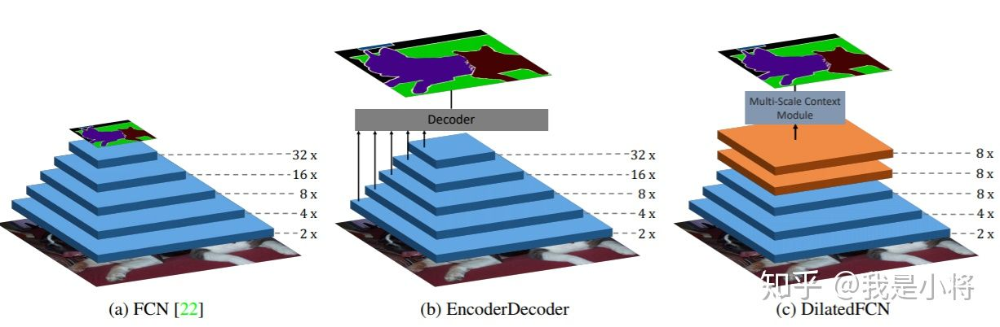图3 语义分割不同架构（来源：https://arxiv.org/abs/1903.11816）

## 整体架构

DeepLabv3+模型的整体架构如图4所示，它的Encoder的主体是带有空洞卷积的DCNN，可以采用常用的分类网络如ResNet，然后是带有空洞卷积的空间金字塔池化模块（Atrous Spatial Pyramid Pooling, ASPP)），主要是为了引入多尺度信息；相比DeepLabv3，v3+引入了Decoder模块，其将底层特征与高层特征进一步融合，提升分割边界准确度。从某种意义上看，DeepLabv3+在DilatedFCN基础上引入了EcoderDecoder的思路。

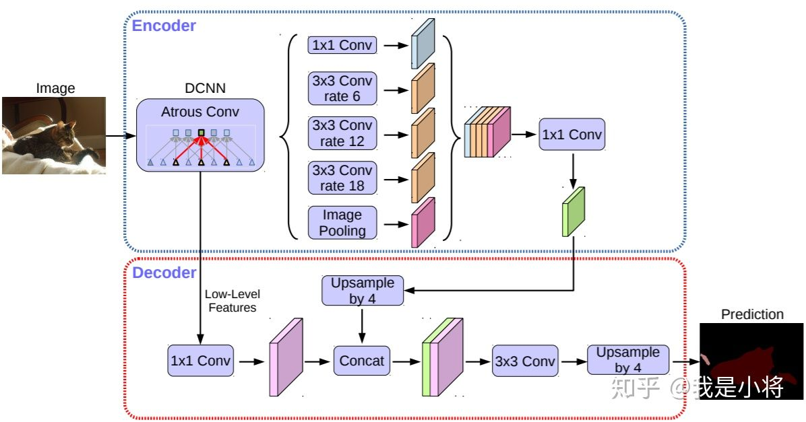图4 DeepLabv3+模型的整体架构

对于DilatedFCN，主要是修改分类网络的后面block，用空洞卷积来替换stride=2的下采样层，如下图所示：其中a是原始FCN，由于下采样的存在，特征图不断降低；而b为DilatedFCN，在第block3后引入空洞卷积，在维持特征图大小的同时保证了感受野和原始网络一致。

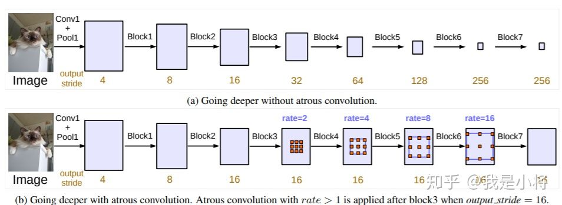图5 DilatedFCN与传统FCN对比

在DeepLab中，将输入图片与输出特征图的尺度之比记为`output_stride`，如上图的`output_stride`为16，如果加上ASPP结构，就变成如下图6所示。其实这就是DeepLabv3结构，v3+只不过是增加了Decoder模块。这里的DCNN可以是任意的分类网络，一般又称为backbone，如采用ResNet网络。

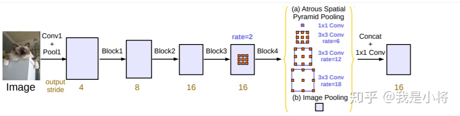图6 output_stride=16的DeepLabv3结构

## 空洞卷积

空洞卷积（Atrous Convolution）是DeepLab模型的关键之一，它可以在不改变特征图大小的同时控制感受野，这有利于提取多尺度信息。空洞卷积如下图所示，其中rate（r）控制着感受野的大小，r越大感受野越大。通常的CNN分类网络的output_stride=32，若希望DilatedFCN的output_stride=16，只需要将最后一个下采样层的stride设置为1，并且后面所有卷积层的r设置为2，这样保证感受野没有发生变化。对于output_stride=8，需要将最后的两个下采样层的stride改为1，并且后面对应的卷积层的rate分别设为2和4。另外一点，DeepLabv3中提到了采用multi-grid方法，针对ResNet网络，最后的3个级联block采用不同rate，若output_stride=16且multi_grid = (1, 2, 4), 那么最后的3个block的rate= 2 · (1, 2, 4) = (2, 4, 8)。这比直接采用(1, 1, 1)要更有效一些，不过结果相差不是太大。

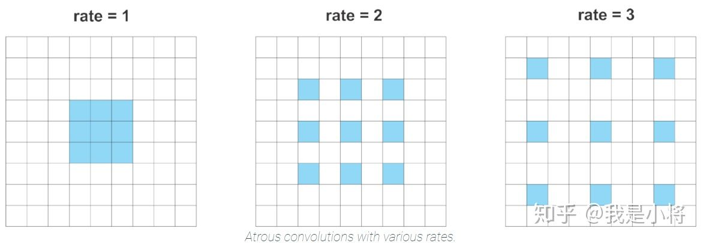图7 不同rate的空洞卷积

空洞卷积(atrous convolution)又叫扩张卷积(dilated convolution)，其实就是向卷积层引入了一个称为“扩张率（dilation rate）”的新参数，这个参数定义了卷积核处理数据时各值的间距。普通卷积和空洞卷积图示如下（以3*3卷积为例）

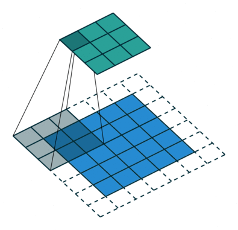

 

 （普通卷积）

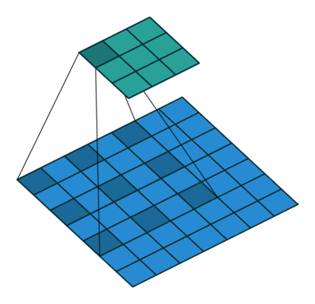

 

 （空洞卷积）

那么这样的结构是为了解决什么问题呢？

这又不得不提起传统网络VGG，在VGG的设计中，作者发现了卷积叠加过程中的一个巧妙规律，即7*7的卷积层正则等效于3个3*3卷积层的叠加，在减少参数的同时，这样的结构更容易学到一个可生成的、表现力良好的特征空间，这也是为什么我们现在看到的网络结构几乎都是3*3,5*5的卷积层的原因。

但与此同时，伴随产生了对于deep cnn中上采样和下采样的一系列问题，一方面是pooling导致的内部数据结构和空间层级化的信息丢失，另一方面，小物体（在一定条件下）经过下采样之后数据会丢失，导致信息无法重建。这个问题在语义分割中尤其显著，而空洞卷积的设计很好的避免了这些问题。

**空洞卷积的两大优势：**

1.特征图相同情况下，空洞卷积可以得到更大的感受野，从而获得更加密集的数据

2.特征图相同情况下，更大的感受野可以提高在目标检测和语义分割的任务中的小物体识别分割的的效果。

我们可以显而易见的看到，使用空洞卷积代替下采样/上采样可以很好的保留图像的空间特征，也不会损失图像信息。当网络层需要更大的感受野，但是由于计算资源有限无法提高卷积核数量或大小时，可以考虑使用空洞卷积。

**空洞卷积存在的问题：**

1.网格效应

　　当多次叠加扩张率为2的3*3 kernel时，会产生如下问题：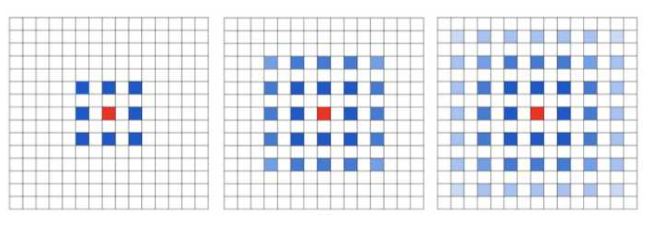

 由此可见，并不是所有的pixel都用来计算了，这样的方式会损失信息的连续性，这对于像素级的任务来说是致命的。

2.远距离信息可能不相关

　　需要注意的是，如果光采用大的扩张率的卷积可能只对一些大物体分割有效果。

**解决方案**

一个称为HDC（混合空洞卷积）的结构被设计出来解决卷积核不连续的问题，它具有如下几个特性：

1.叠加卷积的扩张率不能有大于1的公约数

2.将扩张率设计成锯齿状结构，如[1,2,5,1,2,5]

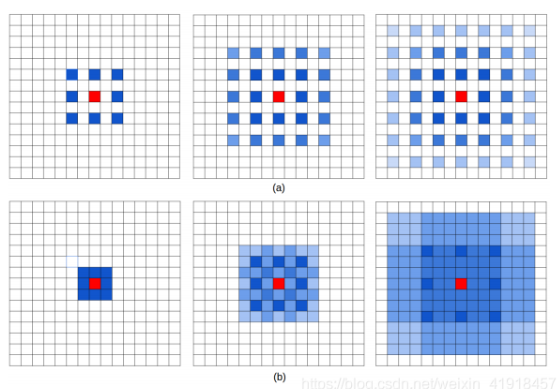

图（a）是连续做rate = 2的空洞卷积的结果，图（b）是分别做rate为1/2/3空洞卷积的结果。

后者的优势在于，从一开始就保留了完整连续的3*3区域，之后的几个rate设计又保证了感受野的连贯性，即使有重叠也密不透风。

## 空间金字塔池化（ASPP）

在DeepLab中，采用空间金字塔池化模块来进一步提取多尺度信息，这里是采用不同rate的空洞卷积来实现这一点。ASPP模块主要包含以下几个部分： （1） 一个1×1卷积层，以及三个3x3的空洞卷积，对于output_stride=16，其rate为(6, 12, 18) ，若output_stride=8，rate加倍（这些卷积层的输出channel数均为256，并且含有BN层）； （2）一个全局平均池化层得到image-level特征，然后送入1x1卷积层（输出256个channel），并双线性插值到原始大小； （3）将（1）和（2）得到的4个不同尺度的特征在channel维度concat在一起，然后送入1x1的卷积进行融合并得到256-channel的新特征。

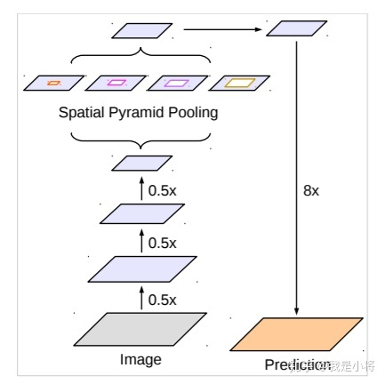图8 DeepLab中的ASPP

ASPP主要是为了抓取多尺度信息，这对于分割准确度至关重要，一个与ASPP结构比较像的是[PSPNet]（[Pyramid Scene Parsing Network](https://link.zhihu.com/?target=https%3A//arxiv.org/abs/1612.01105)）中的金字塔池化模块，如下图所示，主要区别在于这里采用池化层来获取多尺度特征。

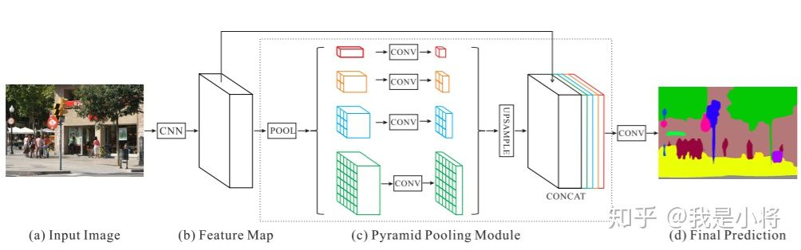图9 PSPNet中的金字塔池化层

此外作者在近期的文章（[Searching for Efficient Multi-Scale Architectures for Dense Image Prediction](https://link.zhihu.com/?target=https%3A//arxiv.org/pdf/1809.04184.pdf)）还尝试了采用NAS来搜索比ASPP更有效的模块，文中称为DPC（Dense Prediction Cell），其搜索空间包括了1x1卷积，不同rate的3x3空洞卷积，以及不同size的平均池化层，下图是NAS得到的最优DPC，这是人工所难以设计的。

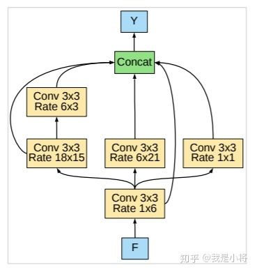图10 最优DPC

## Decoder

对于DeepLabv3，经过ASPP模块得到的特征图的output_stride为8或者16，其经过1x1的分类层后直接双线性插值到原始图片大小，这是一种非常暴力的decoder方法，特别是output_stride=16。然而这并不利于得到较精细的分割结果，故v3+模型中借鉴了EncoderDecoder结构，引入了新的Decoder模块，如下图所示。首先将encoder得到的特征双线性插值得到4x的特征，然后与encoder中对应大小的低级特征concat，如ResNet中的Conv2层，由于encoder得到的特征数只有256，而低级特征维度可能会很高，为了防止encoder得到的高级特征被弱化，先采用1x1卷积对低级特征进行降维（paper中输出维度为48）。两个特征concat后，再采用3x3卷积进一步融合特征，最后再双线性插值得到与原始图片相同大小的分割预测。

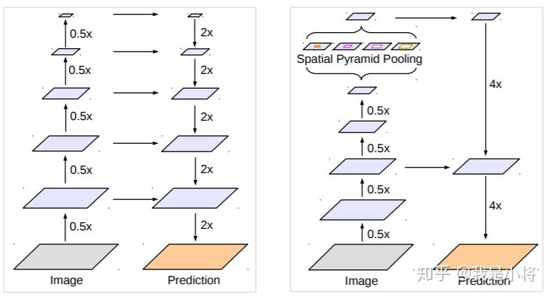图11 DeepLab中的Decoder

## 改进的Xception模型

DeepLabv3所采用的backbone是ResNet网络，在v3+模型作者尝试了改进的Xception，Xception网络主要采用depthwise separable convolution，这使得Xception计算量更小。改进的Xception主要体现在以下几点： （1）参考MSRA的修改（[Deformable Convolutional Networks](https://link.zhihu.com/?target=https%3A//arxiv.org/abs/1703.06211)），增加了更多的层； （2）所有的最大池化层使用stride=2的depthwise separable convolutions替换，这样可以改成空洞卷积 ； （3）与MobileNet类似，在3x3 depthwise convolution后增加BN和ReLU。

采用改进的Xception网络作为backbone，DeepLab网络分割效果上有一定的提升。作者还尝试了在ASPP中加入depthwise separable convolution，发现在基本不影响模型效果的前提下减少计算量。

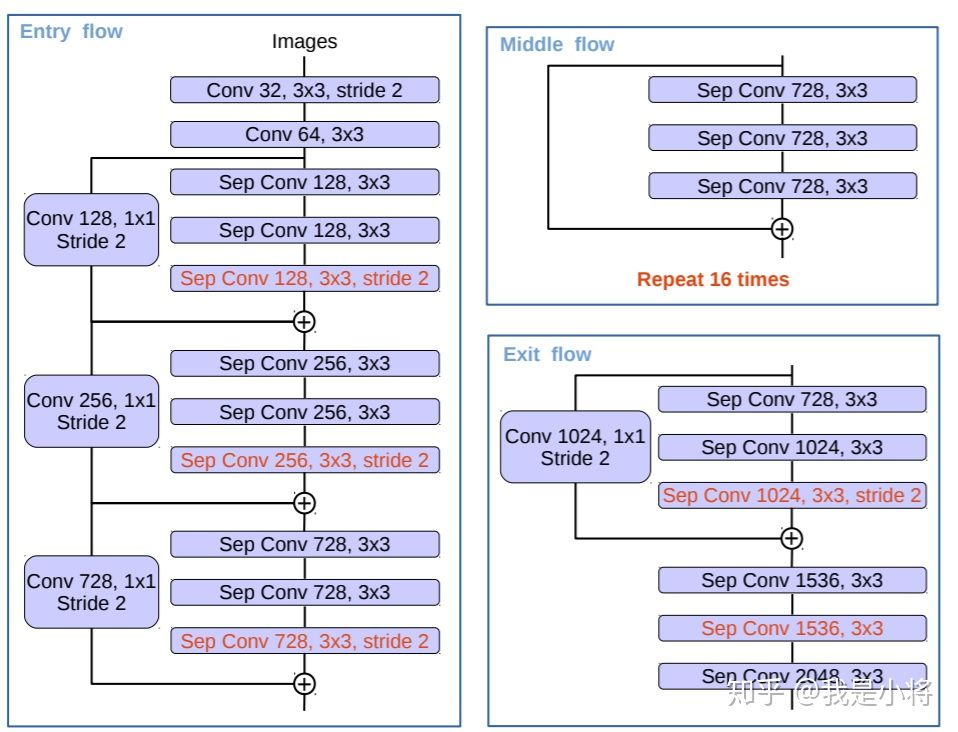图12 修改的Xception网络

# 参考文献 #