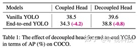
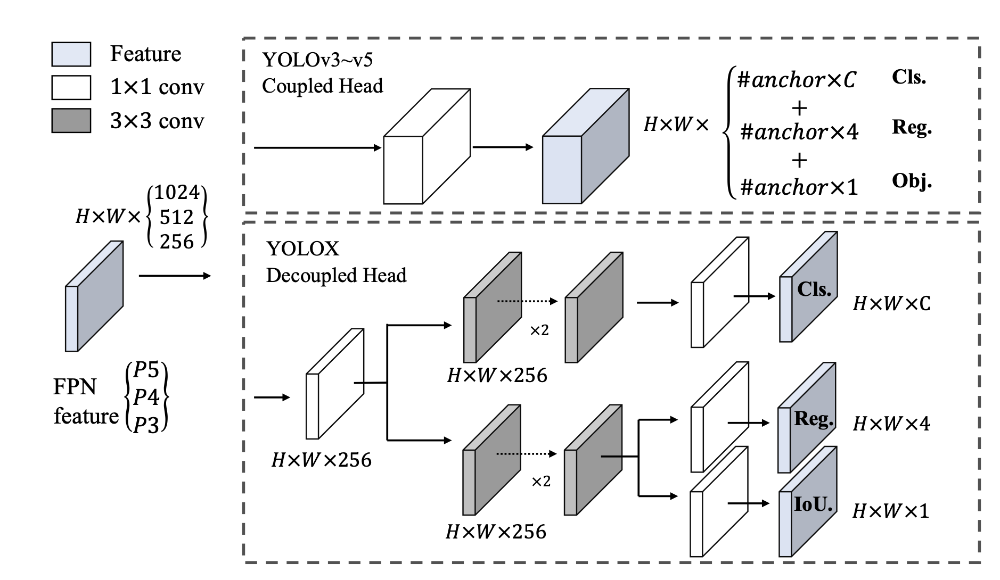
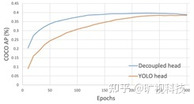
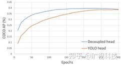
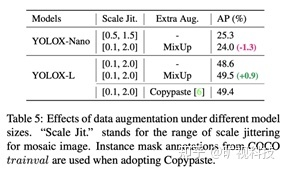
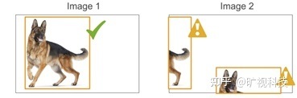
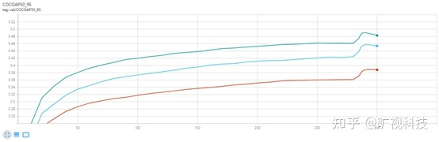
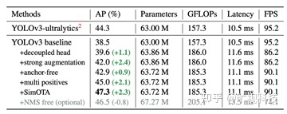

**Decoupled Head**

Decoupled Head 是学术领域一阶段网络一直以来的标准配置 ( RetinaNet，FCOS 等)。相比于它朴素的实现方法，“解耦头”这个词显得有些高大上。我们一开始并没有计划对检测头进行解耦，而是在将 YOLOX 推进到“端到端（ 无需NMS ）”时发现，不论调整损失权重还是控制梯度回传，End2end 的 YOLOX 始终比标准的 YOLOX 低 4~5 个点（ 如 Table1 ），这与我们在 DeFCN 里获得的认知不符。偶然间我们把原始的 YOLO Head 换成 decoupled head，发现这里的差距又显著缩小了，这样的现象说明当前 YOLO Head 的表达能力可能有所欠缺。于是我们将 decoupled head 应用到了非 End2End YOLO 上，结果就如 Fig.3 的所示：不仅在峰值的性能有所提升，收敛速度也明显加快。结合之前 End2end 的实验，这两个现象充分说明 YOLO 系列一直以来使用的检测头可能是不合理的。

将检测头解耦无疑会增加运算的复杂度，但经过权衡速度和性能上的得失，我们最终使用 1个1x1 的卷积先进行降维，并在分类和回归分支里各使用了 2个3x3 卷积，最终调整到仅仅增加一点点参数，YOLOX 在 s,m,l,x 模型速度上的轻微下降也全源自于此。表面上看，解耦检测头提升了 YOLOX 的性能和收敛速度，但更深层次的，它为 YOLO 与检测下游任务的一体化带来可能。比如：

1. YOLOX + Yolact/CondInst/SOLO ，实现端侧的实例分割。

2. YOLOX + 34 层输出，实现端侧人体的 17 个关键点检测。

以往或许已经有一些这方面的工作，但这些领域的 SOTA 依然拥有他们特殊的结构设计，使得该领域无法直接享用到 YOLO 系列发展的成果。如今一个打开了枷锁的检测头，我们认为会让 YOLO 与检测的下游任务更深层次的结合，为检测与下游任务的端到端一体化带来一些变化。

**Data Augmentation**

Mosaic 经过 YOLOv5 和 v4 的验证，证明其在极强的 baseline 上能带来显著涨点。我们组早期在其他研究上发现，为 Mosaic 配上 Copypaste(指的是用分割的标签将目标分割出来放到别的背景上)，依然有不俗的提升。组内的共识是：当模型容量足够大的时候，相对于先验知识（各种 tricks，hand-crafted rules ），更多的后验（数据/数据增强）才会产生本质影响。通过使用 COCO 提供的 ground-truth mask 标注，我们在 YOLOX 上试了试 Copypaste，下表表明，在 48.6mAP 的 YOLOX-Large 模型上，使用 Copypaste 带来0.8%的涨点。

可 Copypaste 的实现依赖于目标的 mask 标注，而 mask 标注在常规的检测业务上是稀缺的资源。而由于 MixUp 和 Copypaste 有着类似的贴图的行为，还不需要 mask 标注，因此可以让 YOLOX 在没有 mask 标注的情况下吃到 Copypaste 的涨点。不过我们实现的 Mixup，没有原始 Mixup 里的 Bernoulli Distribution 和 Soft Label ，有的仅是 0.5 的常数透明度和 Copypaste 里提到的尺度缩放 ( scale jittering )。 YOLOX 里的 Mixup 有如此明显的涨点，大概是因为它在实现和涨点原理上更接近 Copypaste，而不是原版 Mixup。

Data Augmentation 里面需要强调的一点是： 要在训练结束前的15个 epoch 关掉 Mosaic 和Mixup ，这对于 YOLOX 非常重要。可以想象，Mosaic+Mixup 生成的训练图片，远远脱离自然图片的真实分布，并且 Mosaic 大量的 crop 操作会带来很多不准确的标注框，见下图 (来源：[https://github.com/ultralytics/yolov5/issues/2151](https://link.zhihu.com/?target=https%3A//github.com/ultralytics/yolov5/issues/2151))：   

YOLOv5 目前在考虑使用 mask 标注去修正这些框，使用了 mask 的 Copypaste 也已经有了 PR，相信很快会在 v5 的性能表上有所体现。这点上，我们认为 YOLOX 走在了 v5 的前面。回到提前关 Data Aug，核心目的是为了让检测器避开不准确标注框的影响，在自然图片的数据分布下完成最终的收敛。为此我们也补上新的一条使用 YOLOX 的 best practice：

***如果训不到 300 个 epoch 便打算终止，请记得将关 Aug 的时间节点设定为终止前的 10~15 个 epoch 。\***

具体参考 yolox/exp/yolox_base.py 里的 no_aug_epochs 以及 yolox/core/trainer.py 里调用 close_mosaic 的方式。提前关 Data Aug 疗效如下：

**Anchor Free 与 Label Assignment**

1). Anchor Based 检测器为了追求最优性能通常会需要对anchor box 进行[聚类分析](https://www.zhihu.com/search?q=聚类分析&search_source=Entity&hybrid_search_source=Entity&hybrid_search_extra={"sourceType"%3A"answer"%2C"sourceId"%3A2021031747})，这无形间增加了算法工程师的时间成本；

 2). Anchor 增加了检测头的复杂度以及生成结果的数量，将大量检测结果从NPU搬运到CPU上对于某些边缘设备是无法容忍的。

3).  Anchor Free 的解码代码逻辑更简单，可读性更高。

至于为什么 Anchor Free 现在可以上 YOLO ，并且性能不降反升，这与样本匹配有密不可分的联系。与 Anchor Free 比起来，样本匹配在业界似乎没有什么关注度。但是一个好的样本匹配算法可以天然缓解拥挤场景的检测问题（ LLA、OTA 里使用动态样本匹配可以在 CrowdHuman 上提升 FCOS 将近 10 个点），缓解极端长宽比的物体的检测效果差的问题，以及极端大小目标正样本不均衡的问题。甚至可能可以缓解旋转物体检测效果不好的问题，这些问题本质上都是样本匹配的问题。在我们的认知中，样本匹配有 4 个因素十分重要：

1) loss/quality/prediction aware ：基于网络自身的预测来计算 anchor box 或者 anchor point 与 gt 的匹配关系，充分考虑到了不同结构/复杂度的模型可能会有不同行为，是一种真正的 dynamic 样本匹配。而 loss aware 后续也被发现对于 DeTR 和 DeFCN 这类端到端检测器至关重要。与之相对的，基于 IoU 阈值 in Grid(YOLOv1) in Box or Center(FCOS) 都属于依赖人为定义的几何先验做样本匹配，目前来看都属于次优方案。

2) center prior : 考虑到感受野的问题，以及大部分场景下，目标的[质心](https://www.zhihu.com/search?q=质心&search_source=Entity&hybrid_search_source=Entity&hybrid_search_extra={"sourceType"%3A"answer"%2C"sourceId"%3A2021031747})都与目标的几何中心有一定的联系，**将正样本限定在目标中心的一定区域内做 loss/quality aware 样本匹配能很好地解决收敛不稳定的问题。**

3) 不同目标设定不同的正样本数量( dynamic k )：我们不可能为同一场景下的西瓜和蚂蚁分配同样的正样本数，如果真是那样，那要么蚂蚁有很多低质量的正样本，要么西瓜仅仅只有一两个正样本。Dynamic k 的关键在于如何确定k，有些方法通过其他方式间接实现了动态 k ，比如 ATSS、PAA ，甚至 RetinaNet ，**同时，k的估计依然可以是 prediction aware 的，我们具体的做法是首先计算每个目标最接近的10个预测，然后把这个 10 个预测与 gt 的 iou 加起来求得最终的k**，很简单有效，对 10 这个数字也不是很敏感，在 5~15 调整几乎没有影响。

4) 全局信息：**有些 anchor box/point 处于正样本之间的交界处、或者正负样本之间的交界处，这类 anchor box/point 的正负划分，甚至若为正，该是谁的正样本，都应充分考虑全局信息。**

我们在 CVPR 21 年的工作 OTA 充分考虑到了以上 4 点，通过把样本匹配建模成最优传输问题，求得了全局信息下的最优样本匹配方案，欢迎大家[阅读原文](https://link.zhihu.com/?target=https%3A//openaccess.thecvf.com/content/CVPR2021/html/Ge_OTA_Optimal_Transport_Assignment_for_Object_Detection_CVPR_2021_paper.html)。但是 OTA 最大的问题是会增加约 20~25 %的额外训练时间，对于动辄 300epoch 的 COCO 训练来说是有些吃不消的，此外 Sinkhorn-Iter 也会占用大量的显存，所以在 YOLOX 上，我们去掉了 OTA 里的最优方案求解过程，保留上面 4 点的前 3 点，简而言之： loss aware dynamic top k。由于相对 OTA  去掉了Sinkhorn-Iter 求最优解的过程，我们把 YOLOX 采用的样本匹配方案称为 SimOTA  ( Simplified OTA )。我们在 Condinst 这类实例分割上用过 SimOTA ，获得了 box 近1个点， seg 0.5 左右的涨点。同时在内部 11 个奇奇怪怪，指标五花八门的业务数据上也测试过 SimOTA ，平均下来发现 SimOTA>FCOS>>ATSS ，这些实验都满足我们**不去过拟合 COCO 和 COCO style mAP** 的初衷。没有复杂的数学公式和原理，不增加额外的计算时间，但是有效。用今年非常流行的句式为这个小节结个尾： Anchor free and dynamic label assignment are all you need.

**End2end**

端到端（ 无需 NMS ）是个很诱人的特性，如果预测结果天然就是一个 set ，岂不是完全不用担心后处理和数据搬运？去年有不少相关的工作放出（ DeFCN，PSS, DeTR ），但是在 CNN 上实现端到端通常需要增加2个 Conv 才能让特征变的足够稀疏并实现端到端，且要求检测头有足够的表达能力( Decoupled Head 部分已经详细描述了这个问题)，从下表中可以看到，在 YOLOX 上实现 NMS Free 的代价是轻微的掉点和明显的掉 FPS 。所以我们没有在最终版本中使用 End2End 特性。

## YOLOX LOSS 具体实现流程

1.

# 参考文献 #

https://arxiv.org/pdf/2107.08430.pdf

https://www.zhihu.com/question/473350307/answer/2021031747