# 通用目标检测

##　IOU

### **IOU损失函数：**

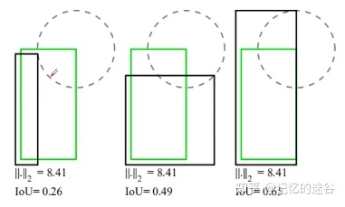

图片展示了3组矩形框重合的示例：绿色是真实目标存在的框GT box，黑色是预测的box位置。通过观察上图，发现第三个预测效果较好，因为预测目标的位置与真实目标最为接近。但是计算三组l2损失发现损失值都为8.41，然而IOU的值不同。因此说明l2损失不能准确反应两个目标边界框重合的程度，因此诞生了IOU损失函数。

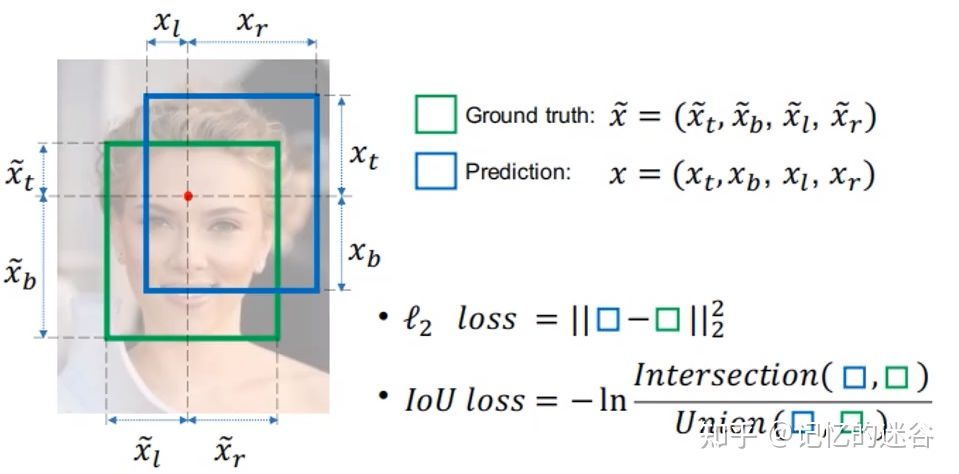

上图是IOU损失函数的计算方法：首先绿色的框表示真实目标的位置，蓝色框代表预测框的位置。IOU的计算方法很简单，用两个方框相交的面积/两个方框合并的面积，将得到的值取以e为底对数，前面添上负号就得到了IOU损失函数。

### **GIOU损失函数：**

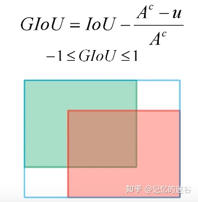

如图：绿色是真实目标边界框，红色是预测目标边界框，最外面的蓝色边框是将红绿矩形用最小矩形框起来的边界，Ac是蓝色矩形框的面积，u对应红绿矩形的并集面积。

如果当红绿矩形完美重合，那么IOU =1, Ac = u = 预测目标边界框面积，GIOU = 1 - 0 = 1。如果两个目标分开很远，Ac趋向于很大的数值，u趋于0，IOU也趋于0，GIOU = 0 - 1 = -1。因此GIOU取值的区间是[-1, 1]。

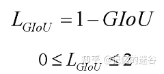

GIOU损失函数的最终表达形式是L(GIOU) = 1 - GIOU

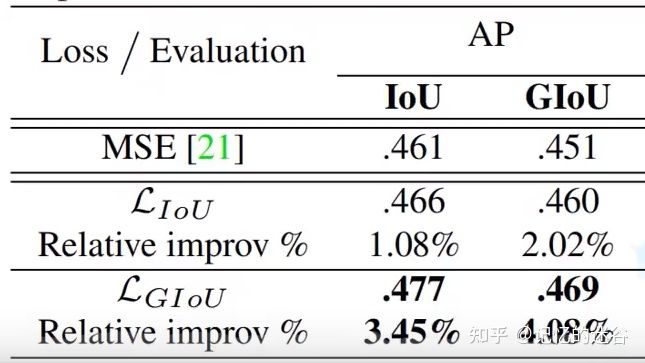

上表是原论文中的实验效果：第一列(AP-IoU一列)采用MSE(l2损失)的mAP=0.461，采用IoU损失得到的mAP=0.466，有些许提升。如果采用GIoU loss，能达到0.477，效果比IOU更好。

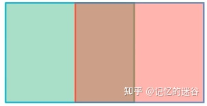

但是，GIOU也存在它的缺点：当两个预测框高宽相同，且处于同一水平面时，GIOU就退化为IOU。此外，GIOU和IOU还有两个缺点：收敛较慢、回归不够准确。

### **DIOU 损失函数：**

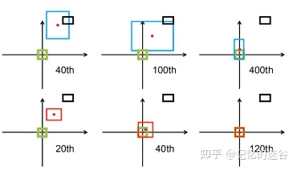

在介绍DIOU之前，先来介绍采用DIOU的效果：如图，黑色代表anchor box， 蓝色红色代表default box，绿色代表真实目标存在的框GT box的位置，期望红蓝框与绿框尽可能重合。第一行是使用GIOU训练网络，让预测边界框尽可能回归到真实目标边界框中，迭代到400次后才勉强重合。第二行使用DIOU训练网络，到达120步时，发现与目标边界框已经完全重合。可以看出，相对于GIOU，DIOU的不仅收敛速度更快，准确率也更高。

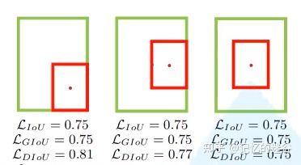

我们再看一组图，图中给出了3组目标边界框与目标边界框的重合关系，显然他们的重合位置不相同的，我们期望第三种重合（两个box中心位置尽可能重合。这三组计算的IOU loss和GIoU loss是一模一样的，因此这两种损失不能很好表达边界框重合关系）。但是DIOU计算出的三种情况的损失是不一样的，显然DIOU更加合理。

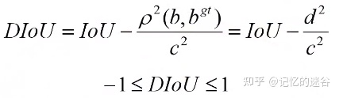DIOU计算公式

ρ代表b和b(gt)之间的欧氏距离

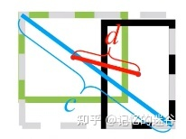

结合这张图理解一下公式：b代表预测中心坐标的参数，也就是黑框的中心点，bgt代表真实目标边界框中心的参数，即绿框中心点。ρ^2就是两个中心点距离的平方，即图中的d(红线)的平方，c代表两个矩形的最小外接矩形对角线(蓝线)长度。如果两个框完美重叠，d=0 ，IOU = 1，DIOU = 1 - 0 = 1 。如果两个框相距很远，d^2/c^2 趋近于1，IOU = 0, DIOU = 0 - 1 = -1 。因此，DIOU的取值范围也是[-1,1]。

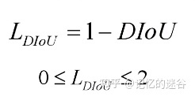

DIOU最终损失函数为：L(DIoU) = 1 - DIOU

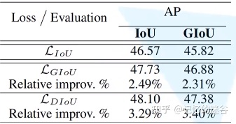

当采用DIOU loss，mAP为46.57，相较于Iou和GIOU准确率都有提高，且收敛速度相比IOU提高了3%左右。

### **CIOU LOSS：**

论文中，作者表示一个优秀的回归定位损失应该考虑三种几何参数：重叠面积、中心点距离、长宽比。CIoU就是在DIoU的基础上增加了检测框尺度的loss，增加了长和宽的loss，这样预测框就会更加的符合真实框。

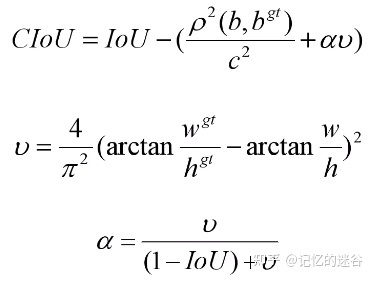

因此CIOU的三项恰好对应IOU，中心点距离，长宽比的计算。CIOU loss = 1 - CIoU。α和v为长宽比，计算公式如上图所示：w、h和w(gt)、h(gt)分别代表预测框的高宽和真实框的高宽。

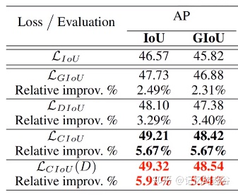

如果使用CIOU，mAP可以达到49.21%，相比于GIoU涨了1.5个百分点。CIOU(D)指在验证模型评价mAP时，将IOU换成DIOU，准确率还有提升 。

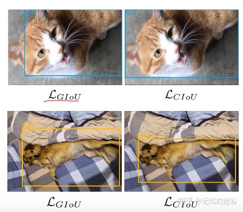

实际检测效果中，CIOU相比GIOU在框选目标时，能找到一个更合适的框选位置。如上图所示，第一行的两张图中，第一个猫猫使用GIOU损失函数，发现有一只猫耳朵在框外，第二只猫猫使用DIOU损失函数，将猫猫的位置准确标出。同样，第二行中，第一只狗狗虽然完整标出，但并不能准确框出狗狗的轮廓，而第二张图检测框的位置刚好合适。

# 参考文献 #

https://zhuanlan.zhihu.com/p/359982543

https://www.bilibili.com/video/BV1yi4y1g7ro

