## 1. 读完本章你可以学到的知识点

- 熟悉ncnn里的一个op的生命周期.
- 熟悉AbsVal这个op在ncnn里的naive实现.
- 熟悉AbsVal这个op在ncnn里针对arm端(v7 / v8)的优化实现.
- 熟悉在大型项目里c++的基本常用知识点如多态, 虚继承, 继承时构造函数 / 析构函数的执行顺序等.
- 以下所有代码统一来自分支, git checkout 20201218
- ps: 在前面的文章[ncnn初探四: 带你阅读ncnn::CMakeLists.txt](https://zhuanlan.zhihu.com/p/340365125)已经讲过了ncnn里的op架构设计, 这里就不再重复啰嗦了, 只讲讲op的生命周期.

## 2. AbsVal这个op在ncnn里的naive实现

- 首先你可以看一下这篇文章[ncnn初探三: 如何阅读ncnn源码](https://zhuanlan.zhihu.com/p/337201589), 熟悉如何从tests目录作为切入点, 开始我们的代码阅读之旅.
- main函数, 我们的起点, 如下所示.

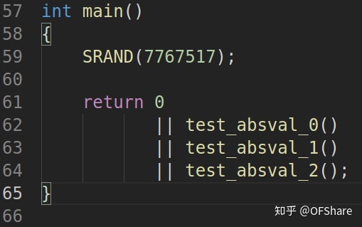

-  为了方便, 我们只看test_absval_0()这个函数, 另外的两个其实是类似. 其实它们都是测试不同维度的Mat的正确性.

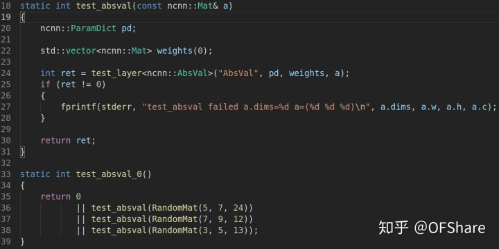

- 第24行是我们上层进入底层的入口, 如果我们不看起底层的实现, 也应该明白底层要做的事(从整体上看 / 思考). 它其实就是想把我们的输入数据(const ncnn::Mat& a) ------经过AbsVal op的处理后----> 得到处理过后的数据(我们假设为ncnn::Mat b).
- 我们类比一下, 不管是AbsVal这个简单的op还是其它什么op, 它们的功能(抽象一下)都是这样的: 输入数据(Mat input) ------经过某个op的处理-------> 输出数据(Mat output).
- 在24行的返回值, 我们可以看出, 只有输入数据a, 输出数据又在哪儿呢. 在ncnn里, op的单元测试遵循这样的规则: 这个op会先用naive的实现处理, 假设此时naive的实现的输出数据为b, (即a ---naive op的处理---> b), 这个是基准. 然后会经过x86(arm / vulkan)优化的op的处理, 假设此时优化的op的处理的输出数据为c, (即a ---优化op的实现 ----> c). 然后将 b 和 c进行compare对比, 当它们的误差小于一个范围时, 即认为这个优化的op的实现是正确的, 此时第24行会返回0. 所以第24行的代码, 我们看不到输出, 因为我们也不太关心这个输出. 本质上在ncnn里我们都认为naive的实现是没有问题的, 然后来测试其各个平台下对应优化的op的正确性.
- 然后我们跳进24行这个test_layer模板函数, 它里面先定义了一个ncnn::Option类型的大小为4的数组, 表示要测试4个选项下的情况.

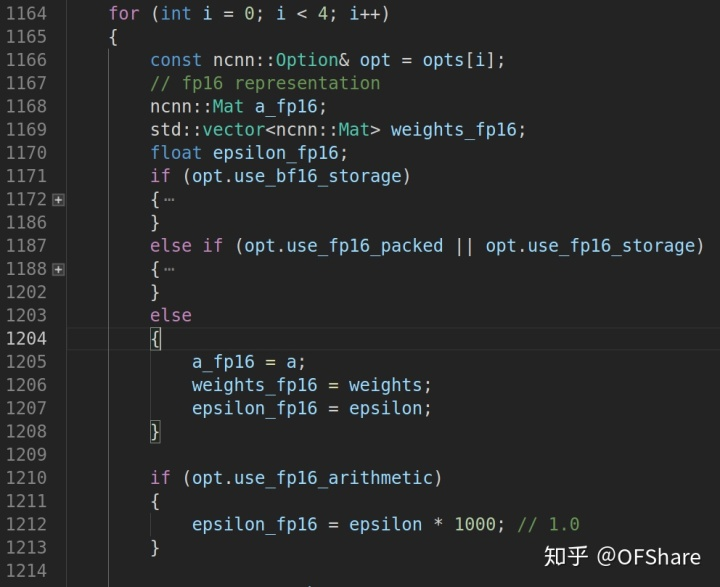

- 第1171行, 表示是否用**bf16**存储, bf16的相关资料见下面的连接. 简单来说, 就是将一个float32截断(取)前16位而成.
- [如何评价Google 在TensorFlow 中引入的bfloat16 数据类型？](https://www.zhihu.com/question/275682777) 
- [nihui：用bf16加速ncnn](https://zhuanlan.zhihu.com/p/112564372) 
- 第1187行, 表示是否用fp16_*packed, fp16_storage.*
- *第1203的else, 表示我们用最朴素的, 我们也只分析这种情况(因为简单), 上面的两种本质也差不多, 就是数据的表示形式变了一下.*

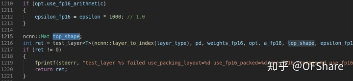

- 第1210行, 我们也取false. 然后我们就开始看1216行了. 我们先看一下**ncnn::layer_\*to_\*index**的实现, 如下图. 其实从函数名字我们就能看出它返回这个layer的index, 入参是这个layer的名字(字符串).

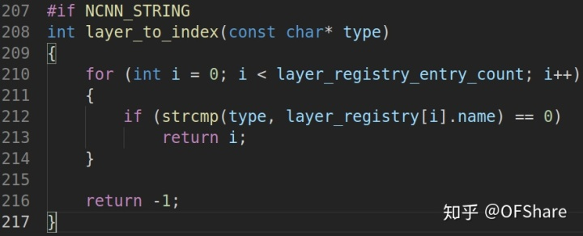

layer*registry是一个数组, 里面每个元素都是layer_*registry_entry类型(名字 + 函数指针)

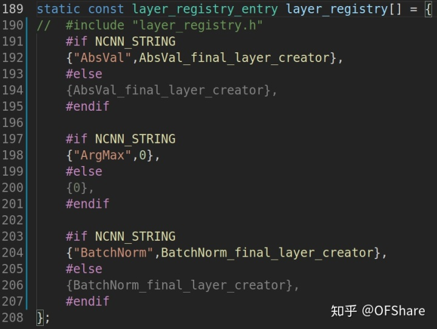

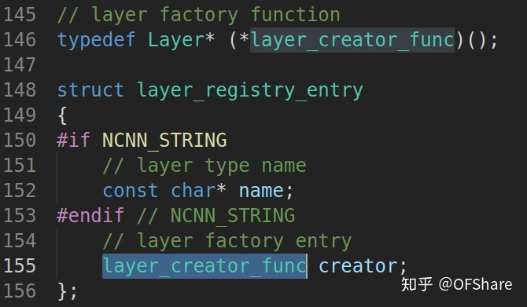

我们这里看一下{"AbsVal",AbsVal_final_layer_creator}, AbsVal_final_layer_creator是一个函数指针, 它是由下面的函数产生的

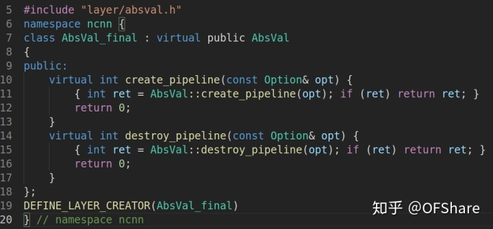

DEFINE_LAYER_CREATOR(AbsVal_final)是个宏, 下面的两个连续的#在宏里表示字符串的连接, 可以看到这个宏其实是定义了一个函数, 这个函数new 了一个对象, 返回的指针是基类类型(多态常用用法). 如 new BatchNorm_final, new BatchNorm_final_avx2, new AbsVal_final等等.

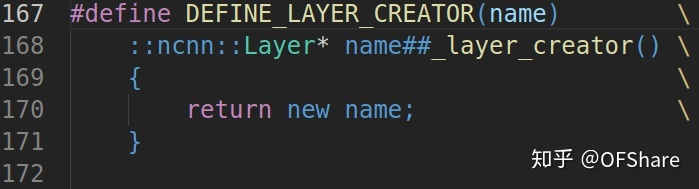

回过头来, 这里我们就把**ncnn::layer_\*to_\*index**里面的所有细节讲完了. 然后我们跳进1216行, 来到了如下图所示的这里. 从这里, 我们终于可以开始看AbsVal 这个op的naive实现了.

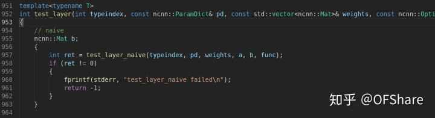

我们接着跳进第957行, 来到如下所示的代码片段(为了截图截全, 改变了一下花括号以及缩进)

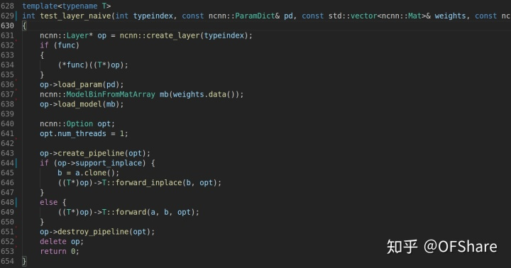

第631行到652行, 可以看做就是一个**op的生命周期**

- 第一步, 创建一个op, 就是new 了一个对象.
- 第二步, 执行load_param和load_model.
- 第三步, 执行create_pipeline
- 第四步, 执行forward
- 第五步, 执行destroy_pipeline, 然后delete.

我们首先看**ncnn::create_layer(typeindex)**函数, 它针对不同的平台, 以及该平台下是否有对应的优化的op组成.

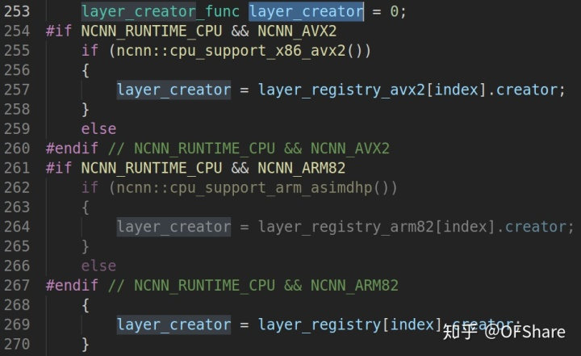

从253行到270行的代码片段可以看出, 我们的op有layer_registry_**avx2**, layer_registry_**arm82**, 以及layer_registry(naive的实现)三种情况. 比如说我们的op在avx2下没有对应的优化, 那么它就会回滚到用layer_registry创建.

这里631行, 我们等价于**Layer \* op = new AbsVal_final**; 这里涉及一个在继承体系下时构造函数初始化顺序问题, 我们在new AbsVal_final创建这个对象时, 先调用的是Layer的构造函数, 然后是AbsVal的构造函数, 最后是AbsVal_final的构造函数, 这个是c++的语法问题, 我们可以进行简单的记忆, "万丈高楼平地起", 我们总是从最低的楼构造起的. 与之作为对比的是析构函数, 我们总是从最高楼开始析构的(别忘了析构函数总是virtual的).


接着我们执行第636到638行, 由于AbsVal这个op不需要任何weight, 所以这两行相当于什么都没做. 第643的create_pipeline一样也什么都没做.

AbsVal是支持support_inplace的, 所以我们执行646行, 我们把模板参数T换成z真实的参数, 即        ((AbsVal*)op)->AbsVal::forward_inplace(b, opt); 下面的第25行到45行就是其对应的实现, 需要注意的是这里packed = 1. 如果你对下面截图的代码阅读起来很有点吃力, 那么肯定是因为你不太了解ncnn::Mat的内存布局, 建议去看看我前面的文章 [ncnn初探二: 图解ncnn::Mat的内存排布](https://zhuanlan.zhihu.com/p/336359747) 相信你阅读完后, 就会发现这段代码是如此的简单.

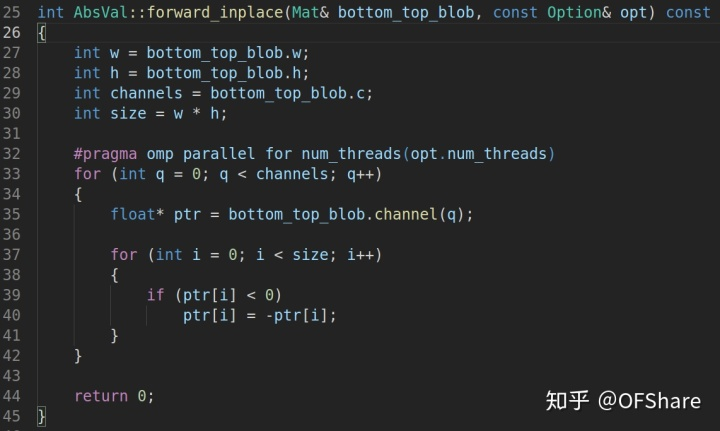

到这里我们就讲完了AbsVal op的naive实现. 其实它的核心naive实现就上面这几行代码, 但是我却花了很多的篇幅讲解, 这是为什么呢. 因为通过这个一步一步跟这个op, 可以类比到其他的op, 它们的阅读流程都是一样的. 

另外说一点, 我们在阅读大型项目代码时, 函数跳转特别多, 稍微不留神就不知道看到哪儿了, 这里说一个我阅读时的技巧, 我们始终要知道**这个函数属于那个对象,** 因为有类的封装, 我们在看到一个函数时, 它大多是被用一个类封装起来的, 所以当我们看到这个函数时, 要清楚是那个对象此时在调用这个函数, 这个对象有哪些数据成员(已初始化), 因为很多函数就是对数据进行修改, 而这些修改可能就是要修改此对象的数据成员.

## 3. AbsVal这个op在ncnn里针对arm端的优化实现

\- armeabi-v7a / arm64-v8a的时候, Layer的继承关系都如下图所示

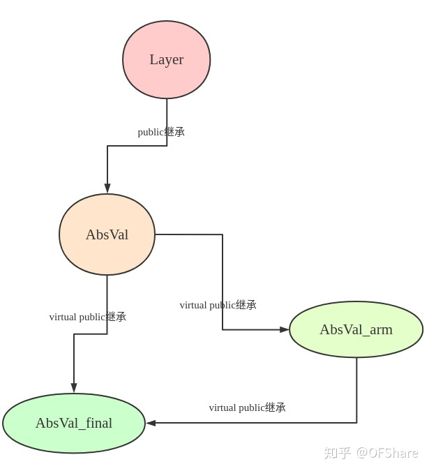

```cpp
// 注意forward_inplace在AbsVal类里有实现, 在AbsVal_arm类里也有实现
// 当我们这样执行forward_inplace函数时, 是先去AbsVal_arm类里找是否有forward_inplace函数,
// 如果有, 那就找到了, 如果没有, 就接着去AbsVal类里找.
Layer *op = new AbsVal_final;
op -> forward_inplace(c, opt);
```

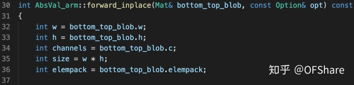

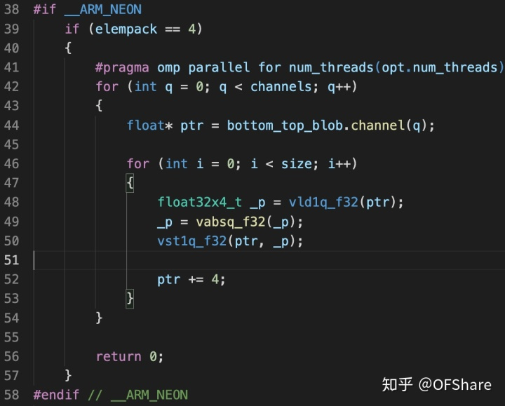

**当elempack为4**的时候的情况, 第48行表示一下取出4个float32放到_*p里, 第49行表示对_p里数取绝对值, 结果再放回到_p里, 第50行表示将_p里的数据, 放回到ptr所指的地方去.*

*这段代码如果你看不太懂, 那么肯定是你对ncnn::Mat的内存布局不熟悉, 建议去看看我原来的一篇文章*[ncnn初探二: 图解ncnn::Mat的内存排布](https://zhuanlan.zhihu.com/p/336359747) 

而且这里你也不太需要neon的前置知识, 仅仅通过函数名就能知道程序大概在做什么. 这里的vld1q_f32, vabsq_f32, vst1q_f32, 你可以叫函数, 当然它们有个更加专业(看起来高大上的)术语叫**intrinsics.**

**当elempack不是4的时候**

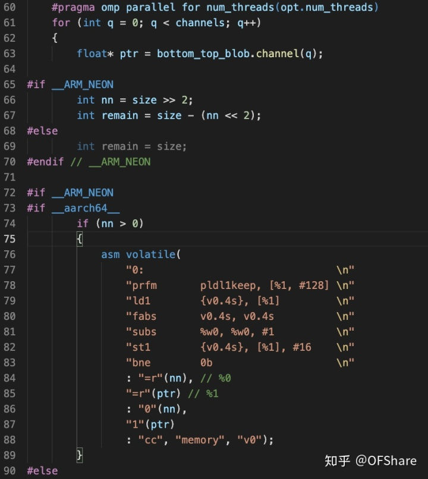

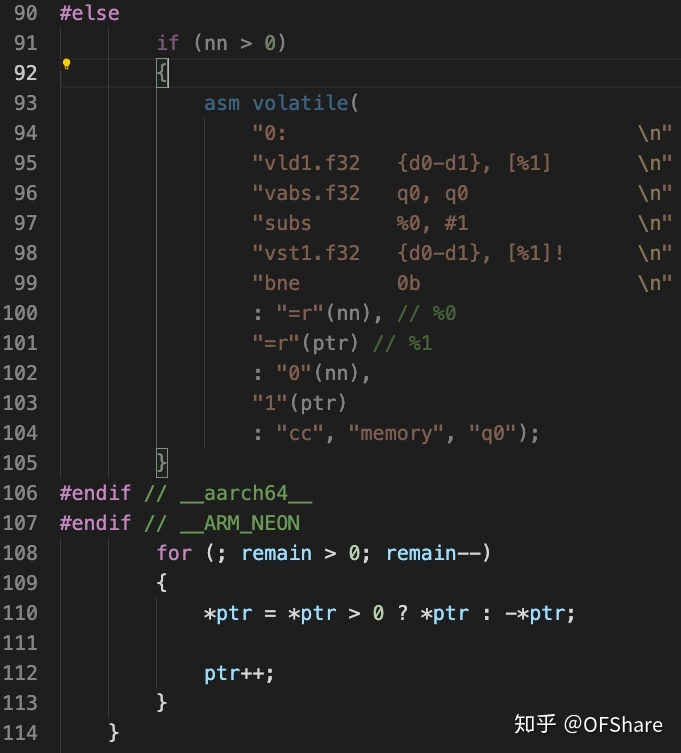

第66, 67行分别是整除4, 和模4取余, 所以**nn**表示有多少个4个元素为一组, **remain**表示剩下的.

第72行到107行, 处理**nn,** 根据**__aarch64__**宏走不同的分支, 你可以认为如果是arm64-v8a, 那么__aarch64__就是真, 如果是armeabi-v7a, 那么__aarch64__就是假.

第108行到113行, 处理**remain.**

第76到88行, 以及93行到104行, 出现了关键字**asm volatile**内联汇编, 我们暂时先知道有这么个东西, 下回再仔细讲.

## 4. References

- [如何评价Google 在TensorFlow 中引入的bfloat16 数据类型？](https://www.zhihu.com/question/275682777) 
- [nihui：用bf16加速ncnn](https://zhuanlan.zhihu.com/p/112564372)

# 参考文献 #

https://zhuanlan.zhihu.com/p/341417330