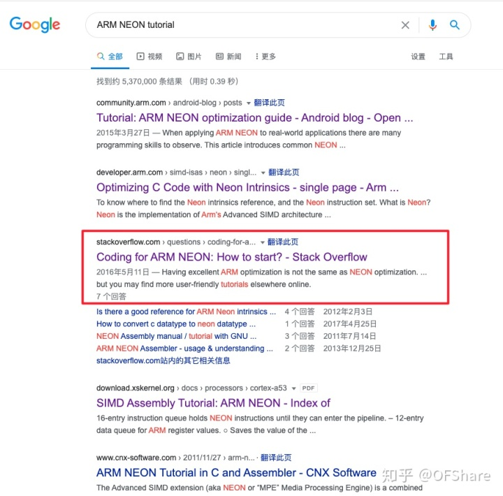

## 0. 写在前面

- 这是一篇译文, 作为我们后续ARM NEON之旅的开端.
- **授人以鱼不如授人以渔**, 我是怎么找到这篇文章的呢. 打开google搜索, 键入"ARM NEON tutorial"就能找到了. 因为我觉得原作者说的不错, 所以就分享给大家了.

## 1. Coding for ARM NEON: How to start?

## **背景**

让我从我不是一名专家程序员开始说起吧. 我是一名年轻的初级计算机视觉工程师, 而且主要是因为我大量的使用了伟大的OpenCV2库里的C++ API, 所以我对C++编程有着相当丰富的经验. 我所学到的一切都是为了执行项目, 解决项目中遇到的问题和按时完成项目这些需要才学到的, 这在工业界中是(普遍的)事实. 

最近, 我们开始开发用于嵌入式系统（ARM板）的计算机视觉软件, 并且使用纯C ++优化的代码来实现. 但是, 由于与传统计算机相比, 其资源有限, 因此在这种体系结构中构建实时计算机视觉系统仍是一个巨大的挑战.

这时我发现了NEON. 我已经阅读了很多有关此的文章, 但这是一个相当新的主题, 因此没有太多的信息, 而且阅读的越多, 我就越困惑.

## 问题

我正在尝试使用NEON一次计算4或8个数组元素的功能来优化C ++代码(主要是*for循环).* 在C ++环境中是否可以使用某种库或一组函数? 我感到困惑的主要根源是, 我看到的几乎所有代码段都是用汇编写的, 而我对此绝对没有背景, 因此在这一点上负担不起学习成本. 我在Linux Gentoo中使用Eclipse IDE编写C ++代码.

------

(ps译者注: 我个人是非常理解原作者的按需要学习的做法, 等我们工作后, 你就会发现自己所学到的知识大多是与工作内容相关的, 无关的东西你可能很喜欢, 但是却往往没时间学它. 另一个点就是我们往往都是在工作中遇到这个知识点, 然后才去学它的, 我一般叫**懒惰式学习法**, 所以这就要求我们要有很强的学习能力. 

多说一点, 所以如果我是招聘人员的话, 我是更看重学习能力的, 这比什么是否拥有XXX经验更重要, 那些XXX经验只不过是人家没接触而已, 学习能力强的话, 都是很快上手的, 然而学习能力在面试过程中肯定是不能很好体现出来的, 所以通过侧面的考算法题反应一个人的学习能力是一个不错的折衷的解决方案. **闻道有先后 术业有专攻**大概就是这个意思吧, 仅个人观点QAQ)

------

## 2. [Rob Napier](https://link.zhihu.com/?target=https%3A//stackoverflow.com/users/97337/rob-napier)的回答

从你的更新中, 您可能误解了NEON处理器的功能. 它是一个SIMD（单指令多数据）矢量处理器. 这意味着在同一时间对多条数据执行一条指令非常擅长（例如“乘以4”）. 它还喜欢做诸如“将所有这些数字加在一起”或“将这两个数字列表中的每个元素相加以创建第三个数字列表”之类的事情. 因此, 如果您遇到的问题看起来像是这样, 那NEON处理器将为您带来巨大的帮助.

为了获得这种好处, 您必须将数据以非常特定的格式放置, 以便矢量处理器可以同时加载多个数据, 并行处理它们, 然后同时将它们写回. 您需要组织一些事情, 在数学上避免大多数条件判断语句(因为对于NEON来说, 过早查看结果就像一趟往返旅行). 向量编程是对程序进行思考的另一种方式, 全部与管道管理有关.

现在, 对于许多非常常见的问题, 编译器可以自动解决所有这些问题. 但仍然是处理数字以及特定格式的数字. 例如, 您几乎总是需要将所有数字放入内存中的连续块中. 如果您要处理结构和类内部的字段, 那么NEON并不能真正为您提供帮助. 它不是通用的“并行处理”引擎. 这是用于执行并行数学运算的SIMD处理器.

对于非常高性能的系统, 数据格式就是一切. 您不会采用任意的数据格式(结构, 类等)来加速它们. 您找出可以让您进行最并行工作的数据格式, 然后围绕该代码编写代码. 您使数据连续, 您避免(多次重复)内存分配的代价. 但这实际上不是一个简单的StackOverflow问题可以解决的问题. 高性能编程是一种整体技能, 是一种不同的思维方式. 找到正确的编译器标志所获得的性能提升并不是高性能编程. 如您所见, 默认值已经相当不错了.

您真正应该问的问题是, 是否可以重新组织数据, 以便可以更好的使用OpenCV. OpenCV已经有许多优化的并行操作, 几乎可以肯定会充分利用NEON. 您要尽可能保持OpenCV使用的格式的数据. 这可能是您获得最大性能改进的地方.

------

我的经验是, 手工编写NEON汇编代码肯定是有可能击败clang和gcc编译器的优化的(至少在过去几年是这样的, 尽管编译器会继续改进(缩小这个差距)). 出色的ARM优化与NEON优化不同。就像@Mats指出的那样, 编译器通常可以在明显可以进行优化的情况下做得很好, 但是并不是对于所有情况都能很理想的优化, 所以在有些情况, 一个稍微熟练的开发者肯定是有可能击败编译器的优化的, 有时这种差距还是巨大的. (@wallyk也是正确的, 手工调(编写)汇编代码最好是留在最后, 尽管它非常有用很强大.）

(ps译者注: 提防*[过早的优化](https://link.zhihu.com/?target=https%3A//translate.googleusercontent.com/translate_c%3Fdepth%3D1%26hl%3Dzh-CN%26prev%3Dsearch%26pto%3Daue%26rurl%3Dtranslate.google.com.hk%26sl%3Den%26sp%3Dnmt4%26u%3Dhttps%3A//en.wikipedia.org/wiki/Program_optimization%26usg%3DALkJrhgII4ZjBSjT8hCDGFhQHWwmo3eqiQ%23When_to_optimize).* 正确的开发顺序是使代码正常运行, 然后查看是否*需要*优化. 只有当代码稳定时, 优化才有意义.)

那就是说, 考虑到您的发言“对于汇编, 我没有任何的背景, 而且可能没啥精力去学习它”不是这样的, 您不必太过在意. 没有至少了解汇编的基础知识（和一些非基础知识）以及（特别是矢量化NEON汇编）猜测编译器的行为是没有意义的. 击败编译器的第一步是了解它.

如果您愿意学习, 我最喜欢的介绍是[Whirlwind Tour of ARM Assembly](https://link.zhihu.com/?target=http%3A//www.coranac.com/tonc/text/asm.htm). 加上下面的一些其他参考, 足以让我在遇到特殊问题时比编译器高2-3倍. 另一方面, 它们不够用, 以至于当我向经验丰富的NEON开发人员展示我的代码时, 他看了大约三秒钟并说：“您在那里停了下来。” 真正好的汇编很难, 但是半体面的汇编仍然比优化的C ++更好. (同样, 每年随着编译器编写者变得更好导致这观点变得不那么正确, 但这仍然是正确的)

- [ARM Assembly language](https://link.zhihu.com/?target=http%3A//shervinemami.info/armAssembly.html)
- [A few things iOS developers ought to know about the ARM architecture](https://link.zhihu.com/?target=https%3A//wanderingcoder.net/2010/07/19/ought-arm/) (iPhone-focused, but the principles are the same for all uses.)
- [ARM NEON support in the ARM compiler](https://link.zhihu.com/?target=http%3A//www.arm.com/files/pdf/NEON_Support_in_the_ARM_Compiler.pdf)
- [Coding for NEON](https://link.zhihu.com/?target=http%3A//community.arm.com/groups/processors/blog/2010/03/17/coding-for-neon--part-1-load-and-stores)

附带说明一下, [我对NEON intrinsics函数的经验](https://link.zhihu.com/?target=https%3A//translate.googleusercontent.com/translate_c%3Fdepth%3D1%26hl%3Dzh-CN%26prev%3Dsearch%26pto%3Daue%26rurl%3Dtranslate.google.com.hk%26sl%3Den%26sp%3Dnmt4%26u%3Dhttps%3A//stackoverflow.com/questions/9828567/arm-neon-intrinsics-vs-hand-assembly/9829272%26usg%3DALkJrhjp22YSLgy24Z91TJIaltgl6rVlXg%239829272)是, 它们不是那么的有用. 如果您要击败编译器, 则需要实际编写完整的汇编代码. 大多数时候, 无论您将使用哪种intrinsics函数, 编译器都已经知道.获得性能提升的地方通常是重组循环以最好地管理管道(而intrinsics函数对此无济于事). 这可能在最近几年有所改善, 但是我希望改进的向量优化器比其他方法更能胜过intrinsics函数.

# 参考文献 #

https://zhuanlan.zhihu.com/p/342431588