## 1. 读完本章你可以学到的知识点

- 熟悉cmake的常见语法.
- 熟悉CMakeLists.txt是如何维护ncnn项目代码.
- 一窥ncnn里Layer(op)的架构设计.
- 为了统一, 下文的代码都是统一来之**20201218**这个tag(***git checkout 20201218\***)
- cmake --version == 3.19.1

## 2. ncnn配置架构设计

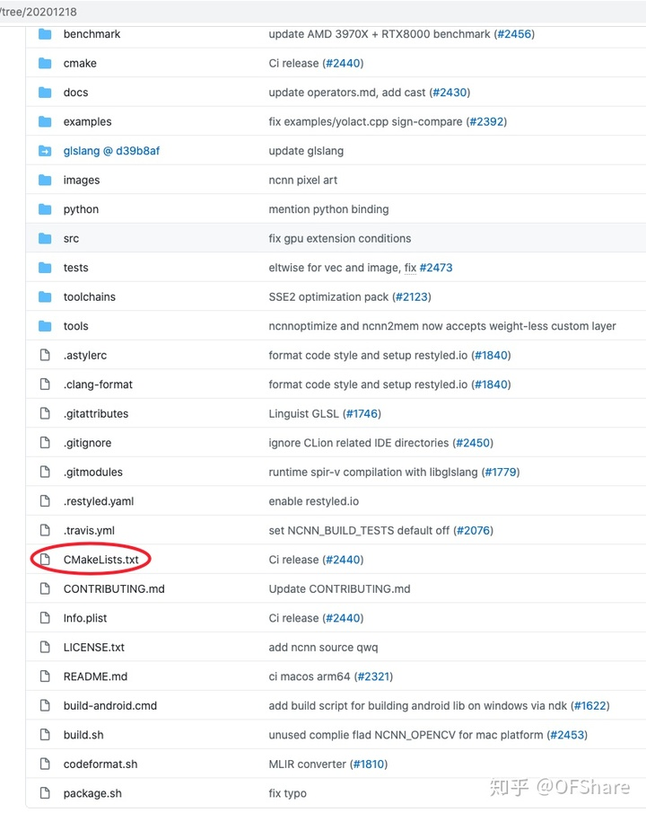

- 图中圈红的地方, 是整个配置的起点, 你可以类比看作就是我们写cpp时的main函数. 所以我们阅读的起点就是这.
- 用你喜欢的IDE打开它, 然后跟着我的思路我们一起阅读吧.

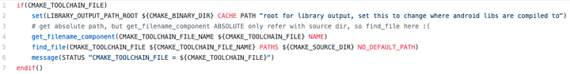

这个整个CMakeLists.txt的前几行代码, 这里涉及到的cmake语法有: **if, set, find_file, message, get_filename_component.** 看起来很基本简单, 对, 我们就是要从简单的入手.

- 我们先来看cmake里的**if,** 它的语义和其他编程语言里的if-else语义一样, 但是它在cmake里有自己独特的语法(我个人觉得它比较复杂, 并不是看起来的那么简单)
- 建议接着阅读前先看一下这篇post, 里面有对**if**的讲解 [when-should-i-wrap-variables-with-in-cmake](https://link.zhihu.com/?target=https%3A//stackoverflow.com/questions/25809332/when-should-i-wrap-variables-with-in-cmake) 

```cmake
if(<constant>)

True if the constant is 1, ON, YES, TRUE, Y, or a non-zero number. 
False if the constant is 0, OFF, NO, FALSE, N, IGNORE, NOTFOUND, the empty string, 
or ends in the suffix -NOTFOUND. 
Named boolean constants are case-insensitive. If the argument is not one of these constants, 
it is treated as a variable.

if(<variable>)

True if the variable is defined to a value that is not a false constant. 
False otherwise. (Note macro arguments are not variables.)
```

也就是说, 在if里, 它先把它看作<constant>, 如果不是<constant>再看作<variable>.

下面给出一个代码片段, **cmake --version**等于3.19.1, 不同的版本下面的代码执行可能不一样, 在低版本你可以看作是曾经cmake的bug.

```cmake
unset(BLA)
set(FOO "BLA")
if(FOO)
    message("if(<variable>): True")
else()
    message("if(<variable>): False")
endif()

if(${FOO})
    message("if(<constant>): True")
else()
    message("if(<constant>): False")
endif()
```

上面的输出是

```cmake
if(<variable>): True
if(<constant>): False
```

第一个if, 先判断if里面的, 是不是<constant>发现不是, 所以当作<variable>看待, 解引用有值(为字符串"BLA"), 所以if语句为真, 对应输出True.

第二个语句, 先解引用if(${FOO}) ----> if(BLA), 这时便回到了第一个if语句的情况, 先判断是不是<constant>发现不是, 所以当作<variable>看待, 解引用为空字符串, 所以if语句为假, 对应输出False.

下面用一个图表示(很多时候一个图就能表示上百句看起来很啰嗦的话), 当你看到这几行代码时, 你的脑袋里应该出现下面这样的图

```cmake
# unset表示没有定义它, 如果没有定义前, 你就使用它, 在cmake里都默认用空串表示
# 画图时, 把引号都去掉
unset(BLA)
set(FOO "BLA")
```

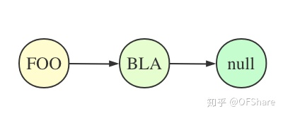

```text
有了上面这个图
${FOO} 自然表示“BLA”
${BLA} 自然表示null, 即空串
```

这就是cmake里的**if**语法, 我个人觉得所有的cmake语法里, 只有**if**是最难的, 其他的都相对简单,

如果你没有看懂**if**语法, 建议再看看, 思考一下.

------

- cmake里的**set**, 我们在讲cmake的if时, 是不是没有提及set, 因为它是不是一看就懂. 这里强调一点, 在cmake里, 你可以把所有的变量都看作**字符串 / 字符串列表**. 像这样, "xxxx" 或者 "xxx1;xxx2;xxx3"分号分割, 本质上都可以看作字符串.

```cmake
# 它类似与cpp里 std::string foo = "BLA";
set(FOO "BLA")
set(FOO BLA)

# var1是个字符串, var2是个字符串列表, 另外注意在message输出时,
# 最好加上双引号, 你可以对比一下 不加双引号和加双引号的输出对比.
# var1="x"
# var2="a;b;c;d;e"
set(var1 x)
set(var2 a b c d e)
message("var1=${var1}")
message("var2=${var2}")
```

- 其他的**message, find_file, get_filename_component,** 相信你见到这几个名字就大概知道它的用法了(见名知意). 它们分别是**输出信息**(类似cpp里的std::cout)**, 查找文件, 获得文件名的组件.**
- 现在再来看最初的那几段代码, 假设调用如下.

```cmake
# cmake 里的-D表示define, 即定义这个变量的值, 类似于string a = "xxx"
# cmake -DCMAKE_TOOLCHAIN_FILE="../../../android.toolchain.cmake" ..

if(CMAKE_TOOLCHAIN_FILE)
    set(LIBRARY_OUTPUT_PATH_ROOT ${CMAKE_BINARY_DIR} CACHE PATH "root for library output, set this to change where android libs are compiled to")
    # get absolute path, but get_filename_component ABSOLUTE only refer with source dir, so find_file here :(
    get_filename_component(CMAKE_TOOLCHAIN_FILE_NAME ${CMAKE_TOOLCHAIN_FILE} NAME)
    find_file(CMAKE_TOOLCHAIN_FILE ${CMAKE_TOOLCHAIN_FILE_NAME} PATHS ${CMAKE_SOURCE_DIR} NO_DEFAULT_PATH)
    message(STATUS "CMAKE_TOOLCHAIN_FILE = ${CMAKE_TOOLCHAIN_FILE}")
endif()
```

我们关注find_file那一行, 它的意思是要查找文件, 在PATHS ${CMAKE_SOURCE_DIR}指定的路径下查找一个名字叫${CMAKE_TOOLCHAIN_FILE_NAME}的文件, 如果找到 / 找不到, 都存到CMAKE_TOOLCHAIN_FILE这个变量里.

现在问题来了, 在那个指定的路径下, 其实是没有那个文件的, 所以它永远也找不到, 找不到应该用xxx-NOTFOUND标示, 但是这里find_file做了一件**很奇怪的事**, 它总是把CMAKE_TOOLCHAIN_FILE表示的"../../../android.toolchain.cmake"这个字符串, 表示的相对路径改为其绝对路径, 就算找不到. 

所以我们可以简单的这样写, 与原代码等价, 如同上面的分析, 在指定的路径下, 查找一个名字叫"not_exist_file"的文件, 尽管总是找不到, 在**find_file**里也总是把相对路径翻译为绝对路径. 这个现象我个人认为是一个(有趣的)bug.

```cmake
# 相对路径 / 绝对路径调用
# cmake -DCMAKE_TOOLCHAIN_FILE="../../../android.toolchain.cmake" ..
# cmake -DCMAKE_TOOLCHAIN_FILE="/root/android.toolchain.cmake" ..

if(CMAKE_TOOLCHAIN_FILE)                                                                                                                                                    
    find_file(CMAKE_TOOLCHAIN_FILE "not_exist_file" PATHS ${CMAKE_SOURCE_DIR} NO_DEFAULT_PATH)
    message(STATUS "CMAKE_TOOLCHAIN_FILE = ${CMAKE_TOOLCHAIN_FILE}")
endif()
return()
```

这个问题也有小伙伴在ncnn里提了issue [Confusion about CMAKE_TOOLCHAIN_FILE](https://link.zhihu.com/?target=https%3A//github.com/Tencent/ncnn/issues/2480), 里面也有我的回答. 

ps: 为什么我会这么关注这几行代码呢？(QAQ), 因为这是整个ncnn的CMakeLists.txt里最初的几行, 相当于一个东西的门面, 希望它尽量简洁明了且正确.

------

- 好了, 我们接着往下看.

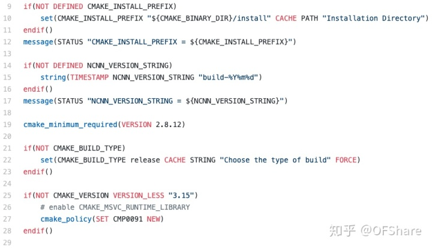

第9行定义了一个CMAKE_INSTALL_PREFIX变量, 看名字我们就知道表示安装(**make install**)的一个前缀路径.

第14行定义了一个NCNN_VERSION_STRING变量, 表示构建的时间戳.

第21行定义了一个CMAKE_BUILD_TYPE变量, 这个变量cmake系统本身会用到, 这里默认始终编译release版本. 简单的来说, release版本和debug版本的区别就是添加的**编译参数不同**而已.

第25行判断cmake的版本**不小于**"3.15"时, 做的一个操作.

这里有一个**${CMAKE_BINARY_DIR}**变量, 在cmake里我们总是用out-of-source build. 此时${CMAKE_BINARY_DIR} 从名字来看, 表示一个二进制目录, 即这个目录存放产生的各种二进制文件, 即我们的**build**目录.

```cmake
# 外部编译(out-of-source build) 而不是in-source build
# out-of-source build一般在源文件的顶层目录中 新建build目录
# 对于命令行可以  cd build
# 然后  cmake .. 即可
# 这样所有的临时文件 都会放在build目录下不会和source有任何的瓜噶。
```

我们接着看

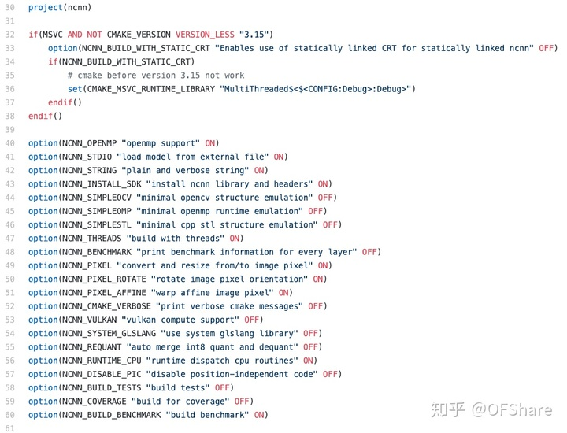

这里**option**定义了各种变量 ON / OFF

```cmake
# 表示NCNN_BUILD_BENCHMARK这个变量默认是ON的, "build benchmark"这段话介绍这个变量是做什么的
# 我们在编译的时候, 可以通过-NCNN_BUILD_BENCHMARK=OFF 进行控制.
option(NCNN_BUILD_BENCHMARK "build benchmark" ON)
```

我们接着看

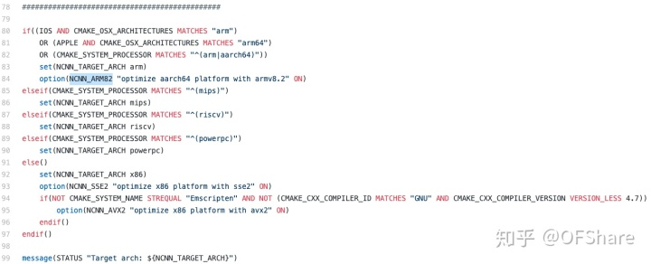

这里定义了**NCNN_TARGET_ARCH**这个变量, 从这里看出ncnn针对的**平台ARCHITECTURE**是arm(ios / apple / android ), mips, riscv, powerpc, x86. 其实重点是**arm和x86**下的优化

```text
# 该变量在macOS上设置为“Darwin”.
# 在Linux和Windows上，它分别计算为“Linux”和“Windows”.
${CMAKE_SYSTEM_NAME}

# 包含当前正在为其构建的CPU的名称
${CMAKE_SYSTEM_PROCESSOR}

# 如下类似的输出
-- cmake_system_processor: x86_64
-- Target arch: x86
```

[检测操作系统](https://link.zhihu.com/?target=https%3A//www.bookstack.cn/read/CMake-Cookbook/content-chapter2-2.1-chinese.md) 

[检测处理器体系结构](https://link.zhihu.com/?target=https%3A//www.bookstack.cn/read/CMake-Cookbook/content-chapter2-2.4-chinese.md) 

- 121行到167行是**NCNN_VULKAN**相关, 也就是ncnn里如何用GPU加速的方案(常见的有opencl / vulkan这些)

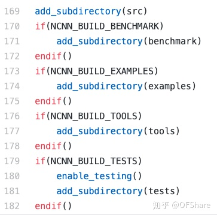

169行到182行, 分别到对应目录, 去该目录执行对应的CMakeLists.txt文件.

```cmake
# 表示跑到当前目录下的一个叫src的目录下, 接着执行src目录下的CMakeLists.txt
# 等执行完再回来, 有点类似dfs里的回溯.
add_subdirectory(src)
```

这样我们就看完了顶层的CMakeLists.txt. 画个图表示如下. 

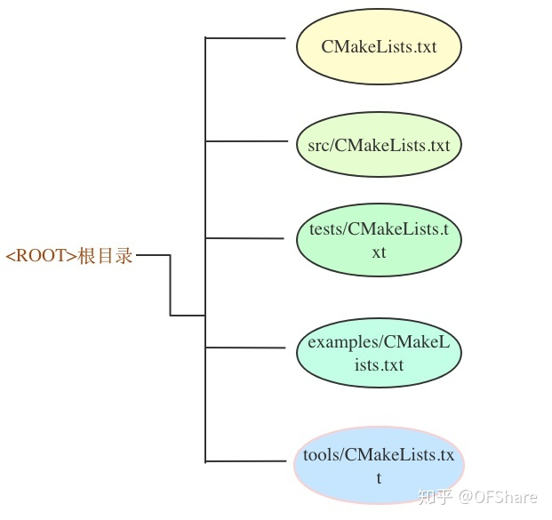

总的来说顶层的CMakeLists.txt就是定义了一些变量, 然后分别跑到不同目录下执行各自的CMakeLists.txt. 这里有一个cmake定义的变量的作用域的问题, 简单的来说cmake里变量的作用域和cpp里的是类似的. 我们在顶层CMakeLists.txt里定义的变量可以看作是全局的, 所以在其他的CMakeLists.txt文件里也能访问(即可以使用)的到.

------


- 接下来我们重点分析**src/CMakeLists.txt**, src表示source, 这个是编译整个ncnn源码(*.cpp)的配置文件.

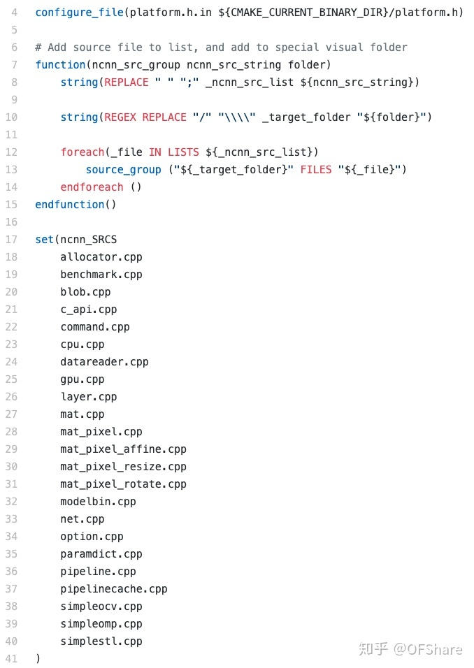

我们先来看**configure_file**

```cmake
# configure_file 配置文件，让你可以在代码文件中使用CMake中定义的的变量
# 然后把platform.h.in ---> 放到${CMAKE_CURRENT_BINARY_DIR}/platform.h里
configure_file(platform.h.in ${CMAKE_CURRENT_BINARY_DIR}/platform.h)

#cmakedefine01 NCNN_VULKAN 这句会翻译成下面的样子
#define NCNN_VULKAN 0 或者 #define NCNN_VULKAN 1

#注意：@@之间的名称要与cmakedefine后的变量名一样
#cmakedefine NCNN_VERSION_STRING "@NCNN_VERSION_STRING@" 这句会翻译成下面的样子
#define NCNN_VERSION_STRING "build-20201229"
```

**${CMAKE_CURRENT_BINARY_DIR}** 当前正在处理的二进制目录路径。build目录完全路径，当前cmake正在处理。**add_subdirectory()**添加每个目录，这些目录会在build目录树中创建二进制目录，并且在处理时，设置该变量。

7到15行定义了一个函数, cmake里函数的定义, Emmm有很多规则, 但大多不难. 建议看看这个文章 [learning-cmake-3-function-macro](https://link.zhihu.com/?target=https%3A//elloop.github.io/tools/2016-04-11/learning-cmake-3-function-macro) 17到41行定义了一个字符串列表变量**ncnn_SRCS,** 从名字来看就是ncnn里的src源文件, 后面我们会编译它

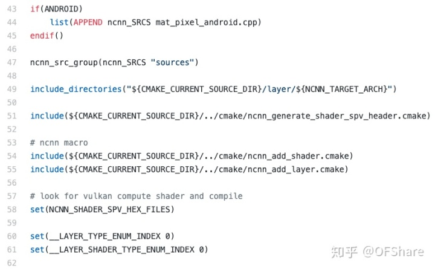

- 第19行**include_directories**表示我们在编译源文件时, 查找头文件时(如代码里写了一句#include "mat.h"), 可以去哪儿查找的路径.
- **${CMAKE_CURRENT_SOURCE_DIR}**表示当前正在处理源文件的目录, 我们当前在src/CMakeLists.txt, 所以也就是src目录.
- **include** 和cpp里的#include 头文件类似, 第51, 54, 55行, 把这些.cmake文件包含进来. 我们重点看**ncnn_add_layer.cmake**, 查看这个文件, 发现里面就是定义了一个宏, 名字叫做ncnn_add_layer.

```text
macro(ncnn_add_layer class)
  # ...
endmacro()
```

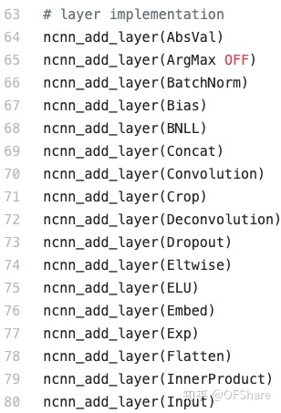

图没有截全, 算一下, 大概有141 - 64 + 1 = 78, 所以也就是ncnn里实现了**78个layer(**在目前这一版**).**

- 接下来我们重点讨论**ncnn_add_layer**这个宏, 假设这样调用这个宏, 且${NCNN_TARGET_ARCH}为arm(即在arm平台下, 因为我们知道ncnn最初极致优化的就是针对arm, 里面我们讨论的东西也会多些), **ncnn_add_layer(AbsVal)**

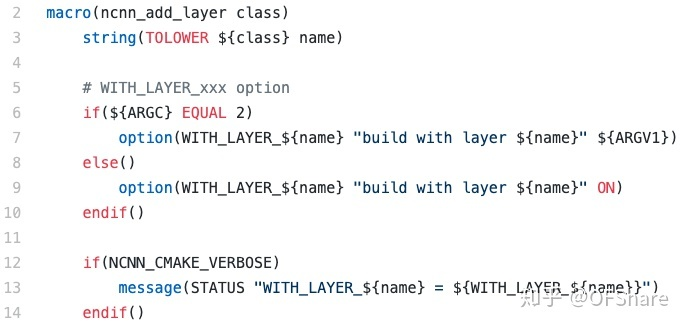

记住宏传进去的都是字符串, 前文也讲了, 在cmake里所有的变量都可以当作字符串看待.

| ARGC | 传入的实际参数的个数，也就是调用函数 / 宏传入的参数个数, 注意是参数的个数, 函数 / 宏名不算在内 |
| ---- | ------------------------------------------------------------ |
|      |                                                              |

所以这里**${ARGC}**为1, 执行完3到14行后, 各个变量如下图表示(注意大小写)

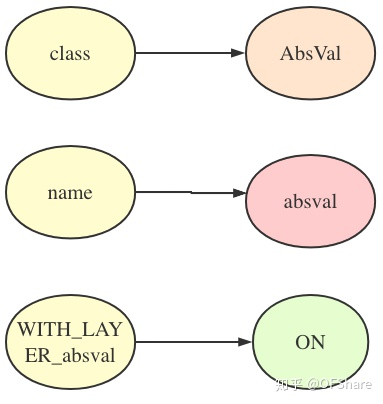

我们接着往下看

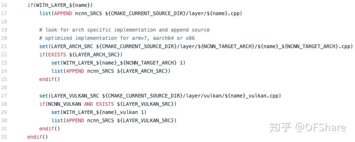

第17行, 首先添加, **src/layer/absval.cpp**这个文件到ncnn_SRCS字符串列表中

第21行, 是这个layer(op)在不同架构下的优化实现, 对于absval有: src/layer/arm/absval_arm.cpp

第27行, 是这个layer(op)在vulkan下的实现: src/layer/vulkan/absval_vulkan.cpp

其中第17行总是true, 第21行, 第27行得看在目标平台下是否有优化, 没有的话相当于只有朴素版本的实现(naive实现). 注意它们都是放到**ncnn_SRCS**这个字符串列表里(分别对应第24, 30行), 最后统一编译.

执行完16到32行后, 增加了如下几个变量.

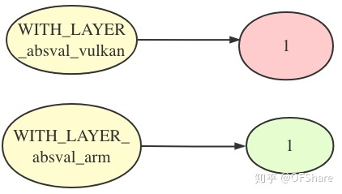

我们接着往下看

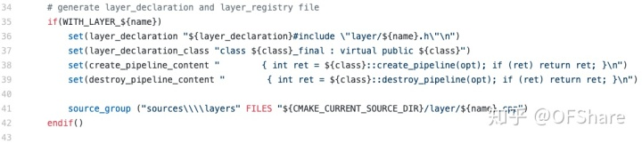

34到42行, 分别定义了4个变量, layer_declaration负责头文件, layer_declaration*class负责类, create_pipeline_content负责create_pipeline, destroy_pipeline_content负责destroy_pipeline.*

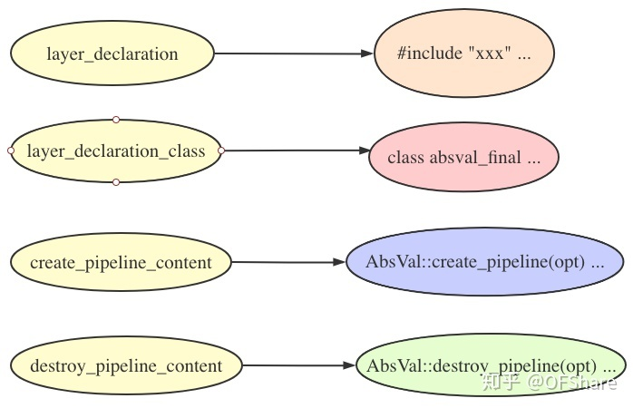

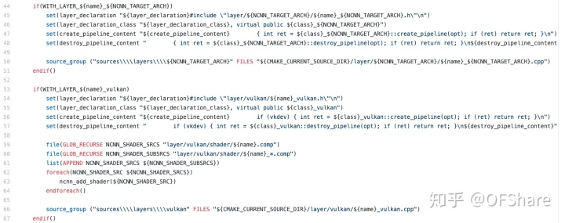

第44到67行, 分别对上面提到的变量添加arm平台下的优化, 以及vulkan优化. 不要觉得这里很复杂, 其实就是定义了一些字符串而已, 最后它们会像这个样子, 在自动生成的build/src/layer_declaration.h这个文件里, build目录是你out-of-source build时的目录

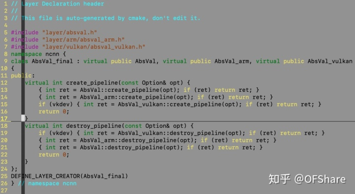

从这个自动生成的头文件, 我们来一窥ncnn layer(op)的架构设计, 如图表示

```cmake
# 注意这里是 vulkan + armeabi-v7a
cmake -DCMAKE_TOOLCHAIN_FILE="$androidNdk16/build/cmake/android.toolchain.cmake" \
                              -DANDROID_ABI="armeabi-v7a" -DANDROID_ARM_NEON=ON \
                              -DANDROID_PLATFORM=android-24 -DNCNN_VULKAN=ON ..
```

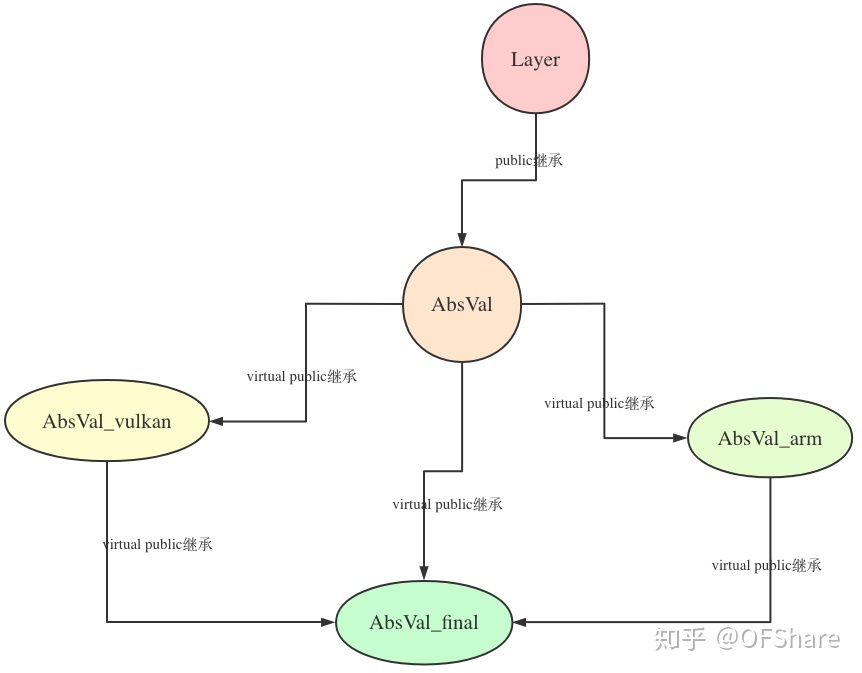

```cmake
# 注意这里是 vulkan + arm64-v8a
cmake -DCMAKE_TOOLCHAIN_FILE="$androidNdk16/build/cmake/android.toolchain.cmake" \
                             -DANDROID_ABI="arm64-v8a" -DANDROID_ARM_NEON=ON \
                             -DANDROID_PLATFORM=android-24 -DNCNN_VULKAN=ON ..
```

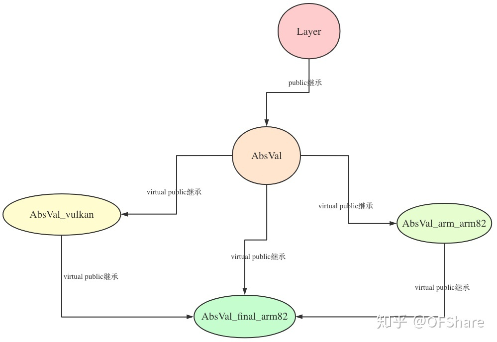

```cpp
// 基类Layer, 统一封装了一些数据成员和函数, virtual函数有默认实现, 也可以等着它的继承者们重新实现 . 
// 主要有一下几个重要的函数: 
// load_param, 负责num_output， activation_type这些的设置
// load_model, 负责weight_data, bias_data这些的设置 
// create_pipeline, 负责如将weight_data 这些进行pack, 更好的内存排布(访存), 有利于使用指令集intrinsic
// destroy_pipeline, 负责释放一些资源
// forward, 负责前向计算
virtual int load_param(const ParamDict& pd);
virtual int load_model(const ModelBin& mb);

virtual int create_pipeline(const Option& opt);
virtual int destroy_pipeline(const Option& opt);

virtual int forward(const Mat& bottom_blob, Mat& top_blob, const Option& opt) const;
virtual int forward_inplace(Mat& bottom_top_blob, const Option& opt) const;

virtual int forward(const VkImageMat& bottom_blob, VkImageMat& top_blob, VkCompute& cmd, const Option& opt) const;
virtual int forward_inplace(VkMat& bottom_top_blob, VkCompute& cmd, const Option& opt) const;
```

这里有个经常出现在深度学习推理引擎的一个词**blob**, 这个词貌似最初在caffe的设计里出现, 我们可以翻译为气泡, 

int forward(const Mat& bottom_blob, Mat& top_blob,const Option& opt), 对于这个函数声明, 我们大概就能推出这个函数在做什么: 将底部的气泡, 上升到顶部去. 也就是将bottom_blob, 经过一些操作, 然后存放到top_blob里去. 是不是很像一个气泡上升的过程.

const VkImageMat& bottom_blob, 这里有**VK**标示, 表示这个forward使用GPU实现的, VK可以看作Vulkan的缩写.

我们接着看AbsVal类, 因为这个op太过简单, 所以你会发现它的里面空空然, 这时你可以看一下其他类, 如InnerProduct.

这里整体总结一下, AbsVal看作是一个naive的实现, 即朴素版本, AbsVal_arm / AbsVal_arm_arm82是针对arm端的优化实现, AbsVal_vulkan是针对GPU端的优化实现. 这里举例用的是AbsVal, 你可以把它换成其他的如InnerProduct, 都是这样设计的. 另外AbsVal 这个(以及其它)Layer, 我们也叫op(算子), 所以你会经常听到某某op arm端的优化.

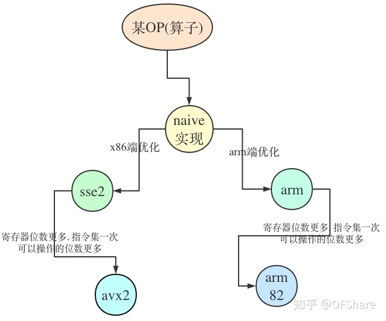

另外这个Layer的整体架构设计, 用到了virtual public继承, 即虚继承, 主要是解决多继承的问题.

我们接着看

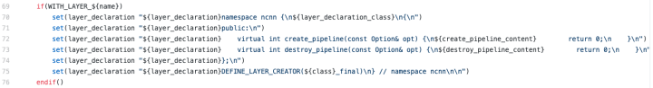

这里统一由layer_declaration闭包开头的那些字符串.

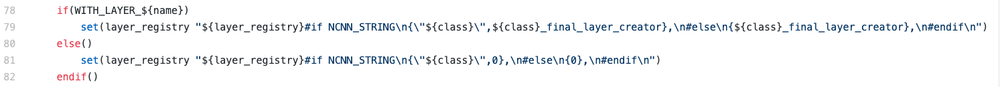

这里最后会生成这样, 在build/src/layer_registry.h里(其他的build/src/layer_registry_arm82.h, build/src/layer_registry_avx2.h后面分析, 不过看名字后缀大概也能猜出来是做什么的吧)

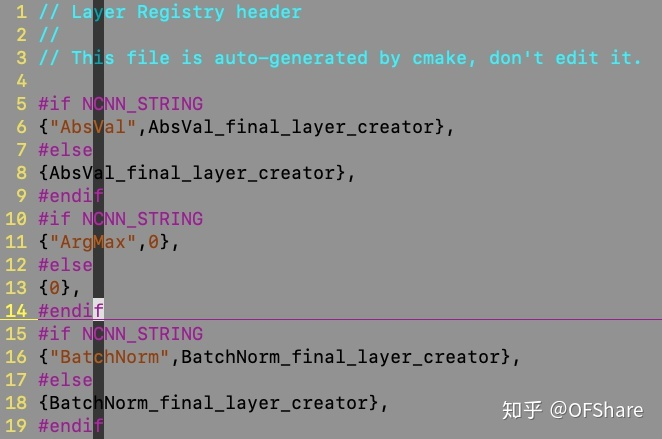

我们接着看

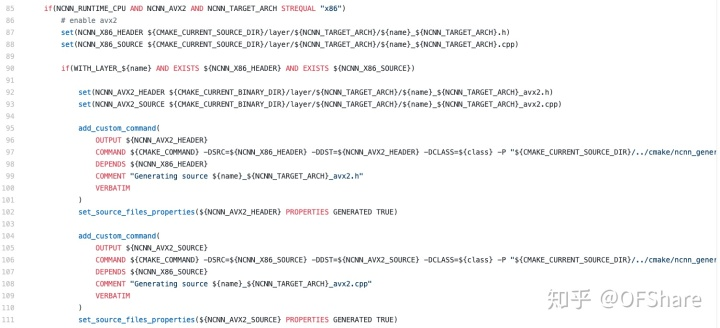

这里没截全, 应该是85行到155行一起看, 从第一个if语句我们就知道, 这里是针对x86平台下, NCNN_AVX2 指令集的优化.

作为对比, 我们看下157到223行, 这里同样没截全, 同理从第一个if语句我们就知道, 这里是针对arm64平台下, NCNN_ARM82 指令集的优化.

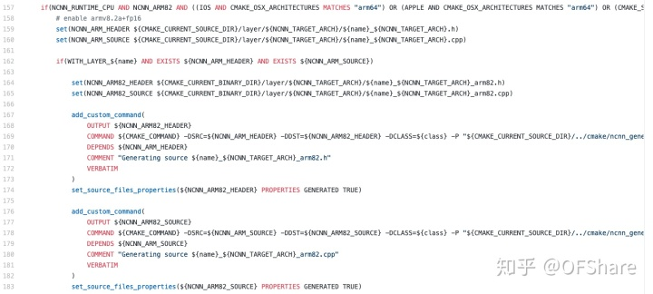

这里多了两个变量, 如下图所示

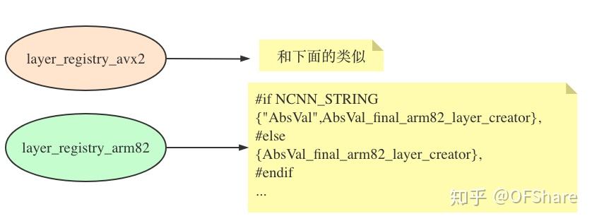

我们接着看最后几行

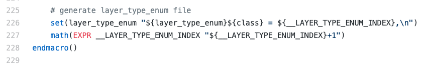

这里多了一个变量, 如下图所示

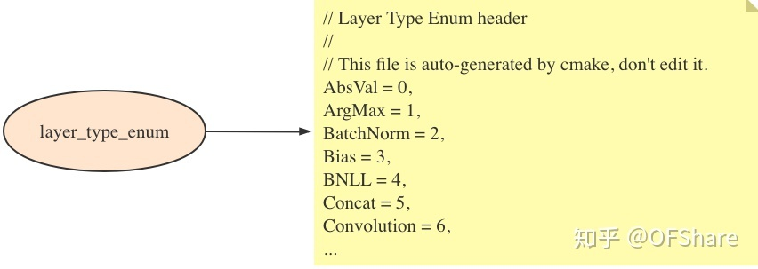

到这里我们终于讲完ncnn_add_layer这个宏. 这里再补充一下cmake 函数 / 宏的作用域的问题.

```cmake
# 会输出layer_declaration: /abc/def
macro(ncnn_add_layer class)
  set(layer_declaration "${layer_declaration}/${class}")                                                                                                                    
endmacro()
ncnn_add_layer("abc")
ncnn_add_layer("def")
message("layer_declaration: ${layer_declaration}")
return()
```

在函数内部定义和使用的变量, 只在当前函数及函数内部调用的子函数可见.

类似于 C 语言中的宏, 就是用于代码展开. 不会创建新的作用域, 是在当前作用域展示并执行的.

[宏 - Modern CMake](https://link.zhihu.com/?target=https%3A//cmake.biofan.org/macros.html) 

[作用域 - Modern CMake](https://link.zhihu.com/?target=https%3A//cmake.biofan.org/scopes.html) 

------

我们接着看

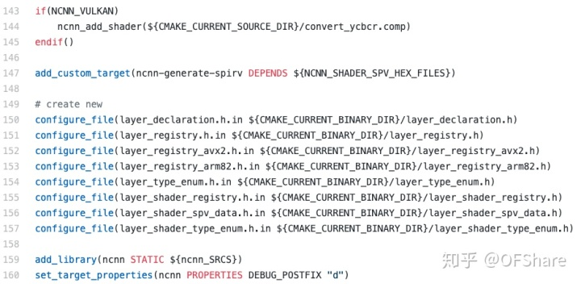

150到157行就是把我们在ncnn_add_laye这个宏里定义的各个变量的值放到文件里去.

[http://layer_declaration.h.in](https://link.zhihu.com/?target=http%3A//layer_declaration.h.in) 对应layer_declaration这个cmake变量, 同理[http://layer_registry_arm82.h.in](https://link.zhihu.com/?target=http%3A//layer_registry_arm82.h.in)对应layer_registry_arm82这个cmake变量, 以此类推.

第159行, 我们终于编译源文件(**${ncnn_SRCS}**)了, 生成静态库**libncnn.a**, 到这里我们就基本讲完了所有知识点了.

后面剩下的我就一笔带过了, 想想*我们在编译****${ncnn_\*SRCS}**这些源文件时, 肯定还依赖其它文件, 所以后面就是找一些库, 添加编译时的参数这些, 涉及的cmake 命令有, **find_package, target_compile_options, target_compile_definitions, set_target_properties, add_dependencies, target_link_libraries, install.**

# 参考文献 #