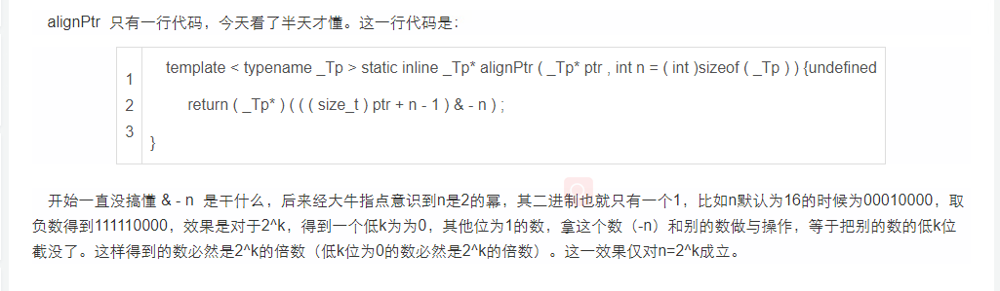

## 1. 读完本章你可以学到的知识点

- 什么是内存对齐的分配
- 内存对齐分配如何在ncnn里实现: ncnn::fastMalloc, ncnn::fastFree
- 完整可运行简短代码见文末

## 2. 什么是内存对齐的分配方式？

-  我们知道在任何程序中, 分配的内存肯定是有一个地址的. 现在假设分配了一个对象a, 它在内存的地址为x(指初始地址, 也就是这块内存的头地址, x看成一个整数), x + 1为下一个字节的地址, x + 2为下下一个字节的地址, 依次类推. 
- 一般来说内存对齐我们是这样描述的, 内存按8字节对齐的, 内存按16字节对齐的等等, 一句话解释就是: 我们分配的这个地址(转为整数) addr % p == 0(p等于8 / 16 / 等等)
- addr % p == 0, (addr + 2 * p) % p == 0, ..., (addr + k * p) % p == 0
- 因为随意分配的地址可能addr % p != 0, 所以我们一般的做法是先分配一个比申请空间稍大的空间, 然后将这个头地址, 往前移动几个字节, 使得新的addr满足 % p == 0

```cpp
 // 这里我们假设分配的内存空间是16字节对齐的, 下面的代码分配了6 * 4bytes = 24bytes的空间
 // 假设分配的这24个字节的空间的头地址为x
 // 当我们说分配的内存大小是16字节对齐的, 也就是说x % 16 == 0, 即x是16的整数倍
 // 根据简单的数学知识, x + 1, x + 2, ..., x + 15对16取模都是不等于0的
 // (x + 1) % 16 != 0, (x + 2) % 16 != 0, ... (x + 15) % 16 != 0
 int *p = new int[6];

 // 输出地址
 size_t x = (size_t)p;
 std::cout << x << std::endl;
 assert(x % 16 == 0);
```

- stackoverflow上类似的问题 [what-is-meant-by-memory-is-8-bytes-aligned](https://link.zhihu.com/?target=https%3A//stackoverflow.com/questions/2846914/what-is-meant-by-memory-is-8-bytes-aligned)


**简单Demo**
 将 **allocator.h** 中的 **alignPtr** 和 **fastMalloc** 两个函数提取出来，做一个简单的调用Demo，具体如下。


Demo & 问题

如果对上述问题感兴趣，你可以继续往下看了：）

### 3 分析

Step n 和 第2部分代码中的是一一对应的哦！

#### 3.1 Step1 : 分配内存


```cpp
unsigned char* udata = (unsigned char*)malloc(size + sizeof(void*) + MALLOC_ALIGN);
```


内存分配

- **问题1：为什么要多分配 sizeof(void \*) 大小的内存?（图中8B部分）**
   因为设计者期望保存对其前的内存指针。（存放原始的头指针 `adata[-1] = udata`）
- **问题2：为什么要多分配 MALLOC_ALIGN 大小的内存？（图中16B部分）**
   因为对齐单位是16(MALLOC_ALIGN)，而对其后，数据指针不一定指在分配的内存的起始位置，为了保证对其后仍然有100B目标内存可用，要+16。

#### 3.2 Step2 : 对其方法调用分析


```cpp
unsigned char** adata = alignPtr((unsigned char**)udata + 1, MALLOC_ALIGN);
```


关于udata+1

- **问题3：为什么要将udata转换成(unsigned char \**)？**
   1）现在udata是char *类型，假设指向的内存是`udata = 0x0000000102803030`，那么`udata+1 = 0x0000000102803031`, 而`(unsigned char **)udata + 1 = 0x0000000102803038`，我们期望在内存地址的开始初留出一个存放指针的空间(8B)，所以选择后者。
   2）我们要使用留出的8B的空间**存储对齐前的内存地址**，而对齐前的指针的类型（在这个函数体中）是**unsigned char \***，那么将内存看做一个**unsigned char \*** 的数组的指针，再以此存储我们的对齐前内存地址（**unsigned char \*类型**），多么的优雅，多么的符合概念啊！

- udata是一个指针变量, 依旧是一个变量, 这个变量存的数值为size_t x = (size_t)udata, 后面我们统一用x表示

```cpp
template<typename _Tp>
static inline _Tp* alignPtr(_Tp* ptr, int n = (int)sizeof(_Tp)) {
  return (_Tp*)(((size_t)ptr + n - 1) & -n);
}
// 首先我们需要知道_Tp是什么类型, 当然为unsigned char*
// 我们先看(size_t)ptr, 它等于x + 8, 为一个整数另y = x + 8

// (y + n - 1) & (-n), 当n是16时, 这里就表示寻找 大于等于y的且是16的整数倍的最小整数。

// 然后我们找到了这个整数, 也就是地址, 这个地址 % 16是等于0的, 也就我们说的内存对于16是对齐的.

// 如果还有点疑惑, 请看下面这个类比
int *a = new int(101);
std::cout << (size_t)(int*)a << std::endl;
std::cout << (size_t)(int**)a << std::endl;
std::cout << (size_t)(char*)a << std::endl;
std::cout << (size_t)(float*)a << std::endl;
std::cout << (size_t)(char**)a << std::endl;
std::cout << (size_t)(float**)a << std::endl;

// 你会发现上面的输出都是一样的, 这当然一样, 因为他们指的都是同一个地址
// 哪里会不同, 当你对他们进行指针加减时, 同样都是+1, 有的指针一下走4个字节, 有的指针一下走1个字节
```


#### Step3 : 实现偏移


```cpp
template<typename _Tp> static inline _Tp* alignPtr(_Tp* ptr, int n=(int)sizeof(_Tp)) {
    return (_Tp*)(((size_t)ptr + n-1) & -n);
}
```


实现地址偏移

- **问题4：_Tp是什么类型？**
   unsigned char *
- **问题5：& -n 如何理解？**
   1）**目的**：n = 16 (B)，这边的目的是让内存指向的地址为16的整数倍
   2）**目的达成分析**: 16的二进制值是 0001 0000，-16的二进制值是16二进制值的各位取反(...0001 1111)，再加1(...1111 0000)。如果一个地址是64位的，这么操作后就是0xffff ffff ffff fff0，与目标数字按位与后，自然就是一个能被16整除的数字了。
   3）**举一反三**: 不仅16，2^n的数字都可以这么操作哦
- **问题6：什么是&，什么是按位与**
   ……这个……不解释……

ps：




#### Step4 : 设置未对齐前的内存地址


```undefined
adata[-1] = udata;
```
`adata[-1]` 和python是不一样的，是指改数组头指针的前一个，其实是越界访问。如图所示，存储的位置是绿色部分。


设置对齐前内存地址

- **问题7：为什么要设置？**
   宝贝儿，因为内存释放的时候要用~ 代码如下，不解释咯！


```cpp
static inline void fastFree(void* ptr) {
    if (ptr) {
        unsigned char* udata = ((unsigned char**)ptr)[-1];
        free(udata);
    }
}
```

#### Step5 : 返回用户关注的内存地址


```kotlin
return adata;
```


image.png


用户拿到的内存指针指向的是数据的开始位置哦！

- **问题8：为啥要内存对齐，而且为了对齐还浪费了部分内存？**
   简单来说，为了提高运算速度，更深层的原因比较复杂，不赘述咯。


- 到这里我们我们就讲完了, 内存按16字节对齐分配是如何在ncnn里实现的
- 最后总结一下就是, fastMalloc分配的空间, 返回的地址是最开始分配的地址x, 然后往前走了一些字节, 这个返回的地址addre % 16 == 0, 最开始分配的地址x, 存放在addre[-1]中

```cpp
// 有了前面的知识, 释放内存的代码就很显然了
// 把我们原来保存的头地址拿出来, free掉即可.
static inline void fastFree(void* ptr) {
  if (ptr) {
    unsigned char* udata = ((unsigned char**)ptr)[-1];
    free(udata);
  }
}
```

## 4. Reference:

- [https://www.jianshu.com/p/9c58dd414e5f](https://link.zhihu.com/?target=https%3A//www.jianshu.com/p/9c58dd414e5f) 
- [What's the purpose of align C++ pointer position](https://link.zhihu.com/?target=https%3A//stackoverflow.com/questions/27745324/whats-the-purpose-of-align-c-pointer-position) 

## 5. 完整代码

```cpp
/*
 * Author        : OFShare
 * E-mail        : OFShare@outlook.com
 * Created Time  : 2020-12-05 23:59:53 PM
 * File Name     : main.cc
 */

#include <bits/stdc++.h>

#define ll long long
void debug() {
#ifdef Acui
  freopen("data.in", "r", stdin);
  freopen("data.out", "w", stdout);
#endif
}

using namespace std;

// the alignment of all the allocated buffers
#define MALLOC_ALIGN 16

// Aligns a pointer to the specified number of bytes
// ptr Aligned pointer
// n Alignment size that must be a power of two
template<typename _Tp>
static inline _Tp* alignPtr(_Tp* ptr, int n = (int)sizeof(_Tp)) {
  return (_Tp*)(((size_t)ptr + n - 1) & -n);
}

// Aligns a buffer size to the specified number of bytes
// The function returns the minimum number that is greater or equal to sz and is divisible by n
// sz Buffer size to align
// n Alignment size that must be a power of two
static inline size_t alignSize(size_t sz, int n) {
  return (sz + n - 1) & -n;
}

static inline void* fastMalloc(size_t size) {
  unsigned char* udata = (unsigned char*)malloc(size + sizeof(void*) + MALLOC_ALIGN);
  if (!udata)
    return 0;
  unsigned char** adata = alignPtr((unsigned char**)udata + 1, MALLOC_ALIGN);
  adata[-1] = udata;
  return adata;
}

static inline void fastFree(void* ptr) {
  if (ptr) {
    unsigned char* udata = ((unsigned char**)ptr)[-1];
    free(udata);
  }
}

int main() {
  int *a = new int(5);
  std::cout << "a: " << a << std::endl;
  std::cout << "(size_t)a: " << (size_t)a << std::endl;
  std::cout << "(ll)a: " << (ll)a << std::endl;

  size_t totalsize = alignSize(12, 4);
  size_t totalsize2 = alignSize(17, 4);
  std::cout << "totalsize: " << totalsize << std::endl;
  std::cout << "totalsize: " << totalsize2 << std::endl;
  void* data = fastMalloc(totalsize);
  fastFree(data);
  std::cout << "data:         " << data << std::endl;
  std::cout << "(void*)data:  " << (void*)data << std::endl;
  std::cout << "(int*)data:   " << (int*)data << std::endl;
  std::cout << "(float*)data: " << (float*)data << std::endl;
  return 0;
}
```

# 参考文献 #

https://zhuanlan.zhihu.com/p/335774042

https://zhuanlan.zhihu.com/p/30007037

https://www.jianshu.com/p/9c58dd414e5f