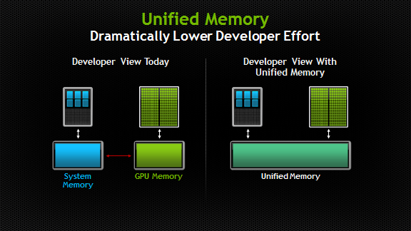

## 什么是unified memory？

在CUDA 6中，NVIDIA引入了CUDA历史上一个最重要的一个编程模型改进之一，unified memory（以下简称UM）。在今天典型的PC上，CPU与GPU的内存是物理上独立的，通过PCI-E总线进行连接通信。实际上，在CUDA 6.0之前，程序员必须在编程期间很清楚这一点，并且反应在代码中。必须在CPU和GPU两端都进行内存分配，并不断地进行手动copy，来保证两端的内存一致。

Unified memory在程序员的视角中，维护了一个统一的内存池，在CPU与GPU中共享。使用了单一指针进行托管内存，由系统来自动地进行内存迁移。

OK, talk is cheap, show me the code.

首先以排序文件中的数据来举例，简单对比一下CPU代码（左）与带有UM的CUDA代码（右）：

```c
void sortfile(FILE *fp, int N)                       void sortfile(FILE *fp, int N)                   
{                                                    {
    char *data;                                          char *data; 
    data = (char*)malloc(N);                             cudaMallocManaged(data, N);

    fread(data, 1, N, fp);                               fread(data, 1, N, fp);

    qsort(data, N, 1, compare);                          qsort<<<...>>>(data, N, 1, compare);
                                                         cudaDeviceSynchronize();

    usedata(data);                                       usedata(data);
    free(data);                                          free(data);
}
```

可以清晰地看到，两段代码惊人地相似。

仅有的不同在于:

- GPU版本

- - 使用cudaMallocManaged来分配内存，而非malloc
  - 由于CPU与GPU间是异步执行，因此在launch kernel后需要调用cudaDeviceSynchronize进行同步。

在CUDA 6.0之前，要实现以上的功能，可能需要以下的代码：

```c
void sortfile(FILE *fp, int N)    
{
    char *h_data, *d_data;                                        
    h_data= (char*)malloc(N); 
    cudaMalloc(&d_data, N);

    fread(h_data, 1, N, fp);  

    cudaMemcpy(d_data, h_data, N, cudaMemcpyHostToDevice);

    qsort<<<...>>>(data, N, 1, compare);

    cudaMemcpy(h_data, h_data, N, cudaMemcpyDeviceToHost);  //不需要手动进行同步，该函数内部会在传输数据前进行同步
    
    usedata(data);
    free(data); 
}
```

到目前为止，可以看出主要有以下的优势：

- 简化了代码编写和内存模型

- - 可以在CPU端和GPU端共用一个指针，不用单独各自分配空间。方便管理，减少了代码量。
  - 语言结合更紧密，减少与兼容语言的语法差异。
  - 更方便的代码迁移。

## Deep Copy

等等。。。从之前的描述来看，好像也并没有减少很多代码量。。那我们接下来考虑一个十分常见的情况，。当我们拥有一个这样的结构体：

```c
struct dataElem {
    int data1;
    int data2;
    char *text;
}
```

我们可能要进行这样的处理：

```c
void launch(dataElem *elem) 
{
    dataElem *d_elem;
    char *d_text;

    int textlen = strlen(elem->text);

    // 在GPU端为g_elem分配空间
    cudaMalloc(&d_elem, sizeof(dataElem));
    cudaMalloc(&d_text, textlen);
    // 将数据拷贝到CPU端
    cudaMemcpy(d_elem, elem, sizeof(dataElem));
    cudaMemcpy(d_text, elem->text, textlen);
    // 根据gpu端分配的新text空间，更新gpu端的text指针
    cudaMemcpy(&(d_elem->text), &d_text, sizeof(g_text));

    // 最终CPU和GPU端拥有不同的elem的拷贝
    kernel<<< ... >>>(g_elem);
}
```

但在CUDA 6.0后，由于UM的引用，可以这样：

```c
void launch(dataElem *elem) 
{  
    kernel<<< ... >>>(elem); 
} 
```

很明显，deep copy的情况下，UM极大地减少了代码量。在UM出现之前，由于两端地址空间不同步，需要进行多次的手动分配和拷贝内存。尤其对于非cuda程序员，十分不习惯，而且十分繁琐。当实际数据结构更加复杂时，两者差距会更加显著。

而对于常见数据结构--链表，本质上是有指针组成的嵌套的数据结构，在没有UM的情况下， CPU与GPU间共享链表非常难以处理，内存空间的传递很复杂。

这时使用UM，可以有以下的优势：

- 在CPU和GPU间直接传递链表元素。
- 在CPU或GPU任一一端来修改链表元素。
- 避免了复杂的同步问题。

不过实际上在UM出现前，可以Zero-copy memory（pinned host memory）来解决这个复杂的问题。但即使这样，UM的存在仍有意义，因为pinned host memory的数据获取受制于PCI-express的性能，使用UM可以获得更好的性能。对于这一问题，本文暂时不进行深入讨论。

## Unified Memory with C+

由于现代C++中尽量避免显式调用malloc等内存分配函数，而使用new来进行wrap。因此可以通过override new函数来使用UM。

```c
class Managed {
    void *operator new(size_t len) 
   {
        void *ptr;
         cudaMallocManaged(&ptr, len);
         return ptr;
   }
    void operator delete(void *ptr) 
   {
        cudaFree(ptr);
   }
};
```

通过继承该class，从而让custom C++ class实现UM的pass-by-reference。而通过在constructor中，调用cudaMallocManaged来实现UM下的pass-by-value。下面以一个string class来说明：

```c
// 通过继承来实现 pass-by-reference
class String : public Managed {
    int length;
    char *data;
    // 通过copy constructor实现pass-by-value
    String (const String &s) {
        length = s.length;
        cudaMallocManaged(&data, length);
        memcpy(data, s.data, length);
    }
};
```

## Unified Memory or Unified Virtual Addressing?

实际上在CUDA 4.0就开始支持Unified Virtual Addressing了，请不要与Unified Memory混淆。尽管UM是依赖于UVA的，但实际上他们并不是一回事。要讲清楚这一个问题，首先我们要知道UVA所关心的内存类型

- device memory (可能在不同的gpu上）
- on-chip shared memory
- host memory 

而对于SM中的local memory，register等线程相关的内存，很明显不在UVA所关注的范围。因此UVA实际上是为这些内存提供统一的地址空间，为此UVA启用了zero-copy技术，在CPU端分配内存，将CUDA VA映射上去，通过PCI-E进行每个操作。而且注意，UVA永远不会为你进行内存迁移。

关于两者之间更深入的对比，和性能分析，超出了本文讨论范围，也许会在后续的文章中继续讨论。

## 疑问：

- 问：UM会消除System Memory和GPU Memory之间的拷贝么？

- - 答：不会，只是这部分copy工作交给CUDA在runtime期间执行，只是对程序员透明而已。memory copy的overhead依然存在，还有race conditions的问题依然需要考虑，从而确保GPU与CPU端的数据一致。简单的说，如果你手动管理内存能力优秀，UM不可能为你带来更好的性能，只是减少你的工作量。

- 问：既然并没有消除数据间的拷贝，看起来这只是compiler time的事情，为什么仍需要算力3.0以上？难道是为了骗大家买卡么？

- - wait....到目前为止，实际上我们省略了很多实现细节。因为原则上不可能消除拷贝，无法在compile期间获知所有消息。而且重要的一点，在Pascal以后的GPU架构中，提供了49-bit的虚拟内存寻址，和按需页迁移的功能。49位寻址长度足够GPU来cover整个sytem memory和所有的GPUmemory。而页迁移引擎通过内存将任意的可寻址范围内的内存迁移到GPU内存中，来使得GPU线程可以访问non-resident memory。
  - 简言之，新架构的卡物理上允许GPU访问”超额“的内存，不用通过修改程序代码，就使得GPU可以处理out-of-core运算（也就是待处理数据超过本地物理内存的运算）。
  - 而且在Pascal和Volta上甚至支持系统范围的原子内存操作，可以跨越多个GPU，在multi-GPU下，可以极大地简化代码复杂度。
  - 同时，对于数据分散的程序，按需页迁移功能可以通过page fault更小粒度地加载内存，而非加载整个内存，节约更多数据迁移的成本。（其实CPU很早就有类似的事情，原理很相似。）


# 参考文献 #

https://zhuanlan.zhihu.com/p/82651065