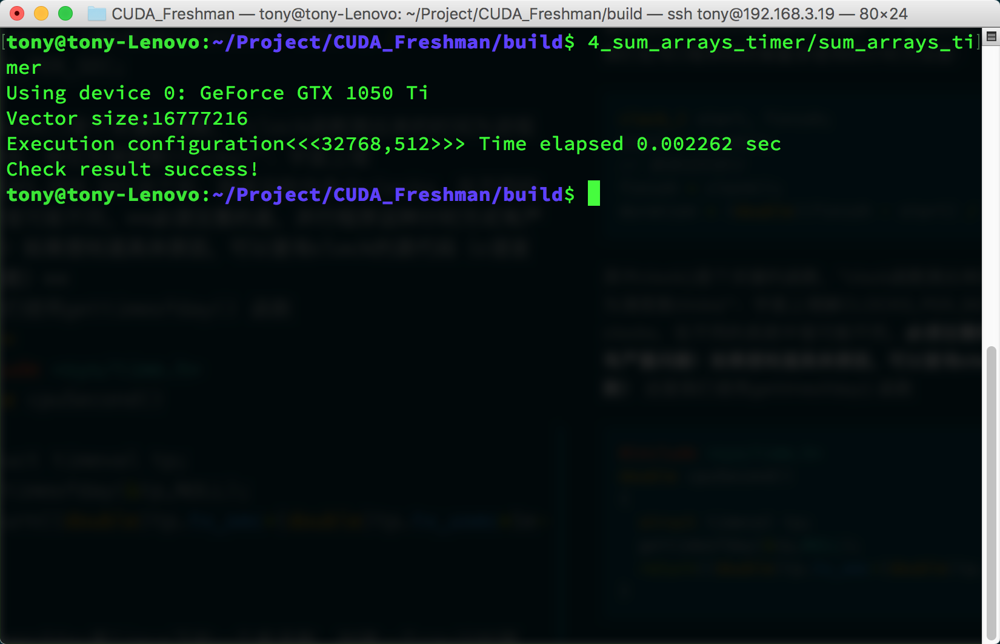
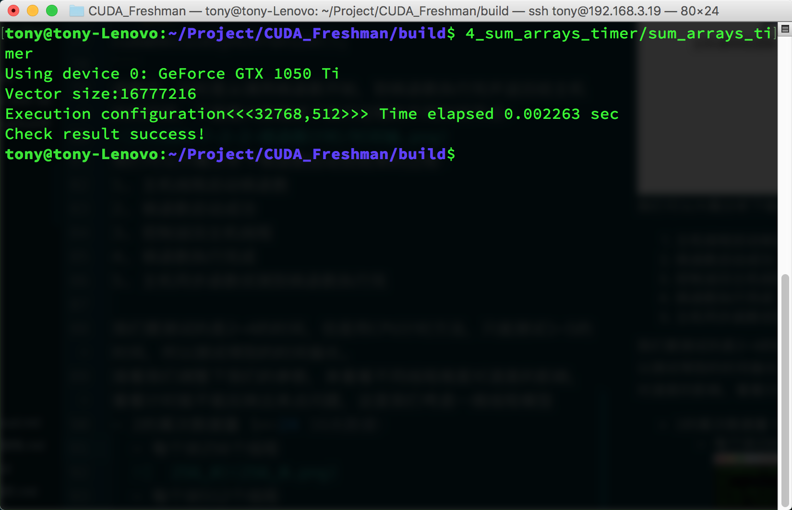
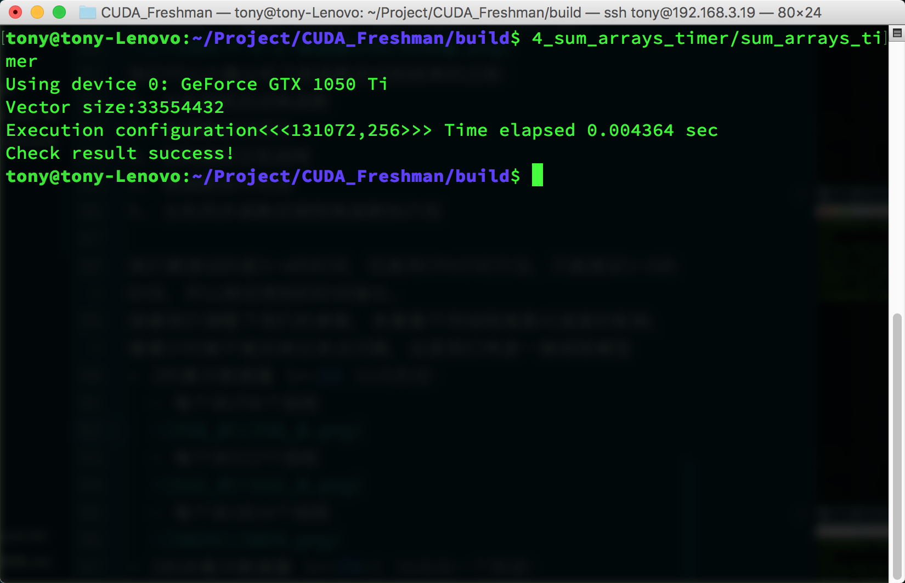
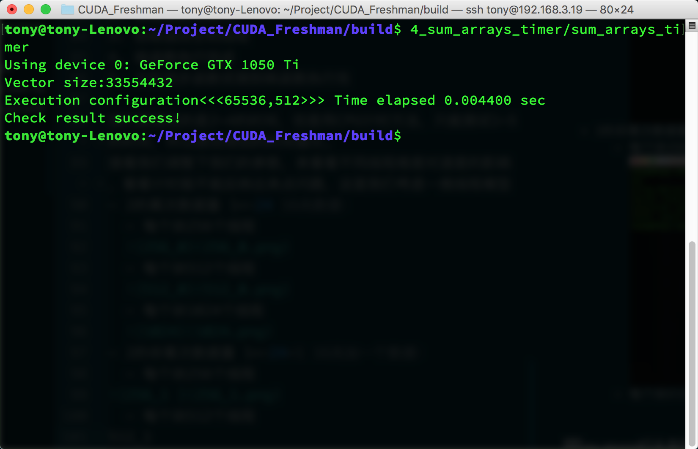
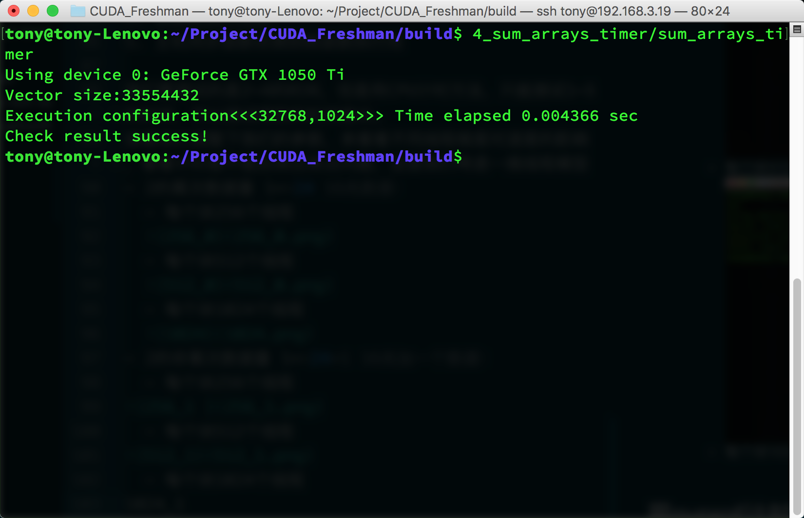
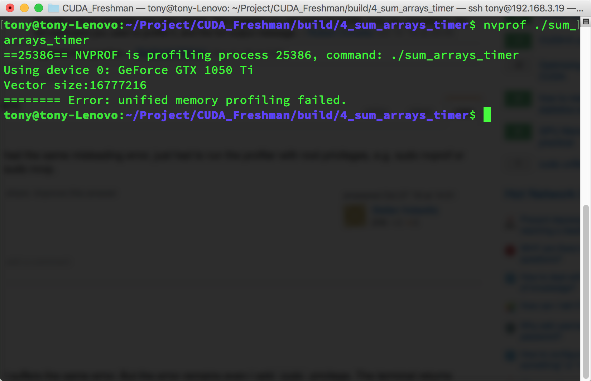
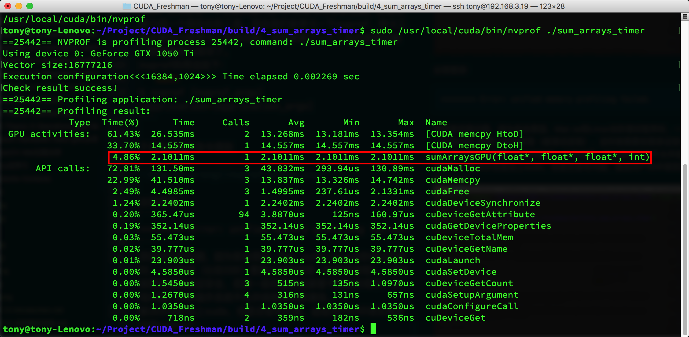

**Abstract:** 本文介绍CUDA核函数计时方法
**Keywords:** gettimeofday,nvprof


# 给核函数计时

## 用CPU计时

使用cpu计时的方法是测试时间的一个常用办法，我记得很有趣的一件事时，我们在写C程序的时候最多使用的计时方法是：

```
clock_t start, finish;
start = clock();
// 要测试的部分
finish = clock();
duration = (double)(finish - start) / CLOCKS_PER_SEC;
```


其中clock()是个关键的函数，“clock函数测出来的时间为进程运行时间，单位为滴答数(ticks)”；字面上理解CLOCKS_PER_SEC这个宏，就是每秒钟多少clocks，在不同的系统中值可能不同。**必须注意的是，并行程序这种计时方式有严重问题！**

```
clock()函数的功能: 这个函数返回从“开启这个程序进程”到“程序中调用C++ clock()函数”时之间的CPU时钟计时单元（clock tick）数当程序单线程或者单核心机器运行时，这种时间的统计方法是正确的。但是如果要执行的代码多个线程并发执行时就会出问题，因为最终end-begin将会是多个核心总共执行的时钟嘀嗒数，因此造成时间偏大。
```


这里我们使用gettimeofday() 函数

```
#include <sys/time.h>
double cpuSecond()
{
  struct timeval tp;
  gettimeofday(&tp,NULL);
  return((double)tp.tv_sec+(double)tp.tv_usec*1e-6);
}
```


gettimeofday是linux下的一个库函数，创建一个cpu计时器，从1970年1月1日0点以来到现在的秒数，需要头文件sys/time.h
那么我们使用这个函数测试核函数运行时间：

我把代码部分贴出来，完整的访问代码库：https://github.com/Tony-Tan/CUDA_Freshman

```
#include <cuda_runtime.h>
#include <stdio.h>
#include "freshman.h"

__global__ void sumArraysGPU(float*a,float*b,float*res,int N)
{
  int i=blockIdx.x*blockDim.x+threadIdx.x;
  if(i < N)
    res[i]=a[i]+b[i];
}
int main(int argc,char **argv)
{
  // set up device.....

  // init data ......

  //timer
  double iStart,iElaps;
  iStart=cpuSecond();
  sumArraysGPU<<<grid,block>>>(a_d,b_d,res_d,nElem);
  cudaDeviceSynchronize();
  iElaps=cpuSecond()-iStart;

  // ......
}
```

主要分析计时这段，首先iStart是cpuSecond返回一个秒数，接着执行核函数，核函数开始执行后马上返回主机线程，所以我们必须要加一个同步函数等待核函数执行完毕，如果不加这个同步函数，那么测试的时间是从调用核函数，到核函数返回给主机线程的时间段，而不是核函数的执行时间，加上了

```
cudaDeviceSynchronize();
```


函数后，计时是从调用核函数开始，到核函数执行完并返回给主机的时间段，下面图大致描述了执行过程的不同时间节点：

我们可以大概分析下核函数启动到结束的过程：

1. 主机线程启动核函数
2. 核函数启动成功
3. 控制返回主机线程
4. 核函数执行完成
5. 主机同步函数侦测到核函数执行完

我们要测试的是2~4的时间，但是用CPU计时方法，只能测试1~5的时间，所以测试得到的时间偏长。
接着我们调整下我们的参数，来看看不同线程维度对速度的影响，看看计时能不能反映出来点问题，这里我们考虑一维线程模型

- 2的幂次数据量 1<<24，16兆数据：
  - 每个块256个线程
    
  - 每个块512个线程
    
  - 每个块1024个线程
    
- 2的非幂次数据量 (1<<24)+1，16兆加一个数据：
  - 每个块256个线程
    
  - 每个块512个线程
    
  - 每个块1024个线程
    

对于我这个cpu这三个参数的性能差距比较小，但是需要注意的是当数据不能被完整切块的时候性能滑铁卢了，这个我们可以使用一点小技巧，比如只传输可完整切割数据块，然后剩下的1，2个使用cpu计算，这种技巧后面有介绍，以及包括如何选择系数。我们本篇之关系计时函数的工作状态，目前看起来还不错。

## 用nvprof计时

CUDA 5.0后有一个工具叫做nvprof的命令行分析工具，后面还要介绍一个图形化的工具，现在我们来学习一下nvprof，学习工具主要技巧是学习工具的功能，当你掌握了一个工具的全部功能，那就是学习成功了。
nvprof的用法如下：

```
$ nvprof [nvprof_args] <application>[application_args]
```


于是我们执行命令得到



出现错误：

```
======== Error: unified memory profiling failed.
```


原因是权限问题，因为安全原因，Mac os和Linux当你调试程序时，一个程序（比如IDE）要接入别的进程（被调试进程），这时候需要权限保证安全，否则一些坏程序会肆意干扰别的程序，出现问题，所以操作系统不允许线程间任意通信。
解决办法是加上sudo，但是还是有问题，超级用户的环境变量里没有nvprof：

如果我们使用完整的nvprof路径加上sudo执行

工具不仅给出了kernel执行的时间，比例，还有其他cuda函数的执行时间，可以看出核函数执行时间只有4%左右，其他内存分配，内存拷贝占了大部分事件，nvprof给出的核函数执行时间2.1011ms，上面cpuSecond计时结果是2.282ms
可见，nvprof可能更接近真实值。
nvprof这个强大的工具给了我们优化的目标，分析数据可以得出我们重点工作要集中在哪部分。

## 理论界限最大化

得到了实际操作值，我们需要知道的是我们能优化的极限值是多少，也就是机器的理论计算极限，这个极限我们永远也达不到，但是我们必须明确的知道，比如理论极限是2秒，我们已经从10秒优化到2.01秒了，基本就没有必要再继续花大量时间优化速度了，而应该考虑买更多的机器或者更新的设备。
各个设备的理论极限可以通过其芯片说明计算得到，比如说：

- Tesla K10 单精度峰值浮点数计算次数：745MHz核心频率 x 2GPU/芯片 x（8个多处理器 x 192个浮点计算单元 x 32 核心/多处理器） x 2 OPS/周期 =4.58 TFLOPS
- Tesla K10 内存带宽峰值： 2GPU/芯片 x 256 位 x 2500 MHz内存时钟 x 2 DDR/8位/字节 = 320 GB/s
- 指令比：字节 4.58 TFLOPS/320 GB/s =13.6 个指令： 1个字节

## 总结

本文我们简单介绍了CUDA核函数的计时方法，以及如何评估理论时间下届，也就是效率的极限值，了解性能瓶颈和性能极限，是优化性能的第一步。

# 参考文献 #

```
https://face2ai.com/CUDA-F-2-2-核函数计时/
https://blog.csdn.net/happyeveryday62/article/details/105428717
```

