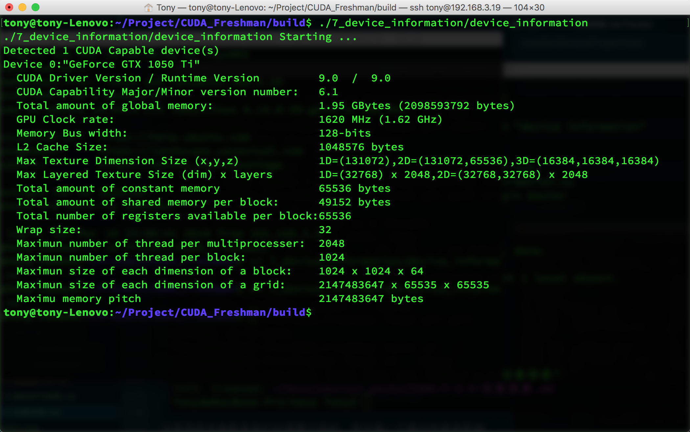
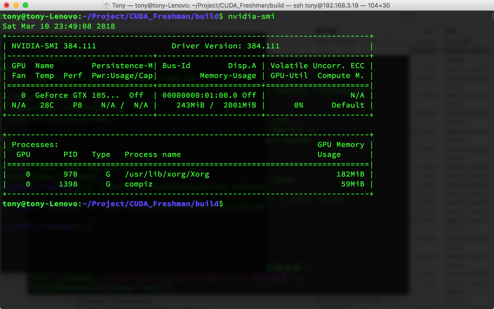
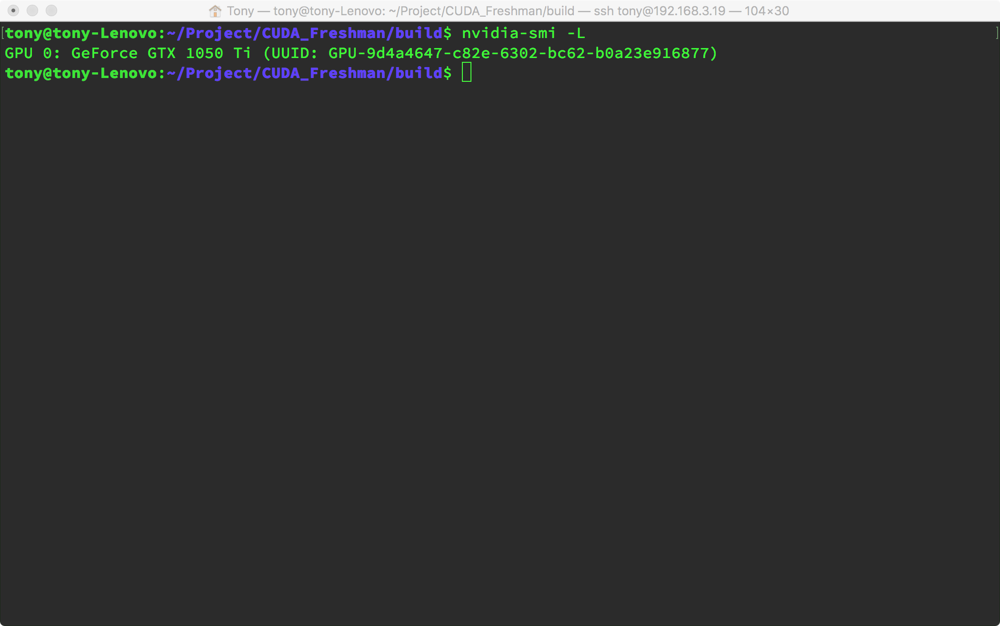
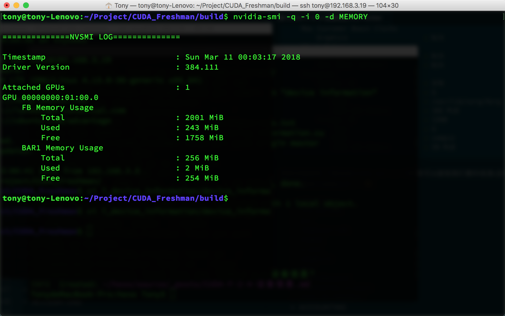

**Abstract:** 本文只介绍一个功能，如何获取设备（一个或多个）信息
**Keywords:** CUDA Device Information


# GPU设备信息

我们用CUDA的时候一般有两种情况，一种自己写完自己用，使用本机或者已经确定的服务器，这时候我们只要查看说明书或者配置说明就知道用的什么型号的GPU，以及GPU的所有信息，但是如果我们写的程序是通用的程序或者框架，我们在使用CUDA前要先确定当前的硬件环境，这使得我们的程序不那么容易因为设备不同而崩溃，本文介绍两种方法，第一种适用于通用程序或者框架，第二种适合查询本机或者可登陆的服务器，并且一般不会改变，那么这时候用一条nvidia驱动提供的指令查询设备信息就很方便了。

## API查询GPU信息

在软件内查询信息，用到如下代码：

```
#include <cuda_runtime.h>
#include <stdio.h>

int main(int argc,char** argv)
{
    printf("%s Starting ...\n",argv[0]);
    int deviceCount = 0;
    cudaError_t error_id = cudaGetDeviceCount(&deviceCount);
    if(error_id!=cudaSuccess)
    {
        printf("cudaGetDeviceCount returned %d\n ->%s\n",
              (int)error_id,cudaGetErrorString(error_id));
        printf("Result = FAIL\n");
        exit(EXIT_FAILURE);
    }
    if(deviceCount==0)
    {
        printf("There are no available device(s) that support CUDA\n");
    }
    else
    {
        printf("Detected %d CUDA Capable device(s)\n",deviceCount);
    }
    int dev=0,driverVersion=0,runtimeVersion=0;
    cudaSetDevice(dev);
    cudaDeviceProp deviceProp;
    cudaGetDeviceProperties(&deviceProp,dev);
    printf("Device %d:\"%s\"\n",dev,deviceProp.name);
    cudaDriverGetVersion(&driverVersion);
    cudaRuntimeGetVersion(&runtimeVersion);
    printf("  CUDA Driver Version / Runtime Version         %d.%d  /  %d.%d\n",
        driverVersion/1000,(driverVersion%100)/10,
        runtimeVersion/1000,(runtimeVersion%100)/10);
    printf("  CUDA Capability Major/Minor version number:   %d.%d\n",
        deviceProp.major,deviceProp.minor);
    printf("  Total amount of global memory:                %.2f MBytes (%llu bytes)\n",
            (float)deviceProp.totalGlobalMem/pow(1024.0,3));
    printf("  GPU Clock rate:                               %.0f MHz (%0.2f GHz)\n",
            deviceProp.clockRate*1e-3f,deviceProp.clockRate*1e-6f);
    printf("  Memory Bus width:                             %d-bits\n",
            deviceProp.memoryBusWidth);
    if (deviceProp.l2CacheSize)
    {
        printf("  L2 Cache Size:                            	%d bytes\n",
                deviceProp.l2CacheSize);
    }
    printf("  Max Texture Dimension Size (x,y,z)            1D=(%d),2D=(%d,%d),3D=(%d,%d,%d)\n",
            deviceProp.maxTexture1D,deviceProp.maxTexture2D[0],deviceProp.maxTexture2D[1]
            ,deviceProp.maxTexture3D[0],deviceProp.maxTexture3D[1],deviceProp.maxTexture3D[2]);
    printf("  Max Layered Texture Size (dim) x layers       1D=(%d) x %d,2D=(%d,%d) x %d\n",
            deviceProp.maxTexture1DLayered[0],deviceProp.maxTexture1DLayered[1],
            deviceProp.maxTexture2DLayered[0],deviceProp.maxTexture2DLayered[1],
            deviceProp.maxTexture2DLayered[2]);
    printf("  Total amount of constant memory               %lu bytes\n",
            deviceProp.totalConstMem);
    printf("  Total amount of shared memory per block:      %lu bytes\n",
            deviceProp.sharedMemPerBlock);
    printf("  Total number of registers available per block:%d\n",
            deviceProp.regsPerBlock);
    printf("  Wrap size:                                    %d\n",deviceProp.warpSize);
    printf("  Maximun number of thread per multiprocesser:  %d\n",
            deviceProp.maxThreadsPerMultiProcessor);
    printf("  Maximun number of thread per block:           %d\n",
            deviceProp.maxThreadsPerBlock);
    printf("  Maximun size of each dimension of a block:    %d x %d x %d\n",
            deviceProp.maxThreadsDim[0],deviceProp.maxThreadsDim[1],deviceProp.maxThreadsDim[2]);
    printf("  Maximun size of each dimension of a grid:     %d x %d x %d\n",
            deviceProp.maxGridSize[0],
	    deviceProp.maxGridSize[1],
	    deviceProp.maxGridSize[2]);
    printf("  Maximu memory pitch                           %lu bytes\n",deviceProp.memPitch);
    exit(EXIT_SUCCESS);
}
```


主要用到了下面API，了解API的功能最好不要看博客，因为博客不会与时俱进，要查文档，所以我这里不挨个解释用法，对于API的不了解，解决办法：查文档，查文档，查文档！

```
cudaSetDevice
```


```
cudaGetDeviceProperties
cudaDriverGetVersion
cudaRuntimeGetVersion
cudaGetDeviceCount
```

运行的效果如下：



这里面很多参数是我们后面要介绍的，而且每一个都对性能有影响：

1. CUDA驱动版本
2. 设备计算能力编号
3. 全局内存大小（1.95G,原文有错误，写成MBytes了）
4. GPU主频
5. GPU带宽
6. L2缓存大小
7. 纹理维度最大值，不同维度下的
8. 层叠纹理维度最大值
9. 常量内存大小
10. 块内共享内存大小
11. 块内寄存器大小
12. 线程束大小
13. 每个处理器硬件处理的最大线程数
14. 每个块处理的最大线程数
15. 块的最大尺寸
16. 网格的最大尺寸
17. 最大连续线性内存

上面这些都是后面要用到的关键参数，这些会严重影响我们的效率。后面会一一说到，不同的设备参数要按照不同的参数来使得程序效率最大化，所以我们必须在程序运行前得到所有我们关心的参数。

## NVIDIA-SMI

nvidia-smi是nvidia驱动程序内带的一个工具，可以返回当前环境的设备信息：

这个命令可以加各种参数，当然参数你要查文档查文档查文档：


利用下面这个参数可以精简上面那么一大堆的信息，而这些可以在脚本中帮我们得到设备信息，比如我们可以写通用程序时在编译前执行脚本来获取设备信息，然后在编译时固化最优参数，这样程序运行时就不会被查询设备信息的过程浪费资源。
也就是我们可以用一下两种方式编写通用程序：

- 运行时获取设备信息：
  - 编译程序
  - 启动程序
  - 查询信息，将信息保存到全局变量
  - 功能函数通过全局变量判断当前设备信息，优化参数
  - 程序运行完毕
- 编译时获取设备信息
  - 脚本获取设备信息
  - 编译程序，根据设备信息调整固化参数到二进制机器码
  - 运行程序
  - 程序运行完毕

详细信息使用

```
nvidia-smi -q -i
```


可以得到如下信息，过于详细，不贴图了：

```
==============NVSMI LOG==============

Timestamp                           : Sun Mar 11 00:01:39 2018
Driver Version                      : 384.111

Attached GPUs                       : 1
GPU 00000000:01:00.0
    Product Name                    : GeForce GTX 1050 Ti
    Product Brand                   : GeForce
    Display Mode                    : Disabled
    Display Active                  : Disabled
    Persistence Mode                : Disabled
    Accounting Mode                 : Disabled
    Accounting Mode Buffer Size     : 1920
    Driver Model
        Current                     : N/A
        Pending                     : N/A
    Serial Number                   : N/A
    GPU UUID                        : GPU-9d4a4647-c82e-6302-bc62-b0a23e916877
    Minor Number                    : 0
    VBIOS Version                   : 86.07.3A.00.27
    MultiGPU Board                  : No
    Board ID                        : 0x100
    GPU Part Number                 : N/A
    Inforom Version
        Image Version               : N/A
        OEM Object                  : N/A
        ECC Object                  : N/A
        Power Management Object     : N/A
    GPU Operation Mode
        Current                     : N/A
        Pending                     : N/A
    GPU Virtualization Mode
        Virtualization mode         : None
    PCI
        Bus                         : 0x01
        Device                      : 0x00
        Domain                      : 0x0000
        Device Id                   : 0x1C8C10DE
        Bus Id                      : 00000000:01:00.0
        Sub System Id               : 0x39D017AA
        GPU Link Info
            PCIe Generation
                Max                 : 3
                Current             : 1
            Link Width
                Max                 : 16x
                Current             : 8x
        Bridge Chip
            Type                    : N/A
            Firmware                : N/A
        Replays since reset         : 0
        Tx Throughput               : 0 KB/s
        Rx Throughput               : 0 KB/s
    Fan Speed                       : N/A
    Performance State               : P8
    Clocks Throttle Reasons
        Idle                        : Active
        Applications Clocks Setting : Not Active
        SW Power Cap                : Not Active
        HW Slowdown                 : Not Active
        Sync Boost                  : Not Active
        SW Thermal Slowdown         : Not Active
    FB Memory Usage
        Total                       : 2001 MiB
        Used                        : 243 MiB
        Free                        : 1758 MiB
    BAR1 Memory Usage
        Total                       : 256 MiB
        Used                        : 2 MiB
        Free                        : 254 MiB
    Compute Mode                    : Default
    Utilization
        Gpu                         : 0 %
        Memory                      : 0 %
        Encoder                     : 0 %
        Decoder                     : 0 %
    Encoder Stats
        Active Sessions             : 0
        Average FPS                 : 0
        Average Latency             : 0
    Ecc Mode
        Current                     : N/A
        Pending                     : N/A
    ECC Errors
        Volatile
            Single Bit
                Device Memory       : N/A
                Register File       : N/A
                L1 Cache            : N/A
                L2 Cache            : N/A
                Texture Memory      : N/A
                Texture Shared      : N/A
                CBU                 : N/A
                Total               : N/A
            Double Bit
                Device Memory       : N/A
                Register File       : N/A
                L1 Cache            : N/A
                L2 Cache            : N/A
                Texture Memory      : N/A
                Texture Shared      : N/A
                CBU                 : N/A
                Total               : N/A
        Aggregate
            Single Bit
                Device Memory       : N/A
                Register File       : N/A
                L1 Cache            : N/A
                L2 Cache            : N/A
                Texture Memory      : N/A
                Texture Shared      : N/A
                CBU                 : N/A
                Total               : N/A
            Double Bit
                Device Memory       : N/A
                Register File       : N/A
                L1 Cache            : N/A
                L2 Cache            : N/A
                Texture Memory      : N/A
                Texture Shared      : N/A
                CBU                 : N/A
                Total               : N/A
    Retired Pages
        Single Bit ECC              : N/A
        Double Bit ECC              : N/A
        Pending                     : N/A
    Temperature
        GPU Current Temp            : 28 C
        GPU Shutdown Temp           : 102 C
        GPU Slowdown Temp           : 97 C
        GPU Max Operating Temp      : 94 C
        Memory Current Temp         : N/A
        Memory Max Operating Temp   : N/A
    Power Readings
        Power Management            : N/A
        Power Draw                  : N/A
        Power Limit                 : N/A
        Default Power Limit         : N/A
        Enforced Power Limit        : N/A
        Min Power Limit             : N/A
        Max Power Limit             : N/A
    Clocks
        Graphics                    : 139 MHz
        SM                          : 139 MHz
        Memory                      : 405 MHz
        Video                       : 544 MHz
    Applications Clocks
        Graphics                    : N/A
        Memory                      : N/A
    Default Applications Clocks
        Graphics                    : N/A
        Memory                      : N/A
    Max Clocks
        Graphics                    : 1911 MHz
        SM                          : 1911 MHz
        Memory                      : 3504 MHz
        Video                       : 1708 MHz
    Max Customer Boost Clocks
        Graphics                    : N/A
    Clock Policy
        Auto Boost                  : N/A
        Auto Boost Default          : N/A
    Processes
        Process ID                  : 970
            Type                    : G
            Name                    : /usr/lib/xorg/Xorg
            Used GPU Memory         : 182 MiB
        Process ID                  : 1398
            Type                    : G
            Name                    : compiz
            Used GPU Memory         : 59 MiB
```


下面这些`nvidia-smi -q -i 0` 的参数可以提取我们要的信息(这样我们就不需要用正则表达式了，😆)

- MEMORY
- UTILIZATION
- ECC
- TEMPERATURE
- POWER
- CLOCK
- COMPUTE
- PIDS
- PERFORMANCE
- SUPPORTED_CLOCKS
- PAGE_RETIREMENT
- ACCOUNTING

比如我们想得到内存信息：

```
nvidia-smi -q -i 0 -d MEMORY
```


得到如下：



多设备时，我们只要把上面的0改成对应的设备号就好了。

## 总结

今天没有理论行的东西，都是技术层面的，没存，技术问题最好的解决方法就是查文档，而原理部分就要看书看教程了，至此CUDA的编程模型大概就是这些了，核函数，计时，内存，线程，设备参数，这些足够能写出比CPU块很多的程序了，但是追求更快的我们要深入研究每一个细节，从下一篇开始，我们深入硬件，研究背后的秘密

# 参考文献 #

```
https://face2ai.com/CUDA-F-2-4-设备信息/
```

