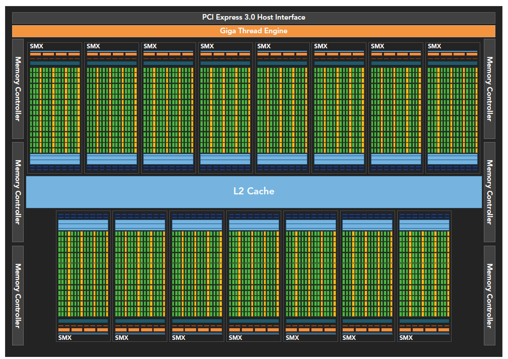
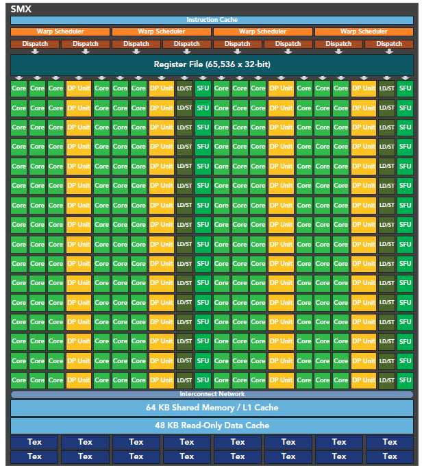
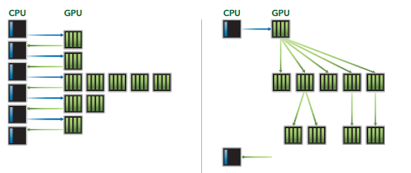
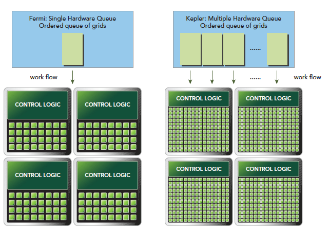
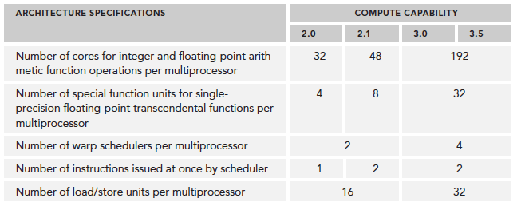
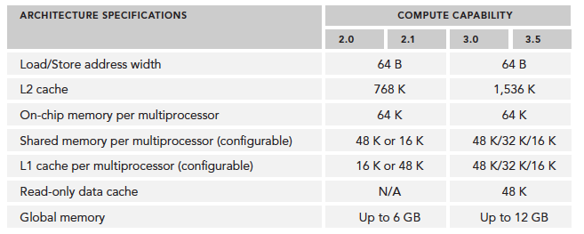

**Abstract:** 本文介绍CUDA执行模型，只比硬件高一层的抽象
**Keywords:** CUDA SM，SIMT，SIMD，Fermi，Kepler


# CUDA执行模型概述

这一篇开始我们开始接近CUDA最核心的部分，就是有关硬件，和程序的执行模型，用CUDA的目的其实说白了就是为计算速度快，所以压榨性能，提高效率其实就是CUDA学习的最终目的，没人学CUDA为了去显示Hello world。
前面几篇我们学了编写，启动核函数，计时，统计时间，然后学习了线程，内存模型，线程内存部分我们会在后面用几章的篇幅进行大书特书，而本章，我们介绍最底层最优理论指导意义的知识。
什么时候我们沿着硬件设计的思路设计程序，我们就会得到百战百胜；什么时候我们背离了硬件设计的思路去设计程序，我们就会得不到好结果。

## 概述

CUDA执行模型揭示了GPU并行架构的抽象视图，再设计硬件的时候，其功能和特性都已经被设计好了，然后去开发硬件，如果这个过程模型特性或功能与硬件设计有冲突，双方就会进行商讨妥协，知道最后产品定型量产，功能和特性算是全部定型，而这些功能和特性就是变成模型的设计基础，而编程模型又直接反应了硬件设计，从而反映了设备的硬件特性。
比如最直观的一个就是内存，线程的层次结构帮助我们控制大规模并行，这个特性就是硬件设计最初设计好，然后集成电路工程师拿去设计，定型后程序员开发驱动，然后在上层可以直接使用这种执行模型来控制硬件。
所以了解CUDA的执行模型，可以帮助我们优化指令吞吐量，和内存使用来获得极限速度。

## GPU架构概述

GPU架构是围绕一个流式多处理器（SM）的扩展阵列搭建的。通过复制这种结构来实现GPU的硬件并行。


上图包括关键组件：

+ instruction cache:

   The instruction cache would include cache lines fetched from memory for execution. The data cache would include cache lines fetched from memory for loading into a register as data. Instruction cache is just another level of memory to access instructions faster.

+ warp scheduler：

  The Streaming multiprocessor(SMs) of a Graphics Processing Unit(GPU) execute instructions from a group of consecutive threads, called warps.... Hence the performance of warp scheduler is critical to the performance of GPU. 

+ special function unit(SFU):
  
  The Special Function Unit (SFU) is an **acelerator devoted to perform tracendental and trigonometric operations**. This module is commonly present in Graphics Processing Units as part of the rasterization operations, and this open-source version of an SFU is integrated in the FlexGripPlus GPGPU model.
  
+ dispatch unit:

   A separate unit which we call the dispatch unit **fetch instructions from the front of the queue and sends them to the execution unit**. The dispatch unit also performs the decoding function. Related Discussions:- What is dispatch unit

+ LD/ST:

   ld and st are the **only real (as in implemented in hardware) instructions that move data to and from main memory**. They are also used to access hardware that presents itself as an in memory interface.

+ Interconnect Network:

   An interconnect (generally speaking) is a **physical or logical connection between two electronic devices or networks**. Expressed as a verb, to interconnect is to establish a connection between two separate electronic networks.

+ register file:

   A register file is a **means of memory storage within a computer's central processing unit** (CPU). The computer's register files contain bits of data and mapping locations. These locations specify certain addresses that are input components of a register file.

- CUDA core

  CUDA cores can render the fine details of digital graphics, turning the coding behind high-resolution games and videos into smooth, life-like images and videos. CUDA cores perform such rendering and processing functions in parallel to each other, meaning each core works on a specific task while its neighboring cores are hard at work rendering other graphics.

- uniform cache

  **Uniform Cache** is a **collection of modules** which present an identical or **uniform** interface to various caching mechanisms.


### SM

GPU中每个SM都能支持数百个线程并发执行，每个GPU通常有多个SM，当一个核函数的网格被启动的时候，多个block会被同时分配给可用的SM上执行。

**注意:** 当一个blcok被分配给一个SM后，他就只能在这个SM上执行了，不可能重新分配到其他SM上了，多个线程块可以被分配到同一个SM上。

在SM上同一个块内的多个线程进行线程级别并行，而同一线程内，指令利用指令级并行将单个线程处理成流水线。

### 线程束

CUDA 采用单指令多线程SIMT架构管理执行线程，不同设备有不同的线程束大小，但是到目前为止基本所有设备都是维持在32，也就是说每个SM上有多个block，一个block有多个线程（可以是几百个，但不会超过某个最大值），但是从机器的角度，在某时刻T，SM上只执行一个线程束，也就是32个线程在同时同步执行，线程束中的每个线程执行同一条指令，包括有分支的部分，这个我们后面会讲到，

### SIMD vs SIMT

**单指令多数据**的执行属于向量机，比如我们有四个数字要加上四个数字，那么我们可以用这种单指令多数据的指令来一次完成本来要做四次的运算。这种机制的问题就是过于死板，不允许每个分支有不同的操作，所有分支必须同时执行相同的指令，必须执行没有例外。
相比之下**单指令多线程**SIMT就更加灵活了，虽然两者都是将相同指令广播给多个执行单元，但是SIMT的某些线程可以选择不执行，也就是说同一时刻所有线程被分配给相同的指令，SIMD规定所有人必须执行，而SIMT则规定有些人可以根据需要不执行，这样SIMT就保证了线程级别的并行，而SIMD更像是指令级别的并行。
SIMT包括以下SIMD不具有的关键特性：

1. 每个线程都有自己的指令地址计数器
2. 每个线程都有自己的寄存器状态
3. 每个线程可以有一个独立的执行路径

而上面这三个特性在编程模型可用的方式就是给每个线程一个唯一的标号（blckIdx,threadIdx），并且这三个特性保证了各线程之间的独立

### 32

32是个神奇数字，他的产生是硬件系统设计的结果，也就是集成电路工程师搞出来的，所以软件工程师只能接受。
从概念上讲，32是SM以SIMD方式同时处理的工作粒度，这句话这么理解，可能学过后面的会更深刻的明白，一个SM上在某一个时刻，有32个线程在执行同一条指令，这32个线程可以选择性执行，虽然有些可以不执行，但是他也不能执行别的指令，需要另外需要执行这条指令的线程执行完，然后再继续下一条，就像老师给小朋友们分水果：
第一次分苹果，分给所有32个人，你可以不吃，但是不吃也没别的，你就只能在那看别人吃，等别人吃完了，老师会把没吃的苹果回收，防止浪费。
第二次分橘子，你很爱吃，可是有别的小朋友不爱吃，当然这时候他也不能干别的，只能看你吃完。吃完后老师继续回收刚才没吃的橘子。
第三次分桃子，你们都很爱吃，大家一起吃，吃完了老师发现没有剩下的，继续发别的水果，一直发到所有种类的水果都发完了。今天就可以放学了。

简单的类比，但过程就是这样。

### CUDA编程的组件与逻辑

下图从逻辑角度和硬件角度描述了CUDA编程模型对应的组件。


SM中共享内存和寄存器是关键的资源，线程块中线程通过共享内存和寄存器相互通信协调。
寄存器和共享内存的分配可以严重影响性能！

因为SM有限，虽然我们的编程模型层面看所有线程都是并行执行的，但是在微观上看，所有线程块也是分批次的在物理层面的机器上执行，线程块里不同的线程可能进度都不一样，但是同一个线程束内（一个线程束由32个连续的线程组成）的线程拥有相同的进度。
并行就会引起竞争，多线程以未定义的顺序访问同一个数据，就导致了不可预测的行为，CUDA只提供了一种块内同步的方式，块之间没办法同步！
同一个SM上可以有不止一个常驻的线程束，有些在执行，有些在等待，他们之间状态的转换是不需要开销的。

## Fermi 架构

Fermi架构是第一个完整的GPU架构，所以了解这个架构是非常有必要的，就像几十年过去了，我们的微机原理学的还是386一样，祖宗的基因代代相传，学好了祖宗后面的孙子辈都好掌握。


Fermi架构逻辑图如上，具体数据如下:

1. 512个加速核心，CUDA核
2. 每个CUDA核心都有一个全流水线的整数算数逻辑单元ALU，和一个浮点数运算单元FPU
3. CUDA核被组织到16个SM上
4. 6个384-bits的GDDR5 的内存接口
5. 支持6G的全局机栽内存
6. GigaThread，分配线程块到SM线程束调度器上
7. 768KB的二级缓存，被所有SM共享

而SM则包括下面这些资源：

- 执行单元（CUDA核）
- 调度线程束的调度器和调度单元
- 共享内存，寄存器文件和一级缓存

每个多处理器SM有16个加载/存储单元所以每个时钟周期内有16个线程（半个线程束）计算源地址和目的地址

特殊功能单元SFU执行固有指令，如正弦，余弦，平方根和插值，SFU在每个时钟周期内的每个线程上执行一个固有指令。
每个SM有两个线程束调度器，和两个指令调度单元，当一个线程块被指定给一个SM时，线程块内的所有线程被分成线程束，两个线程束选择其中两个线程束，在用指令调度器存储两个线程束要执行的指令（就像上面例子中分水果的水果一样，我们这里有两个班，两个班的老师各自控制的自己的水果，老师就是指令调度器）
像第一张图上的显示一样，每16个CUDA核心为一个组，还有16个加载/存储单元或4个特殊功能单元。当某个线程块被分配到一个SM上的时候，会被分成多个线程束，线程束在SM上交替执行：


上面曾经说过，每个线程束在同一时间执行同一指令，同一个块内的线程束互相切换是没有时间消耗的。
Fermi上支持同时并发执行内核。并发执行内核允许执行一些小的内核程序来充分利用GPU，如图：


## Kepler 架构

Kepler架构作为Fermi架构的后代，有以下技术突破：

- 强化的SM
- 动态并行
- Hyper-Q技术

技术参数也提高了不少，比如单个SM上CUDA核的数量，SFU的数量，LD/ST的数量等：




kepler架构的最突出的一个特点就是内核可以启动内核了，这使得我们可以使用GPU完成简单的递归操作，流程如下。

Hyper-Q技术主要是CPU和GPU之间的同步硬件连接，以确保CPU在GPU执行的同时做更多的工作。Fermi架构下CPU控制GPU只有一个队列，Kepler架构下可以通过Hyper-Q技术实现多个队列如下图。

计算能力概览：




## 使用Profile进行优化（Profile-Driven Optimization）

中文翻译的这个标题是配置文件驱动优化，驱动这个词在这里应该是个动词，或者翻译的人直接按照字面意思翻译的，其实看完内容以后的意思是根据profile这个文件内的信息对程序进行优化。
性能分析通过以下方法来进行：

1. 应用程序代码的空间(内存)或时间复杂度
2. 特殊指令的使用
3. 函数调用的频率和持续时间

程序优化是建立在对硬件和算法过程理解的基础上的，如果都不了解，靠试验，那么这个结果可想而知。理解平台的执行模型也就是硬件特点，是优化性能的基础。
开发高性能计算程序的两步：

1. 保证结果正确，和程序健壮性
2. 优化速度

Profile可以帮助我们观察程序内部。

- 一个原生的内核应用一般不会产生最佳效果，也就是我们基本不能一下子就写出最好最快的内核，需要通过性能分析工具分析性能。找出性能瓶颈
- CUDA将SM中的计算资源在该SM中的多个常驻线程块之间进行分配，这种分配方式可能导致一些资源成为性能限制因素，性能分析工具可以帮我们找出来这些资源是如何被使用的
- CUDA提供了一个硬件架构的抽象。它能够让用户控制线程并发。性能分析工具可以检测和优化，并肩优化可视化

总结起来一句话，想优化速度，先学好怎么用性能分析工具。

- nvvp
- nvprof

限制内核性能的主要包括但不限于以下因素

- 存储带宽
- 计算资源
- 指令和内存延迟

## 总结

想写出更快更好的CUDA程序，学习硬件执行模型，学习使用测试工具，多思考多总结多练习，就可以做的更好！


# 参考文献 #

```
https://face2ai.com/CUDA-F-3-1-CUDA执行模型概述/
```

