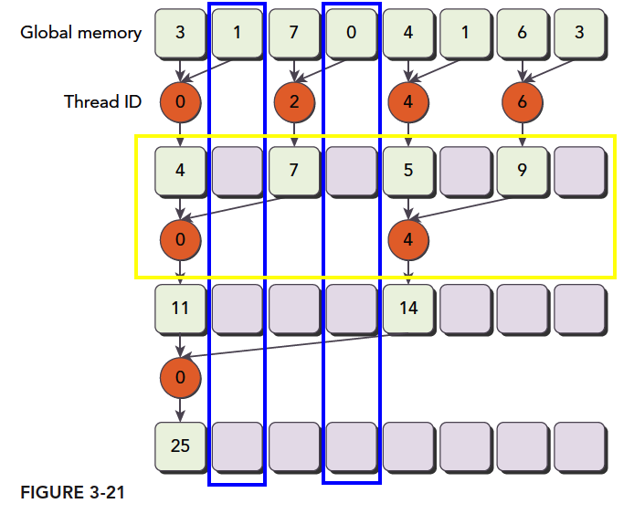
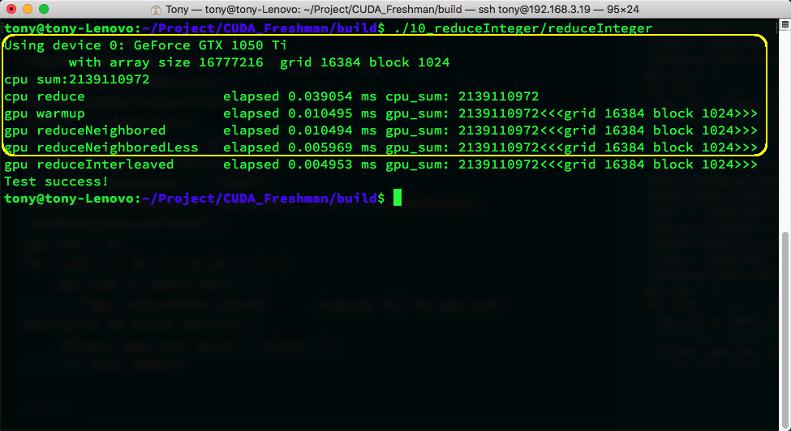
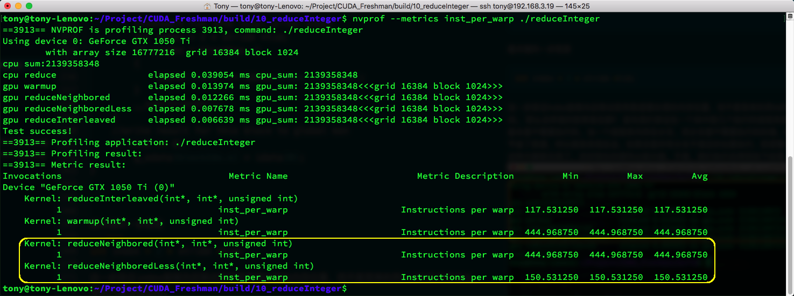
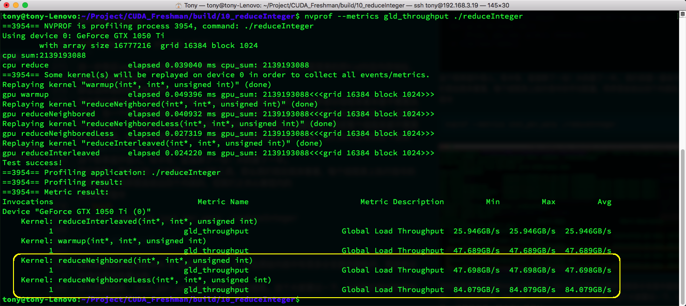
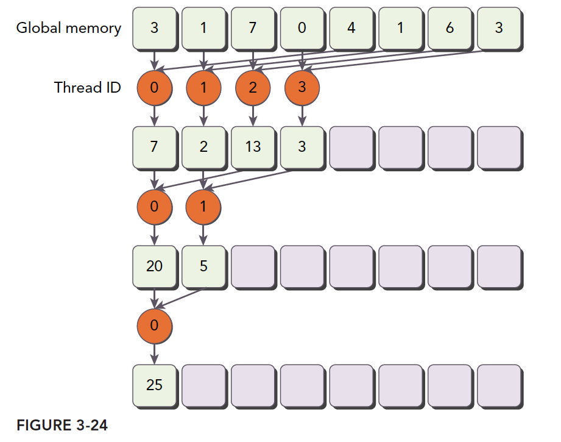
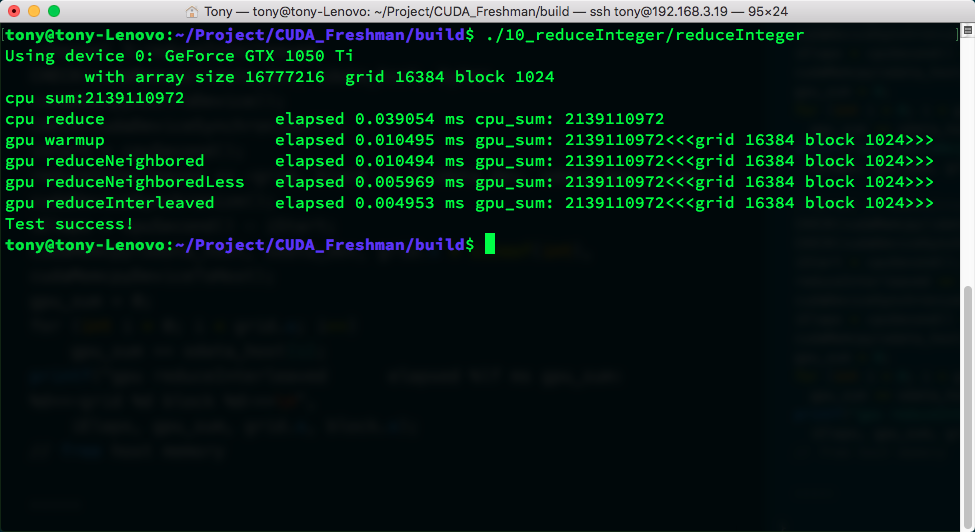
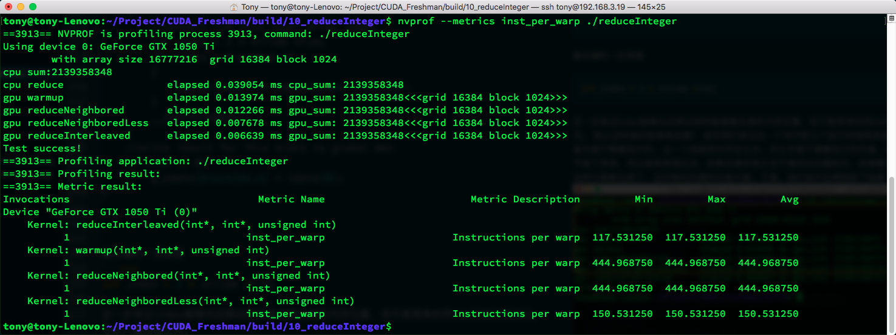
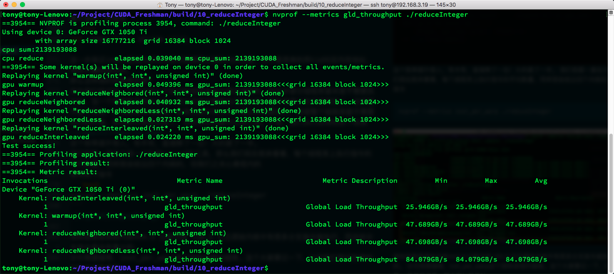

**Abstract:** 介绍规约问题中的分支分化问题
**Keywords:** 规约问题，分支分化 此篇有些结果和参考书中结果相反，需要更深入的技术才能解决


# 避免分支分化

我坚持写博客是因为我上次最困惑最难过的那段时间通过写博客改变了我的非常不好的情况，所以我认为写些东西梳理自己的思路能够改变我的生活，所以我会一直坚持，学习的内容是没有止境的，所以博客也可以写很多。
写博客为了收入我之前也想过，最后放弃了，因为如果你的目的就是挣钱，有写博客这大把时间还不如出去跑个滴滴或者送个外卖来得快，所以我把之前有的捐赠部分都取消掉了，我并不否定那些博客写的质量非常高的人因此有收入，做得好，帮助到人了就可以获得收入，但是为了收入去帮助人，那叫服务。所以我后面可能会挂一个小广告，但是绝对不会因为广告搞得博客非常凌乱，而且收入应该只用作服务器和域名费用，仅此而已，我个人对于做事非常看重目的，我的目的是分享知识，并不是收入，收入只是附加的。
本文介绍一个并行计算中最常见的典型情况，并行分化([线程束分化](https://face2ai.com/CUDA-F-3-2-理解线程束执行的本质-P1/)的等价问题)，以及规约问题，以及其初步优化。

## 并行规约问题

在串行编程中，我们最最最常见的一个问题就是一组特别多数字通过计算变成一个数字，比如加法，也就是求这一组数据的和，或者乘法，这种计算当有如下特点的时候，我们可以用并行归约的方法处理他们：

1. 结合性
2. 交换性

对应的加法或者乘法就是交换律和结合律，在我们的数学分析系列已经详细的介绍了加法和乘法的结合律和交换律的证明。所以对于所有有这两个性质的计算，都可以使用归约式计算。
为什么叫归约，归约是一种常见的计算方式（串并行都可以），一开始我听到这个名字的时候应该是在两年前了，感觉很迷惑，后来发现，归约的归有递归的意思，约就是减少，这样就很明显了，每次迭代计算方式都是相同的（归），从一组多个数据最后得到一个数（约）。
归约的方式基本包括如下几个步骤：

1. 将输入向量划分到更小的数据块中
2. 用一个线程计算一个数据块的部分和
3. 对每个数据块的部分和再求和得到最终的结果。

数据分块保证我们可以用一个线程块来处理一个数据块。
一个线程处理更小的块，所以一个线程块可以处理一个较大的块，然后多个块完成整个数据集的处理。
最后将所有线程块得到的结果相加，就是结果，这一步一般在cpu上完成。

归约问题最常见的加法计算是把向量的数据分成对，然后用不同线程计算每一对元素，得到的结果作为输入继续分成对，迭代的进行，直到最后一个元素。
成对的划分常见的方法有以下两种：

1. 相邻配对：元素与他们相邻的元素配对
   
2. 交错配对：元素与一定距离的元素配对
   

图中将两种方式表现的很清楚了，我们可以用代码实现以下。
首先是cpu版本实现交错配对归约计算的代码：

```
int recursiveReduce(int *data, int const size)
{
	// terminate check
	if (size == 1)
        return data[0];
	// renew the stride
	int const stride = size / 2;
	if (size % 2 == 1)
	{
		for (int i = 0; i < stride; i++)
		{
			data[i] += data[i + stride];
		}
		data[0] += data[size - 1];
	}
	else
	{
		for (int i = 0; i < stride; i++)
		{
			data[i] += data[i + stride];
		}
	}
	// call
	return recursiveReduce(data, stride);
}
```


和书上的代码有些不同，因为书上的代码没有考虑数组长度非2的整数幂次的结果。所以我加了一个处理奇数数组最后一个无人配对的元素的处理。
这个加法运算可以改成任何满足结合律和交换律的计算。比如乘法，求最大值等。
下面我们就来通过不同的配对方式，不同的数据组织来看CUDA的执行效率。

## 并行规约中的分化

[线程束分化](https://face2ai.com/CUDA-F-3-2-理解线程束执行的本质-P1/)已经明确说明了，有判断条件的地方就会产生分支，比如if 和 for这类关键词。
如下图所表示的那样，我们对相邻元素配对进行内核实现的流程描述：


根据上一小节介绍：
第一步：是把这个一个数组分块，每一块只包含部分数据，如上图那样（图中数据较少，但是我们假设一块上只有这么多。），我们假定这是线程块的全部数据
第二步：就是每个线程要做的事，橙色圆圈就是每个线程做的操作，可见线程threadIdx.x=0 的线程进行了三次计算，奇数线程一致在陪跑，没做过任何计算，但是根据3.2中介绍，这些线程虽然什么都不干，但是不可以执行别的指令，4号线程做了两步计算，2号和6号只做了一次计算。
第三步：将所有块得到的结果相加，就是最终结果
这个计算划分就是最简单的并行规约算法，完全符合上面我们提到的三步走的套路
值得注意的是，我们每次进行一轮计算（黄色框，这些操作同时并行）的时候，部分全局内存要进行一次修改，但只有部分被替换，而不被替换的，也不会在后面被使用到，如蓝色框里标注的内存，就被读了一次，后面就完全没有人管了。
我们现在把我们的内核代码贴出来

```
__global__ void reduceNeighbored(int * g_idata,int * g_odata,unsigned int n)
{
	//set thread ID
	unsigned int tid = threadIdx.x;
	//boundary check
	if (tid >= n) return;
	//convert global data pointer to the
	int *idata = g_idata + blockIdx.x*blockDim.x;
	//in-place reduction in global memory
	for (int stride = 1; stride < blockDim.x; stride *= 2)
	{
		if ((tid % (2 * stride)) == 0)
		{
			idata[tid] += idata[tid + stride];
		}
		//synchronize within block
		__syncthreads();
	}
	//write result for this block to global mem
	if (tid == 0)
		g_odata[blockIdx.x] = idata[0];

}
```


这里面唯一要注意的地方就是同步指令

```
__syncthreads();
```


原因还是能从图上找到，我们的每一轮操作都是并行的，但是不保证所有线程能同时执行完毕，所以需要等待，执行的快的等待慢的，这样就能避免块内的线程竞争内存了。
被操作的两个对象之间的距离叫做跨度，也就是变量stride，
完整的执行逻辑如下，

注意主机端和设备端的分界，注意设备端的数据分块。
完整的可执行代码Github:https://github.com/Tony-Tan/CUDA_Freshman

这里把主函数贴出来，但注意里面包含后面的核函数执行部分，所以想要运行还是去github上拉一下吧，顺便点个star

```
int main(int argc,char** argv)
{

	.........
    int size = 1 << 24;

    .........
	dim3 block(blocksize, 1);
	dim3 grid((size - 1) / block.x + 1, 1);

    .........


	//cpu reduction
	int cpu_sum = 0;
	iStart = cpuSecond();

	for (int i = 0; i < size; i++)
		cpu_sum += tmp[i];
	printf("cpu sum:%d \n", cpu_sum);
	iElaps = cpuSecond() - iStart;
	printf("cpu reduce                 elapsed %lf ms cpu_sum: %d\n", iElaps, cpu_sum);
	//kernel 1:reduceNeighbored

	CHECK(cudaMemcpy(idata_dev, idata_host, bytes, cudaMemcpyHostToDevice));
	CHECK(cudaDeviceSynchronize());
	iStart = cpuSecond();
	warmup <<<grid, block >>>(idata_dev, odata_dev, size);
	cudaDeviceSynchronize();
	iElaps = cpuSecond() - iStart;
	cudaMemcpy(odata_host, odata_dev, grid.x * sizeof(int), cudaMemcpyDeviceToHost);
	gpu_sum = 0;
	for (int i = 0; i < grid.x; i++)
		gpu_sum += odata_host[i];
	printf("gpu warmup                 elapsed %lf ms gpu_sum: %d<<<grid %d block %d>>>\n",
		iElaps, gpu_sum, grid.x, block.x);

	//kernel 1:reduceNeighbored

	CHECK(cudaMemcpy(idata_dev, idata_host, bytes, cudaMemcpyHostToDevice));
	CHECK(cudaDeviceSynchronize());
	iStart = cpuSecond();
	reduceNeighbored << <grid, block >> >(idata_dev, odata_dev, size);
	cudaDeviceSynchronize();
	iElaps = cpuSecond() - iStart;
	cudaMemcpy(odata_host, odata_dev, grid.x * sizeof(int), cudaMemcpyDeviceToHost);
	gpu_sum = 0;
	for (int i = 0; i < grid.x; i++)
		gpu_sum += odata_host[i];
	printf("gpu reduceNeighbored       elapsed %lf ms gpu_sum: %d<<<grid %d block %d>>>\n",
		iElaps, gpu_sum, grid.x, block.x);

	//kernel 2:reduceNeighboredLess

	CHECK(cudaMemcpy(idata_dev, idata_host, bytes, cudaMemcpyHostToDevice));
	CHECK(cudaDeviceSynchronize());
	iStart = cpuSecond();
	reduceNeighboredLess <<<grid, block>>>(idata_dev, odata_dev, size);
	cudaDeviceSynchronize();
	iElaps = cpuSecond() - iStart;
	cudaMemcpy(odata_host, odata_dev, grid.x * sizeof(int), cudaMemcpyDeviceToHost);
	gpu_sum = 0;
	for (int i = 0; i < grid.x; i++)
		gpu_sum += odata_host[i];
	printf("gpu reduceNeighboredLess   elapsed %lf ms gpu_sum: %d<<<grid %d block %d>>>\n",
		iElaps, gpu_sum, grid.x, block.x);

	//kernel 3:reduceInterleaved
	CHECK(cudaMemcpy(idata_dev, idata_host, bytes, cudaMemcpyHostToDevice));
	CHECK(cudaDeviceSynchronize());
	iStart = cpuSecond();
	reduceInterleaved << <grid, block >> >(idata_dev, odata_dev, size);
	cudaDeviceSynchronize();
	iElaps = cpuSecond() - iStart;
	cudaMemcpy(odata_host, odata_dev, grid.x * sizeof(int), cudaMemcpyDeviceToHost);
	gpu_sum = 0;
	for (int i = 0; i < grid.x; i++)
		gpu_sum += odata_host[i];
	printf("gpu reduceInterleaved      elapsed %lf ms gpu_sum: %d<<<grid %d block %d>>>\n",
		iElaps, gpu_sum, grid.x, block.x);
	// free host memory

	.....

}
```


代码太长不美观，删减一下，只留下了内核执行部分，可见，主函数只有最后一个循环求和的过程是要注意别忘了的，其他都是常规操作
还有一点，需要注意实际任务中数组不可能每次都是2的整数幂，如果不是2的整数幂需要确定数组边界。


上图就是执行结果，为啥有那么多，因为我把下面两个经过优化的也装进去了，黄色框框里是我们上面这段代码执行结果和时间，warmup 是为了启动gpu防止首次启动计算时gpu的启动过程耽误时间，影响效率测试，warmup的代码就是reducneighbored的代码，可见还是有微弱的差别的。

## 改善并行规约的分化

上面归约显然是最原始的，未经过优化的东西是不能拿出去使用的，或者说一个真理是，不可能一下子就写出来满意的代码。

```
if ((tid % (2 * stride)) == 0)
```


这个条件判断给内核造成了极大的分支，如图所示：


第一轮 有 1212 的线程没用
第二轮 有 3434 的线程没用
第三轮 有 7878 的线程没用

可见线程利用率是非常低的，因为这些线程在一个线程束，所以，只能等待，不能执行别的指令。
对于上面的低利用率，我们想到了下面这个方案来解决：

注意橙色圆形内的标号是线程符号，这样的计算线程的利用率是高于原始版本的，核函数如下：

```
__global__ void reduceNeighboredLess(int * g_idata,int *g_odata,unsigned int n)
{
	unsigned int tid = threadIdx.x;
	unsigned idx = blockIdx.x*blockDim.x + threadIdx.x;
	// convert global data pointer to the local point of this block
	int *idata = g_idata + blockIdx.x*blockDim.x;
	if (idx > n)
		return;
	//in-place reduction in global memory
	for (int stride = 1; stride < blockDim.x; stride *= 2)
	{
		//convert tid into local array index
		int index = 2 * stride *tid;
		if (index < blockDim.x)
		{
			idata[index] += idata[index + stride];
		}
		__syncthreads();
	}
	//write result for this block to global men
	if (tid == 0)
		g_odata[blockIdx.x] = idata[0];
}
```


最关键的一步就是

```
int index = 2 * stride *tid;
```


这一步保证index能够向后移动到有数据要处理的内存位置，而不是简单的用tid对应内存地址，导致大量线程空闲。
那么这样做的效率高在哪？
首先我们保证在一个块中前几个执行的线程束是在接近满跑的，而后半部分线程束基本是不需要执行的，当一个线程束内存在分支，而分支都不需要执行的时候，硬件会停止他们调用别人，这样就节省了资源，所以高效体现在这，如果还是所有分支不满足的也要执行，即便整个线程束都不需要执行的时候，那这种方案就无效了，还好现在的硬件比较只能，于是，我们执行后得到如下结果

这个效率提升惊人，有木有，直接降了一位！大约差了一半。
我们前面一直在介绍一个叫做nvprof的工具，那么我们现在就来看看，每个线程束上执行指令的平均数量，同样我会给出四个内核的，但我们之关心黄框内的
使用如下指令

```
nvprof --metrics inst_per_warp ./reduceInteger
```




指标结果是原始内核444.9 比新内核 150.5 可见原始内核中有很多分支指令被执行，而这些分支指令是没有意义的。
分化程度越高，inst_per_warp这个指标会相对越高。这个大家要记一下，以后我们测试效率的时候会经常使用。
接着我们看一下内存加载吞吐：

```
nvprof --metrics gld_throughput ./reduceInteger
```




依旧只看黄色框框，我们的新内核，内存效率要高很多，也接近一倍了，原因还是我们上面分析的，一个线程块，前面的几个线程束都在干活，而后面几个根本不干活，不干活的不会被执行，而干活的内存请求肯定很集中，最大效率的利用带宽，而最naive的内核，不干活的线程也在线程束内跟着跑，又不请求内存，所以内存访问被打碎，理论上是只有一半的内存效率，测试来看非常接近。

## 交错配对的规约

上面的套路是修改线程处理的数据，使部分线程束最大程度利用数据，接下来采用同样的思想，但是方法不同，接下来我们使用的方法是调整跨度，也就是我们每个线程还是处理对应的内存的位置，但内存对不是相邻的了，而是隔了一定距离的：
示意图是最好的描述方法：

我们依然把上图当做一个完整的线程块，那么前半部分的线程束依然是最大负载在跑，后半部分的线程束也是啥活不干

```
__global__ void reduceInterleaved(int * g_idata, int *g_odata, unsigned int n)
{
	unsigned int tid = threadIdx.x;
	unsigned idx = blockIdx.x*blockDim.x + threadIdx.x;
	// convert global data pointer to the local point of this block
	int *idata = g_idata + blockIdx.x*blockDim.x;
	if (idx >= n)
		return;
	//in-place reduction in global memory
	for (int stride = blockDim.x/2; stride >0; stride >>=1)
	{

		if (tid <stride)
		{
			idata[tid] += idata[tid + stride];
		}
		__syncthreads();
	}
	//write result for this block to global men
	if (tid == 0)
		g_odata[blockIdx.x] = idata[0];
}
```


执行结果


如果单从优化原理的角度，这个内核和前面的内核应该是相同效率的，但是测试结果是，这个新内核比前面的内核速度快了不少，所以我们还是考察一下指标吧：

```
nvprof --metrics inst_per_warp ./reduceInteger
```




```
nvprof --metrics gld_throughput ./reduceInteger
```



reduceInterleaved内存效率居然是最低的，但是线程束内分化却是最小的。
而书中说reduceInterleaved 的优势在内存读取，而非线程束分化，我们实际操作却得出了完全不同结论，到底是内存的无情，还是编译器的绝望，请看我们下个系列，到时候我们会直接研究机器码，来确定到底是什么影响了看似类似，却有结果悬殊的两个内核

此处需要查看机器码，确定两个内核的实际不同

## 总结

本文比较尴尬最后得出来一个跟书中相反的结论，但是整篇的思路还是很流畅的，所以我还是把它发出来了，按照我的性格这种有疑问没解决的（无法确定是否是已有技术无法解决的）一般不会发出来，但是考虑到可能是编译器进化导致的结果，所以还是先发出来，后面如果研究明白了，在CUDA进阶系列作为案例讨论。

# 参考文献 #

```
https://face2ai.com/CUDA-F-3-4-避免分支分化/
```

