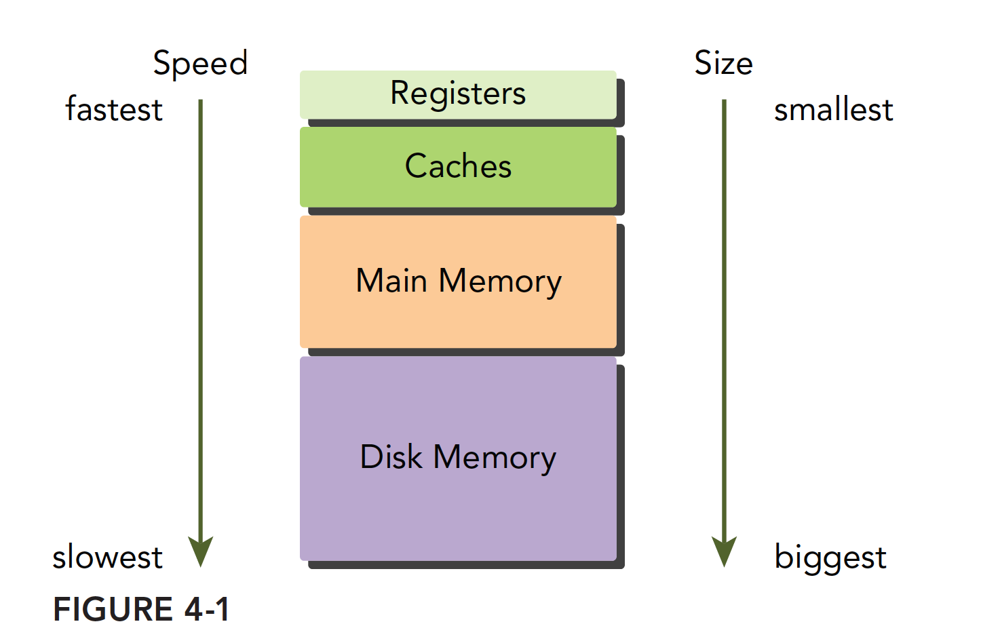
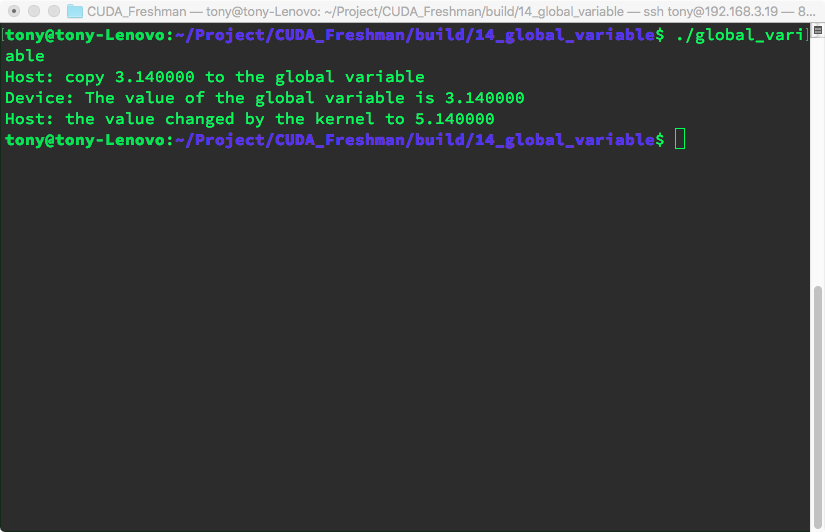

**Abstract:** 本文介绍CUDA编程的内存模型个概述，主要讲解CUDA包含的几种内存，以及各种内存的主要特点和用途，这篇作为内存部分地图一样，指导我们后面的写作和学习。
**Keywords:** CUDA内存模型，CUDA内存层次结构，寄存器，共享内存，本地内存，常量内存，纹理内存，全局内存


# 内存模型概述

废话少说，我们直接进入主题，如果说我进入写程序的行业的印象最深刻的一本书，看过我博客的人应该能猜到，我也不止一遍的向大家推荐过《深入理解计算机系统》那本书告诉了我基本所有的计算机基础知识，编程基础知识，真的很基础，里面有CPU结构，内存管理模型，汇编等等，从知识层次来讲，非常偏底层，但是难度确实够让人难受，那本书，我估计我只看了一半，看懂的应该有一半的三分之二，也就是我只看懂了全书的三分之一，推荐有时间一定要看看，内存访问和管理是程序效率的关键点，高性能计算更是如此，上一篇举得例子关于运输原材料的例子，就是我们平时天天遇到的问题，我们希望有大量的高速度的大容量内存可以给我们的工厂（GPU核心）输送数据，但是根据我们目前的技术，大容量高速的内存不仅造价高，而且不容易生产，到目前为止（2018年5月）计算结构还是普遍采用内存模型获得最佳的延迟和带宽。
CUDA也采用的内存模型，结合了主机和设备内存系统，展现了完整的内存层次模型，其中大部分内存我们可以通过编程控制，来使我们的程序性能得到优化。
如果你之前写的程序都没怎么管理过内存，那请先练习下C语言，可能会有更好的理解。

## 内存层次结构的优点

程序具有局部性特点，包括：

1. 时间局部性
2. 空间局部性

解释一下，时间局部性，就是一个内存位置的数据某时刻被引用，那么在此时刻附近也很有可能被引用，随时间流逝，该数据被引用的可能性逐渐降低。
空间局部性，如果某一内存位置的数据被使用，那么附近的数据也有可能被使用。
现代计算机的内存结构主要如下：


这个内存模型在程序局部性原则成立的时候有效。学习过串行编程的人也应该知道内存模型，速度最快的是寄存器，他能和cpu同步的配合，接着是缓存，在CPU片上，然后是主存储器，现在常见的就是内存条，显卡上也有内存芯片，然后是硬盘，这些内存设备的速度和容量相反，越快的越小，越慢的越大。
局部性是个非常有趣的事情，首先局部性的产生并不是因为设备的原因，而是程序从一开始被编写就有这个特征，与生俱来，所以当我们发现此特征后，就开始设计满足此特征硬件结构，也就是内存模型，当内存模型设计成如上结构的时候，如果你想写快速高效的程序，就要让自己的程序局部性足够好，所以这就进入了一个死循环，最后为了追求高效率，设备将越来越优化局部性，而程序也会越来越局部化。
总结下最后一层（硬盘磁带之类的）的特点：

- 每个比特位的价格要更低
- 容量要更高
- 延迟较高
- 处理器访问频率低

CPU和GPU的主存都是采用DRAM——动态随机存取存储器，而低延迟的内存，比如一级缓存，则采用SRAM——静态随机存取存储器。虽然底层的存储器延迟高，容量大，但是其中有数据被频繁使用的时候，就会向更高一级的层次传输，比如我们运行程序处理数据的时候，程序第一步就是把硬盘里的数据传输到主存里面。
GPU和CPU的内存设计有相似的准则和模型。但他们的区别是：CUDA编程模型将内存层次结构更好的呈献给开发者，让我们显示的控制其行为。

## CUDA内存模型

对于程序员来说，分类内存的方法有很多中，但是对于我们来说最一般的分法是：

- 可编程内存
- 不可编程内存

对于可编程内存，如字面意思，你可以用你的代码来控制这组内存的行为；相反的，不可编程内存是不对用户开放的，也就是说其行为在出厂后就已经固化了，对于不可编程内存，我们能做的就是了解其原理，尽可能的利用规则来加速程序，但对于通过调整代码提升速度来说，效果很一般。
CPU内存结构中，一级二级缓存都是不可编程（完全不可控制）的存储设备。
另一方面，CUDA内存模型相对于CPU来说那是相当丰富了，GPU上的内存设备有：

- 寄存器
- 共享内存
- 本地内存
- 常量内存
- 纹理内存
- 全局内存

上述各种都有自己的作用域，生命周期和缓存行为。CUDA中每个线程都有自己的私有的本地内存；线程块有自己的共享内存，对线程块内所有线程可见；所有线程都能访问读取常量内存和纹理内存，但是不能写，因为他们是只读的；全局内存，常量内存和纹理内存空间有不同的用途。对于一个应用来说，全局内存，常量内存和纹理内存有相同的生命周期。下图总结了上面这段话，后面的大篇幅文章就是挨个介绍这些内存的性质和使用的。


### 寄存器

寄存器无论是在CPU还是在GPU都是速度最快的内存空间，但是和CPU不同的是GPU的寄存器储量要多一些，而且当我们在核函数内不加修饰的声明一个变量，此变量就存储在寄存器中，但是CPU运行的程序有些不同，只有当前在计算的变量存储在寄存器中，其余在主存中，使用时传输至寄存器。在核函数中定义的有常数长度的数组也是在寄存器中分配地址的。
寄存器对于每个线程是私有的，寄存器通常保存被频繁使用的私有变量，注意这里的变量也一定不能使共有的，不然的话彼此之间不可见，就会导致大家同时改变一个变量而互相不知道，寄存器变量的声明周期和核函数一致，从开始运行到运行结束，执行完毕后，寄存器就不能访问了。
寄存器是SM中的稀缺资源，Fermi架构中每个线程最多63个寄存器。Kepler结构扩展到255个寄存器，一个线程如果使用更少的寄存器，那么就会有更多的常驻线程块，SM上并发的线程块越多，效率越高，性能和使用率也就越高。
那么问题就来了，如果一个线程里面的变量太多，以至于寄存器完全不够呢？这时候寄存器发生溢出，本地内存就会过来帮忙存储多出来的变量，这种情况会对效率产生非常负面的影响，所以，不到万不得已，一定要避免此种情况发生。
为了避免寄存器溢出，可以在核函数的代码中配置额外的信息来辅助编译器优化，比如：

```
__global__ void
__lauch_bounds__(maxThreadaPerBlock,minBlocksPerMultiprocessor)
kernel(...) {
    /* kernel code */
}
```


这里面在核函数定义前加了一个 关键字 **lauch_bounds**，然后他后面对应了两个变量：

1. maxThreadaPerBlock：线程块内包含的最大线程数，线程块由核函数来启动

2. minBlocksPerMultiprocessor：可选参数，每个SM中预期的最小的常驻内存块参数。

   注意，对于一定的核函数，优化的启动边界会因为不同的结构而不同

   也可以在编译选项中加入

   ```
   -maxrregcount=32
   ```

来控制一个编译单元里所有核函数使用的最大数量。

### 本地内存

核函数中符

放在本地内存中的变量有以下几种：

- 使用未知索引引用的本地数组
- 可能会占用大量寄存器空间的较大本地数组或者结构体
- 任何不满足核函数寄存器限定条件的变量

本地内存实质上是和全局内存一样在同一块存储区域当中的，其访问特点——高延迟，低带宽。
对于2.0以上的设备，本地内存存储在每个SM的一级缓存，或者设备的二级缓存上。

### 共享内存

在核函数中使用如下修饰符的内存，称为共享内存：

```
__share__
```


每个SM都有一定数量的由线程块分配的共享内存，共享内存是片上内存，跟主存相比，速度要快很多，也即是延迟低，带宽高。其类似于一级缓存，但是可以被编程。
使用共享内存的时候一定要注意，不要因为过度使用共享内存，而导致SM上活跃的线程束减少，也就是说，一个线程块使用的共享内存过多，导致更过的线程块没办法被SM启动，这样影响活跃的线程束数量。
共享内存在核函数内声明，生命周期和线程块一致，线程块运行开始，此块的共享内存被分配，当此块结束，则共享内存被释放。
因为共享内存是块内线程可见的，所以就有竞争问题的存在，也可以通过共享内存进行通信，当然，为了避免内存竞争，可以使用同步语句：

```
void __syncthreads();
```


此语句相当于在线程块执行时各个线程的一个障碍点，当块内所有线程都执行到本障碍点的时候才能进行下一步的计算，这样可以设计出避免内存竞争的共享内存使用程序、
注意，__syncthreads();频繁使用会影响内核执行效率。
SM中的一级缓存，和共享内存共享一个64k的片上内存（不知道现在的设备有没有提高），他们通过静态划分，划分彼此的容量，运行时可以通过下面语句进行设置：

```
cudaError_t cudaFuncSetCacheConfig(const void * func,enum cudaFuncCache);
```


这个函数可以设置内核的共享内存和一级缓存之间的比例。cudaFuncCache参数可选如下配置：

```
cudaFuncCachePreferNone//无参考值，默认设置
cudaFuncCachePreferShared//48k共享内存，16k一级缓存
cudaFuncCachePreferL1// 48k一级缓存，16k共享内存
cudaFuncCachePreferEqual// 32k一级缓存，32k共享内存
```


Fermi架构支持前三种，后面的设备都支持。

### 常量内存

常量内存驻留在设备内存中，每个SM都有专用的常量内存缓存，常量内存使用：

```
__constant__
```


修饰，常量内存在核函数外，全局范围内声明，对于所有设备，只可以声明64k的常量内存，常量内存静态声明，并对同一编译单元中的所有核函数可见。
叫常量内存，显然是不能被修改的，这里不能被修改指的是被核函数修改，主机端代码是可以初始化常量内存的，不然这个内存谁都不能改就没有什么使用意义了，常量内存，被主机端初始化后不能被核函数修改，初始化函数如下：

```
cudaError_t cudaMemcpyToSymbol(const void* symbol,const void *src,size_t count);
```


同 cudaMemcpy的参数列表相似，从src复制count个字节的内存到symbol里面，也就是设备端的常量内存。多数情况下此函数是同步的，也就是会马上被执行。
当线程束中所有线程都从相同的地址取数据时，常量内存表现较好，比如执行某一个多项式计算，系数都存在常量内存里效率会非常高，但是如果不同的线程取不同地址的数据，常量内存就不那么好了，因为常量内存的读取机制是：
一次读取会广播给所有线程束内的线程。

### 纹理内存

纹理内存驻留在设备内存中，在每个SM的只读缓存中缓存，纹理内存是通过指定的缓存访问的全局内存，只读缓存包括硬件滤波的支持，它可以将浮点插入作为读取过程中的一部分来执行，纹理内存是对二维空间局部性的优化。
总的来说纹理内存设计目的应该是为了GPU本职工作显示设计的，但是对于某些特定的程序可能效果更好，比如需要滤波的程序，可以直接通过硬件完成。

### 全局内存

GPU上最大的内存空间，延迟最高，使用最常见的内存，global指的是作用域和生命周期，一般在主机端代码里定义，也可以在设备端定义，不过需要加修饰符，只要不销毁，是和应用程序同生命周期的。全局内存对应于设备内存，一个是逻辑表示，一个是硬件表示、
全局内存可以动态声明，或者静态声明，可以用下面的修饰符在设备代码中静态的声明一个变量：

```
__device__
```


我们前面声明的所有的在GPU上访问的内存都是全局内存，或者说到目前为止我们还没对内存进行任何优化。
因为全局内存的性质，当有多个核函数同时执行的时候，如果使用到了同一全局变量，应注意内存竞争。
全局内存访问是对齐，也就是一次要读取指定大小（32，64，128）整数倍字节的内存，所以当线程束执行内存加载/存储时，需要满足的传输数量通常取决与以下两个因素：

1. 跨线程的内存地址分布
2. 内存事务的对齐方式。

一般情况下满足内存请求的事务越多，未使用的字节被传输的可能性越大，数据吞吐量就会降低，换句话说，对齐的读写模式使得不需要的数据也被传输，所以，利用率低到时吞吐量下降。1.1以下的设备对内存访问要求非常严格（为了达到高效，访问受到限制）因为当时还没有缓存，现在的设备都有缓存了，所以宽松了一些。
接下来演技如何优化全局内存访问，最大程度提高全局内存的数据吞吐量。

### GPU缓存

与CPU缓存类似，GPU缓存不可编程，其行为出厂是时已经设定好了。GPU上有4种缓存：

1. 一级缓存
2. 二级缓存
3. 只读常量缓存
4. 只读纹理缓存

每个SM都有一个一级缓存，所有SM公用一个二级缓存。一级二级缓存的作用都是被用来存储本地内存和全局内存中的数据，也包括寄存器溢出的部分。Fermi，Kepler以及以后的设备，CUDA允许我们配置读操作的数据是使用一级缓存和二级缓存，还是只使用二级缓存。
与CPU不同的是，CPU读写过程都有可能被缓存，但是GPU写的过程不被缓存，只有加载会被缓存！
每个SM有一个只读常量缓存，只读纹理缓存，它们用于设备内存中提高来自于各自内存空间内的读取性能。（常量内存，和纹理内存是否和全局内存在一个硬件片上，这个我还真不知道，要到后面我们研究硬件的时候说明，这里挖个坑）

### CUDA变量声明总结

用表格进行总结：

|   修饰符   |    变量名称    | 存储器 | 作用域 | 生命周期 |
| :--------: | :------------: | :----: | :----: | :------: |
|            |   float var    | 寄存器 |  线程  |   线程   |
|            | float var[100] |  本地  |  线程  |   线程   |
| __share__  |   float var*   |  共享  |   块   |    块    |
| __device__ |   float var*   |  全局  |  全局  | 应用程序 |
| __constant |   float var*   |  常量  |  全局  | 应用程序 |

设备存储器的重要特征：

| 存储器 | 片上/片外 |   缓存    | 存取 |     范围      | 生命周期 |
| :----: | :-------: | :-------: | :--: | :-----------: | :------: |
| 寄存器 |   片上    |    n/a    | R/W  |   一个线程    |   线程   |
|  本地  |   片外    | 1.0以上有 | R/W  |   一个线程    |   线程   |
|  共享  |   片上    |    n/a    | R/W  | 块内所有线程  |    块    |
|  全局  |   片外    | 1.0以上有 | R/W  | 所有线程+主机 | 主机配置 |
|  常量  |   片外    |    Yes    |  R   | 所有线程+主机 | 主机配置 |
|  纹理  |   片外    |    Yes    |  R   | 所有线程+主机 | 主机配置 |

### 静态全局内存

CPU内存有动态分配和静态分配两种类型，从内存位置来说，动态分配在堆上进行，静态分配在站上进行，在代码上的表现是一个需要new，malloc等类似的函数动态分配空间，并用delete和free来释放。在CUDA中也有类似的动态静态之分，我们前面用的都是要cudaMalloc的，所以对比来说就是动态分配，我们今天来个静态分配的，不过与动态分配相同是，也需要显式的将内存copy到设备端，我们用下面代码来看一下程序的运行结果:

```
#include <cuda_runtime.h>
#include <stdio.h>
__device__ float devData;
__global__ void checkGlobalVariable()
{
    printf("Device: The value of the global variable is %f\n",devData);
    devData+=2.0;
}
int main()
{
    float value=3.14f;
    cudaMemcpyToSymbol(devData,&value,sizeof(float));
    printf("Host: copy %f to the global variable\n",value);
    checkGlobalVariable<<<1,1>>>();
    cudaMemcpyFromSymbol(&value,devData,sizeof(float));
    printf("Host: the value changed by the kernel to %f \n",value);
    cudaDeviceReset();
    return EXIT_SUCCESS;
}
```

`cudaMemcpyToSymbol` 静态拷贝

运行结果



这个唯一要注意的就是，这一句

```
cudaMemcpyToSymbol(devData,&value,sizeof(float));
```


函数原型说的是第一个应该是个void*，但是这里写了一个**device** float devData;变量，这个说到底还是设备上的变量定义和主机变量定义的不同，设备变量在代码中定义的时候其实就是一个指针，这个指针指向何处，主机端是不知道的，指向的内容也不知道，想知道指向的内容，唯一的办法还是通过显式的办法传输过来：

```
cudaMemcpyFromSymbol(&value,devData,sizeof(float));
```


这里需要注意的只有这点：

1. 在主机端，devData只是一个标识符，不是设备全局内存的变量地址

2. 在核函数中，devData就是一个全局内存中的变量。

   主机代码不能直接访问设备变量，设备也不能访问主机变量，这就是CUDA编程与CPU多核最大的不同之处

   ```
   cudaMemcpy(&value,devData,sizeof(float));
   ```

是不可以的！这个函数是无效的！就是你不能用动态copy的方法给静态变量赋值！
如果你死活都要用cudaMemcpy，只能用下面的方式：

```
float *dptr=NULL;
cudaGetSymbolAddress((void**)&dptr,devData);
cudaMemcpy(dptr,&value,sizeof(float),cudaMemcpyHostToDevice);
```


主机端不可以对设备变量进行取地址操作！这是非法的！
想要得到devData的地址可以用下面方法：

```
float *dptr=NULL;
cudaGetSymbolAddress((void**)&dptr,devData);
```


当然也有一个例外，可以直接从主机引用GPU内存——CUDA固定内存。后面我们会研究这部分。
CUDA运行时API能访问主机和设备变量，但这取决于你给正确的函数是否提供了正确的参数，使用运行时API，如果参数填错，尤其是主机和设备上的指针，结果是无法预测的。

## 总结

本文给出了CUDA内存模型的Big picture，以提纲方式，引出下面两章的内容。

# 参考文献 #

```
https://face2ai.com/CUDA-F-4-1-内存模型概述/
```

