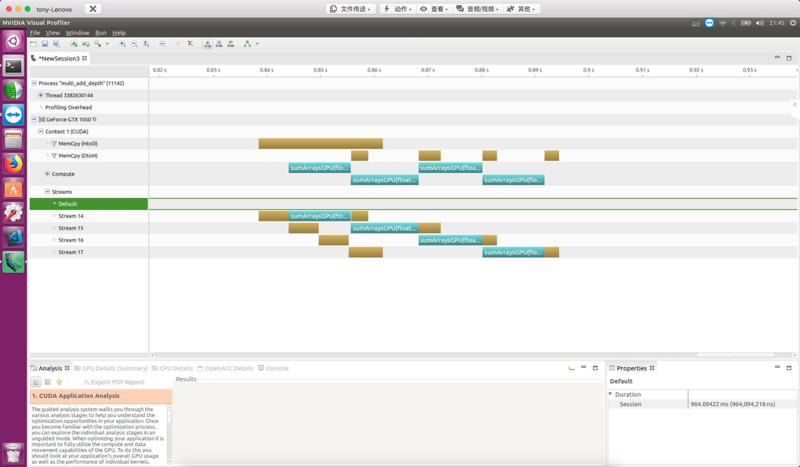
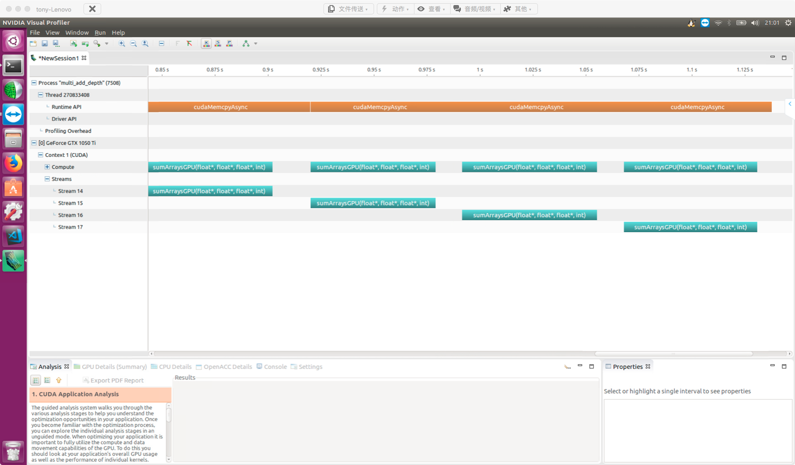
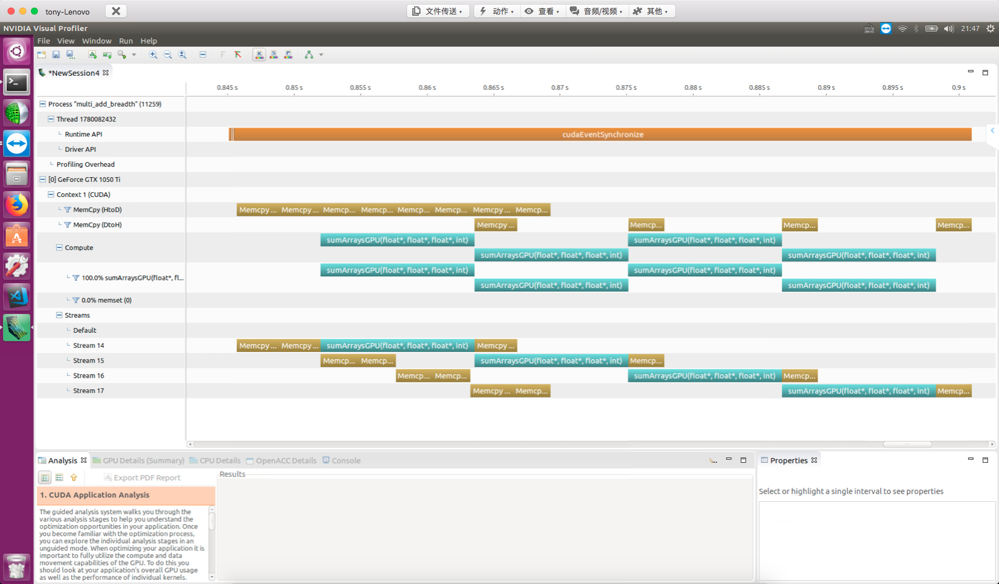

**Abstract:** 本文介绍如何利用流的重叠来隐藏主机到设备的数据传输延迟
**Keywords:** 深度优先，广度优先


# 重叠内核执行和数据传输

前面一节我们主要研究多个内核在不同流中的不同行为，主要使用的工具是NVVP，NVVP是可视化的非常实用的工具，值得大家深入研究一下。
Fermi架构和Kepler架构下有两个复制引擎队列，也就是数据传输队列，一个从设备到主机，一个从主机到设备。所以读取和写入是不经过同一条队列的，这样的好处就是这两个操作可以重叠完成了，注意，只有方向不同的时候才能数据操作。同向的时候不能进行此操作。
应用程序中，还需要检查数据传输和内核执行之间的关系，分为以下两种：

- 如果内核使用数据A，那么对A进行数据传输必须要安排在内核启动之前，且必须在同一个流中
- 如果内核完全不使用数据A，那么内核执行和数据传输可以位于不同的流中重叠执行。

第二种情况就是重叠内核执行和数据传输的基本做法，当数据传输和内核执行被分配到不同的流中时，CUDA执行的时候默认这是安全的，也就是程序编写者要保证他们之间的依赖关系。
但是第一种情况也可以进行重叠，只要对核函数进行一定的分割，我们用向量加法来完成本文的研究。

## 使用深度优先调度重叠

向量加法的内核我们很熟悉了

```
__global__ void sumArraysGPU(float*a,float*b,float*res,int N)
{
    int idx=blockIdx.x*blockDim.x+threadIdx.x;
    if(idx < N)
    //for delay
    {
        for(int j=0;j<N_REPEAT;j++)
            res[idx]=a[idx]+b[idx];
    }
}
```


我们这一章的重点都不是在核函数上，所以，我们使用这种非常简单的内核函数。但是不同的是，我们使用N_REPEAT进行多次冗余计算，原因是为了延长线程的执行时间，方便nvvp捕捉运行数据。
向量加法的过程是：

1. 两个输入向量从主机传入内核
2. 内核运算，计算加法结果
3. 将结果（一个向量）从设备回传到主机

由于这个问题就是一个一步问题，我们没办法让内核和数据传输重叠，因为内核需要全部的数据，但是，我们如果思考一下，向量加法之所以能够并发执行，因为每一位都互不干扰，那么我们可以把向量分块，然后每一个块都是一个上面的过程，并且A块中的数据只用于A块的内核，而跟B，C，D内核没有关系，于是我们来把整个过程分成 N_SEGMENT 份，也就是 N_SEGMENT 个流分别执行，在主机代码中流的使用如下：

```
cudaStream_t stream[N_SEGMENT];
for(int i=0;i<N_SEGMENT;i++)
{
    CHECK(cudaStreamCreate(&stream[i]));
}
cudaEvent_t start,stop;
cudaEventCreate(&start);
cudaEventCreate(&stop);
cudaEventRecord(start,0);
for(int i=0;i<N_SEGMENT;i++)
{
    int ioffset=i*iElem;
    CHECK(cudaMemcpyAsync(&a_d[ioffset],&a_h[ioffset],nByte/N_SEGMENT,cudaMemcpyHostToDevice,stream[i]));
    CHECK(cudaMemcpyAsync(&b_d[ioffset],&b_h[ioffset],nByte/N_SEGMENT,cudaMemcpyHostToDevice,stream[i]));
    sumArraysGPU<<<grid,block,0,stream[i]>>>(&a_d[ioffset],&b_d[ioffset],&res_d[ioffset],iElem);
    CHECK(cudaMemcpyAsync(&res_from_gpu_h[ioffset],&res_d[ioffset],nByte/N_SEGMENT,cudaMemcpyDeviceToHost,stream[i]));
}
//timer
CHECK(cudaEventRecord(stop, 0));
CHECK(cudaEventSynchronize(stop));
```


其中和前面唯一有区别的就是

```
for(int i=0;i<N_SEGMENT;i++)
{
    int ioffset=i*iElem;
    CHECK(cudaMemcpyAsync(&a_d[ioffset],&a_h[ioffset],nByte/N_SEGMENT,cudaMemcpyHostToDevice,stream[i]));
    CHECK(cudaMemcpyAsync(&b_d[ioffset],&b_h[ioffset],nByte/N_SEGMENT,cudaMemcpyHostToDevice,stream[i]));
    sumArraysGPU<<<grid,block,0,stream[i]>>>(&a_d[ioffset],&b_d[ioffset],&res_d[ioffset],iElem);
    CHECK(cudaMemcpyAsync(&res_from_gpu_h[ioffset],&res_d[ioffset],nByte/N_SEGMENT,cudaMemcpyDeviceToHost,stream[i]));
}
```


数据传输使用异步方式，注意异步处理的数据要声明称为固定内存，不能是分页的，如果是分页的可能会出现未知错误。
编译后使用nvvp查看结果如下：



如果使用非固定的主机内存，会产生下面的错误（别问我咋知道的。😜）



分成四份，数据传输和内核执行时重叠的。
观察nvvp结果：

- 不同流中内核相互重叠
- 内核和数据传输重叠

同时图中也有两种阻塞行为：

1. 内核被前面的数据传输阻塞
2. 主机到设备的数据传输被同一方向上的前面的数据传输阻塞

同样这里使用多个流的时候需要注意虚假依赖的问题。

GMU网格管理单元是Kepler架构引入了一个新的网格和调度控制系统，GMU可以暂停新网格调度，使网格排队等待且暂停网格直到他们准备好执行。使得运行时变得灵活。同时GMU也创建多个硬件工作队列，减少虚假内存的影响。

## 使用广度优先调度重叠

同样的，我们看完深度优先之后看一下广度优先
代码：

```
for(int i=0;i<N_SEGMENT;i++)
{
    int ioffset=i*iElem;
    CHECK(cudaMemcpyAsync(&a_d[ioffset],&a_h[ioffset],nByte/N_SEGMENT,cudaMemcpyHostToDevice,stream[i]));
    CHECK(cudaMemcpyAsync(&b_d[ioffset],&b_h[ioffset],nByte/N_SEGMENT,cudaMemcpyHostToDevice,stream[i]));
}
for(int i=0;i<N_SEGMENT;i++)
{
    int ioffset=i*iElem;
    sumArraysGPU<<<grid,block,0,stream[i]>>>(&a_d[ioffset],&b_d[ioffset],&res_d[ioffset],iElem);
}
for(int i=0;i<N_SEGMENT;i++)
{
    int ioffset=i*iElem;
    CHECK(cudaMemcpyAsync(&res_from_gpu_h[ioffset],&res_d[ioffset],nByte/N_SEGMENT,cudaMemcpyDeviceToHost,stream[i]));
}
```


nvvp结果：


在Fermi以后架构的设备，不太需要关注工作调度顺序，因为多个工作队列足以优化执行过程，而Fermi架构则需要关注一下。

## 总结

本文介绍了如何使用流隐藏数据传输的延迟，这是后面非常有用的一种技术，来加速数据密集型应用。

# 参考文献 #

```
https://face2ai.com/CUDA-F-6-3-重叠内核执行和数据传输/
```

