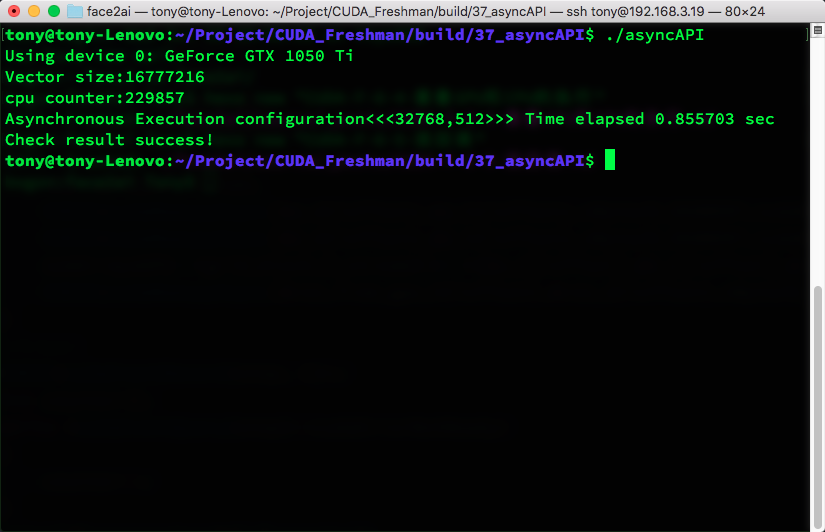

**Abstract:** 本文介绍如何进行GPU和CPU的重叠执行
**Keywords:** 重叠GPU和CPU的执行


# 重叠GPU和CPU的执行

除了上文说到的重叠数据传输和核函数的同时执行，另一个最主要的问题就是使用GPU的同时CPU也进行计算，这就是我们本文关注的重点。
本文示例过程如下：

- 内核调度到各自的流中
- CPU在等待事件的同时进行计算

具体代码如下：

```
cudaEvent_t start,stop;
cudaEventCreate(&start);
cudaEventCreate(&stop);
cudaEventRecord(start,0);
for(int i=0;i<N_SEGMENT;i++)
{
    int ioffset=i*iElem;
    CHECK(cudaMemcpyAsync(&a_d[ioffset],&a_h[ioffset],nByte/N_SEGMENT,cudaMemcpyHostToDevice,stream[i]));
    CHECK(cudaMemcpyAsync(&b_d[ioffset],&b_h[ioffset],nByte/N_SEGMENT,cudaMemcpyHostToDevice,stream[i]));
    sumArraysGPU<<<grid,block,0,stream[i]>>>(&a_d[ioffset],&b_d[ioffset],&res_d[ioffset],iElem);
    CHECK(cudaMemcpyAsync(&res_from_gpu_h[ioffset],&res_d[ioffset],nByte/N_SEGMENT,cudaMemcpyDeviceToHost,stream[i]));
}
//timer
CHECK(cudaEventRecord(stop, 0));
int counter=0;
while (cudaEventQuery(stop)==cudaErrorNotReady)
{
    counter++;
}
printf("cpu counter:%d\n",counter);
```


本文完整的代码在github:https://github.com/Tony-Tan/CUDA_Freshman（欢迎随手star😝 ）
运行结果是：



可见在事件stop执行之前，CPU是一直在工作的，这就达到一种并行的效果
代码中关键的一点是

```
cudaEventQuery(stop)
```


是非阻塞的，否则，不能继续cpu的计算

## 总结

本文很短，但是，作为一个非常不错的例子，展示了GPU和CPU之间的并行。

# 参考文献 #

```
https://face2ai.com/CUDA-F-6-4-重叠GPU和CPU的执行/
```

