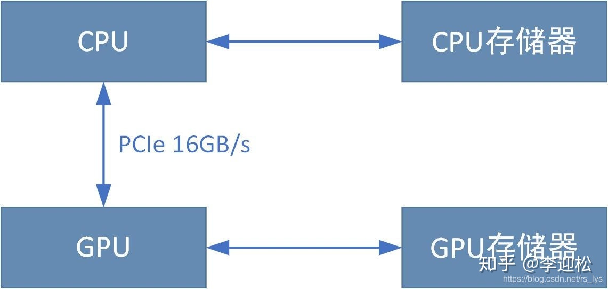
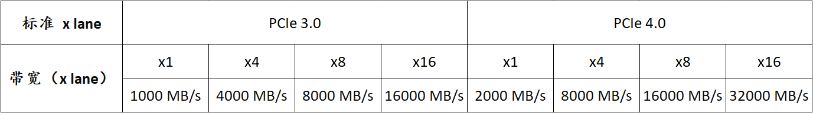
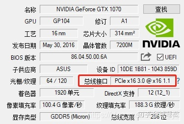
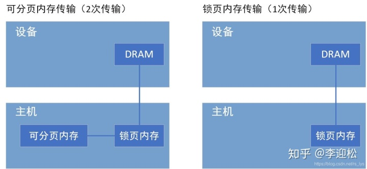

设备端和主机端之间数据传输的效率问题，简单来说就是数据传输效率成为了算法的性能瓶颈。

同事最终通过**固定内存**和**[异步传输](https://www.zhihu.com/search?q=异步传输&search_source=Entity&hybrid_search_source=Entity&hybrid_search_extra={"sourceType"%3A"article"%2C"sourceId"%3A"188246455"})**解决了该问题。本篇的主题也就以此为背景，想为大家科普下：

**如何提高数据传输效率！**

有同学可能想说，数据传输不就是cudaMemcpy吗？还有什么优化的方案呢？

**当然有，还不止一种！**

### 1. 我们在讨论什么？

我们讨论的数据传输，是指设备端和主机端的数据相互拷贝。

设备端指GPU端，数据存放在显存中；主机端指CPU，数据存放在内存中。一般情况下，设备端是不能直接访问主机端内存的（注意是一般情况下，有一种情况是例外，我后面会说），而我们的数据通常情况下都是存放在主机端内存中，要在GPU中执行算法运算就必须先把数据拷贝至设备端，运算完成再把结果拷回至主机端。这个传输过程，显然是会耗时的。



**传输需要多少耗时？** 这和PCIe[总线带宽](https://www.zhihu.com/search?q=总线带宽&search_source=Entity&hybrid_search_source=Entity&hybrid_search_extra={"sourceType"%3A"article"%2C"sourceId"%3A"188246455"})正相关。PCIe是CPU和GPU之间数据传输的接口，发展至今有多代技术，从之前的PCIe 1.0到现在的PCIe 3.0、PCIe 4.0，带宽越来越大，传输也是越来越快。一般PCIe会有多条Lane并行传输，理论传输速度成倍增加，我这里列一下多路PCIe 3.0、PCIe 4.0各自的带宽数值：




可以看到不同代次的总线宽度显著不同，而多Lane有成倍的带宽优势。

我用GPU查了查我的GTX1070桌面版，显示是PCIe x16 3.0，对应上表中的16000MB/s的带宽。



我们可以通过总线带宽来计算数据传输耗时，以一张1280x960的灰度图像为例，1个像素占1个字节，则传输数据量为 1280x960x1 B = 1228800 B = 1200 KB = 1.172 MB。若用我的GTX1070，则传输耗时 t = 1.172/16000 s ≈ 0.07 ms。看起来很少对不对，但我们算的可是[理论峰值](https://www.zhihu.com/search?q=理论峰值&search_source=Entity&hybrid_search_source=Entity&hybrid_search_extra={"sourceType"%3A"article"%2C"sourceId"%3A"188246455"})带宽，你见过有几个产品能到理论峰值的呢？最后的时间基本是要打较大折扣的，时间估计在0.12ms左右，你可能还是觉得很少，但是如果你传的是彩色图（一个像素3个字节）呢？要是一次需要传两张图呢？t = 0.12 x 3 x 2 = 0.72 ms，对于[GPU算法](https://www.zhihu.com/search?q=GPU算法&search_source=Entity&hybrid_search_source=Entity&hybrid_search_extra={"sourceType"%3A"article"%2C"sourceId"%3A"188246455"})来说，这个时间就不该被忽视了。

本文的主题即整理CUDA中各种不同的内存分配/传输方式，传输效率有何不同。希望能为大家设计算法提供一个参考。

### 2. 不同的内存分配/传输方式，传输效率有何不同？

### （1）常规方式传输：cudaMemcpy

在CUDA中常规的传输接口是cudaMemcpy，我想这也是被使用最多的接口，他可以将数据从主机端拷贝至设备端，也可以从设备端拷贝至主机端，函数声明如下：

```text
__host__ cudaError_t cudaMemcpy ( void* dst, const void* src, size_t count, cudaMemcpyKind kind )
```

cudaMemcpyKind决定拷贝的方向，有以下取值：

```text
cudaMemcpyHostToHost = 0
Host -> Host
cudaMemcpyHostToDevice = 1
Host -> Device
cudaMemcpyDeviceToHost = 2
Device -> Host
cudaMemcpyDeviceToDevice = 3
Device -> Device
cudaMemcpyDefault = 4
Direction of the transfer is inferred from the pointer values. Requires unified virtual addressing
```

该方式使用非常简单，很多情况下效率也足以满足性能需求。

### （2）[高维矩阵](https://www.zhihu.com/search?q=高维矩阵&search_source=Entity&hybrid_search_source=Entity&hybrid_search_extra={"sourceType"%3A"article"%2C"sourceId"%3A"188246455"})传输：cudaMemcpy2D/cudaMalloc3D

顾名思义，cudaMemcpy2D/cudaMalloc3D是应对2D及3D矩阵数据的。以图像为例，我们可以用cudaMalloc来分配一维数组来存储一张图像数据，但这不是效率最快的方案，推荐的方式是使用cudaMallocPitch来分配一个[二维数组](https://www.zhihu.com/search?q=二维数组&search_source=Entity&hybrid_search_source=Entity&hybrid_search_extra={"sourceType"%3A"article"%2C"sourceId"%3A"188246455"})来存储图像数据，存取效率更快。

```text
__host__ cudaError_t cudaMallocPitch ( void** devPtr, size_t* pitch, size_t width, size_t height )
```

cudaMallocPitch有一个非常好的特性是二维矩阵的每一行是内存对齐的，访问效率比[一维数组](https://www.zhihu.com/search?q=一维数组&search_source=Entity&hybrid_search_source=Entity&hybrid_search_extra={"sourceType"%3A"article"%2C"sourceId"%3A"188246455"})更高。而通过cudaMallocPitch分配的内存必须配套使用cudaMemcpy2D完成数据传输。

```text
__host__ cudaError_t cudaMemcpy2D ( void* dst, size_t dpitch, const void* src, size_t spitch, size_t width, size_t height, cudaMemcpyKind kind )
```

相比于cudaMemcpy2D对了两个参数dpitch和spitch，他们是每一行的实际字节数，是对齐分配cudaMallocPitch返回的值。

并非说cudaMemcpy2D/cudaMemcpy3D比cudaMemcpy传输更快，而是对齐内存必须使用cudaMemcpy2D/cudaMemcpy3D来配套使用。

3D矩阵的配套API为：

```text
__host__ cudaError_t cudaMalloc3D ( cudaPitchedPtr* pitchedDevPtr, cudaExtent extent )

__host__ cudaError_t cudaMemcpy3D ( const cudaMemcpy3DParms* p )
```

### （3）异步传输：cudaMemcpyAsync / cudaMemcpy2DAsync / cudaMemcpy3DAsync

我们知道传输是走[PCIe总线](https://www.zhihu.com/search?q=PCIe总线&search_source=Entity&hybrid_search_source=Entity&hybrid_search_extra={"sourceType"%3A"article"%2C"sourceId"%3A"188246455"})的，计算和PCIe总线里的数据流通完全独立，那么某些情况下，我们可以让计算和传输异步进行，而不是等数据传输完再做计算。

举个例子：我必须一次传入两张图像，做处理运算。常规操作是使用cudaMemcpy或者cudaMemcpy2D把两张图像都传输到显存，再启动kernel运算。传输和运算是串行的，运算必须等待传输完成。

而`cudaMemcpyAsync / cudaMemcpy2DAsync / cudaMemcpy3DAsync `可以让传输和运算之间异步并行。上面的例子，如果用cudaMemcpyAsync或cudaMemcpy2DAsync，可以先传输第一张影像到显存，然后启动第一张影像的运算kernel，同时启动第二张影像的传输，此时第一张影像的运算和第二张影像的传输就是异步进行的，互相独立，便可隐藏掉第二张影像的传输耗时。


三个[异步传输接口](https://www.zhihu.com/search?q=异步传输接口&search_source=Entity&hybrid_search_source=Entity&hybrid_search_extra={"sourceType"%3A"article"%2C"sourceId"%3A"188246455"})如下：

```text
__host__  __device__ cudaError_t cudaMemsetAsync ( void* devPtr, int  value, size_t count, cudaStream_t stream = 0 )

__host__  __device__ cudaError_t cudaMemcpy2DAsync ( void* dst, size_t dpitch, const void* src, size_t spitch, size_t width, size_t height, cudaMemcpyKind kind, cudaStream_t stream = 0 )

__host__  __device__ cudaError_t cudaMemcpy3DAsync ( const cudaMemcpy3DParms* p, cudaStream_t stream = 0 )
```

异步传输是非常实用的，当你一次处理多个数据时，可以考虑是否可以用异步传输来隐藏一部分传输耗时。

### （4）锁页内存（Page-locked）

**锁页内存**是在主机端上的内存。主机端常规方式分配的内存（用new、malloc等方式）都是可分页（pageable）的，操作系统可以将可分页内存和虚拟内存（硬盘上的一块空间）相互交换，以获得比实际内存容量更大的内存使用。

> 问：为什么我的内存满了程序还不崩？
> 答：因为正在使用虚拟内存。
> 问：为什么这么慢！
> 答：你就想想你拷文件有多慢。

如上所述，可分页内存在分配后是可能被操作系统移动的，GPU端无法获知操作系统是否正在移动对可[分页内存](https://www.zhihu.com/search?q=分页内存&search_source=Entity&hybrid_search_source=Entity&hybrid_search_extra={"sourceType"%3A"article"%2C"sourceId"%3A"188246455"})，所以不可让GPU端直接访问。实际的情况是，**当从可分页内存传输数据到设备内存时，CUDA驱动程序首先分配临时页面锁定的主机内存，将可分页内存复制到页面锁定内存中 [copy 1]，然后再从页面锁定内存传输到[设备内存](https://www.zhihu.com/search?q=设备内存&search_source=Entity&hybrid_search_source=Entity&hybrid_search_extra={"sourceType"%3A"article"%2C"sourceId"%3A"188246455"}) [copy 2]**。显然，这里面有两次传输。

所以我们能否直接分配页面锁定的内存？让GPU端直接访问，让传输只有一次！

答案是肯定的，我们可以在主机端分配**锁页内存**。锁页内存是主机端一块固定的物理内存，它不能被操作系统移动，不参与虚拟内存相关的交换操作。简而言之，分配之后，地址就固定了，被释放之前不会再变化。

GPU知道锁页内存的物理地址，可以通过“直接内存访问（Direct Memory Access，DMA）”技术直接在主机和GPU之间复制数据，传输仅一次，效率更高。



CUDA提供两种方式在主机端分配锁页内存

### 1. cudaMallocHost

```text
__host__ cudaError_t cudaMallocHost ( void** ptr, size_t size )
```

ptr为分配的锁页内存地址，size为分配的字节数。

### 2. cudaHostAlloc

```text
__host__ cudaError_t cudaHostAlloc ( void** pHost, size_t size, unsigned int  flags )
```

pHost为分配的锁页内存地址，size为分配的字节数，flags为内存分配类型，取值如下：

- cudaHostAllocDefault
  默认值，等同于cudaMallocHost。
- cudaHostAllocPortable
  分配所有GPU都可使用的锁页内存
- cudaHostAllocMapped。
  此标志下分配的锁页内存可实现零拷贝功能，主机端和设备端各维护一个地址，通过地址直接访问该块内存，无需传输。
- cudaHostAllocWriteCombined
  将分配的锁页内存声明为write-combined写联合内存，此类内存不使用L1 和L2 cache，所以程序的其它部分就有更多的缓存可用。此外，write-combined内存通过PCIe传输数据时不会被监视，能够获得更高的传输速度。因为没有使用L1、L2cache， 所以主机读取[write-combined内存](https://www.zhihu.com/search?q=write-combined内存&search_source=Entity&hybrid_search_source=Entity&hybrid_search_extra={"sourceType"%3A"article"%2C"sourceId"%3A"188246455"})很慢，write-combined适用于主机端写入、设备端读取的锁页内存。

分配的锁页内存必须使用cudaFreeHost接口释放。

对于一个已存在的可分页内存，可使用cudaHostRegister() 函数将其注册为锁页内存：

```text
__host__ cudaError_t cudaHostRegister ( void* ptr, size_t size, unsigned int  flags )
```

flags和上面一致。

锁页内存的缺点是分配空间过多可能会降低主机系统的性能，因为它减少了用于存储虚拟内存数据的可分页内存的数量。对于图像这类小内存应用还是比较合适的。

### （5）零拷贝内存（Zero-Copy）

通常来说，设备端无法直接访问主机内存，但有一个例外：**零拷贝内存**！顾名思义，零拷贝内存是无需拷贝就可以在主机端和设备端直接访问的内存。

零拷贝具有如下优势：

- 当设备内存不足时可以利用[主机内存](https://www.zhihu.com/search?q=主机内存&search_source=Entity&hybrid_search_source=Entity&hybrid_search_extra={"sourceType"%3A"article"%2C"sourceId"%3A"188246455"})
- 避免主机和设备间的显式数据传输

**准确来说，零拷贝并不是无需拷贝，而是无需显式拷贝**。使用零拷贝内存时不需要cudaMemcpy之类的显式拷贝操作，直接通过指针取值，所以对调用者来说似乎是没有拷贝操作。但实际上是在引用内存中某个值时隐式走PCIe总线拷贝，这样的方式有几个优点：

- 无需所有数据一次性显式拷贝到设备端，而是引用某个数据时即时隐式拷贝
- 隐式拷贝是异步的，可以和计算并行，隐藏内存传输延时

零拷贝内存是一块主机端和设备端共享的内存区域，是锁页内存，使用cudaHostAlloc接口分配。上一小结已经介绍了零拷贝内存的分配方法。分配标志是cudaHostAllocMapped。

对于零拷贝内存，设备端和主机端分别有一个地址，主机端分配时即可获取，设备端通过[函数cudaHostGetDevicePointe](https://www.zhihu.com/search?q=函数cudaHostGetDevicePointe&search_source=Entity&hybrid_search_source=Entity&hybrid_search_extra={"sourceType"%3A"article"%2C"sourceId"%3A"188246455"})r函数获取地址。

```text
__host__ cudaError_t cudaHostGetDevicePointer ( void** pDevice, void* pHost, unsigned int  flags )
```

该函数返回一个在设备端的指针pDevice，该指针可以在设备端被引用以访问映射得到的主机端锁页内存。如果设备端不支持零拷贝方式（主机内存映射），则返回失败。可以使用接口cudaGetDeviceProperties来检查设备是否支持主机内存映射：

```text
struct cudaDeviceProp device_prop
cudaGetDeviceProperties(&device_prop,device_num);
zero_copy_supported=device_prop.canMapHostMemory;
```

如上所述，零拷贝不是无需拷贝，而是一种隐式异步即时拷贝策略，每次隐式拷贝还是要走PCIe总线，所以频繁的对零拷贝内存进行读写，性能也会显著降低。

以下几种情况，可建议使用零拷贝内存：

- 在一大块主机内存中你只需要使用少量数据
- 你不会频繁的对这块内存进行重复访问，频繁的重复访问建议在设备端分配内存显式拷贝。最合适的情况，该内存的数据你都只需要访问一次
- 你需要比显存容量大的内存，或许你可以通过即时交换来获得比显存更大的内存使用，但是零拷贝内存也是一个可选思路

### 3. 总结

从以上内容，我们总结几点关键信息：

-  \1. 常规传输方式：cudaMemcpy，在很多情况下都是最慢的方式，但他近乎适用于所有情况，所以也可能是被使用最多的方式。很多情况下传输不一定构成效率瓶颈
-  \2. 如果是二维或[三维矩阵](https://www.zhihu.com/search?q=三维矩阵&search_source=Entity&hybrid_search_source=Entity&hybrid_search_extra={"sourceType"%3A"article"%2C"sourceId"%3A"188246455"})，可以用对齐分配，配套的需要使用cudaMemcpy2D和cudaMemcpy3D
-  \3. 可以通过异步传输方式：cudaMemcpyAsync / cudaMemcpy2DAsync / cudaMemcpy3DAsync ，隐藏一部分传输耗时
-  \4. 使用锁页内存，相比可分页内存可减少一次传输过程，显著提高传输效率，但过多的分配会影响操作系统性能
-  \5. 零拷贝内存避免显式的数据传输，适用于数据量少且数据使用次数少的情况

# 参考文献 #

https://zhuanlan.zhihu.com/p/188246455