PS： PNNX 替代 ONNX专门做pytorch到设备IR的转换，目前这个可以直通ncnn。

我今天讲的主题叫 PNNX，PyTorch Neural Network Exchange

他是 PyTorch 模型部署的新的方式，可以避开 ONNX 中间商，导出比较干净的高层 OP

PNNX 的名字和写法也是沿袭了 ONNX，然后 P 是 O 的后面一个字母，代表着 PNNX 希望能比 ONNX 做的更好

[https://github.com/Tencent/ncnngithub.com/Tencent/ncnn](https://link.zhihu.com/?target=https%3A//github.com/Tencent/ncnn)

[https://github.com/Tencent/ncnn/pull/3262github.com/Tencent/ncnn/pull/3262](https://link.zhihu.com/?target=https%3A//github.com/Tencent/ncnn/pull/3262)

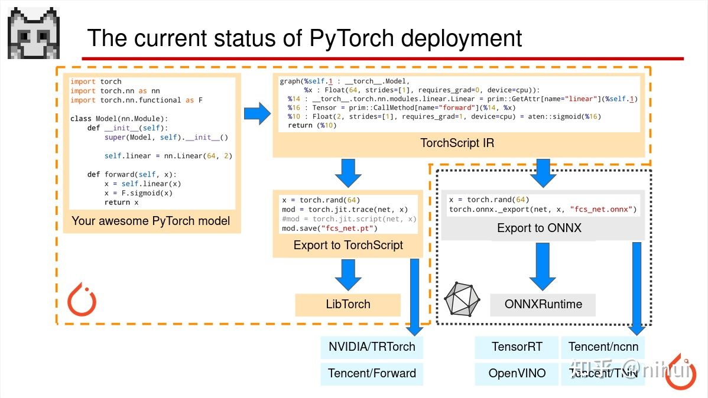

ok，现在就开始讲 PyTorch 模型部署，我们现在这一页看到的是全局的综览，是目前 PyTorch 模型部署的一些流程

我们这个 PPT 画了橘红色的虚线代表 PyTorch 的生态圈，然后 ONNX 用灰色的虚线画出来是代表 ONNX 的生态圈

以下是以我们一些常用的第三方的推理加速库

这是目前 PyTorch 部署的整体流程，基本上涵盖了已知所有的方式，主要是 TorchScript 和 ONNX 两种

接下来我们会详细的介绍各自这些部署方式的优劣势

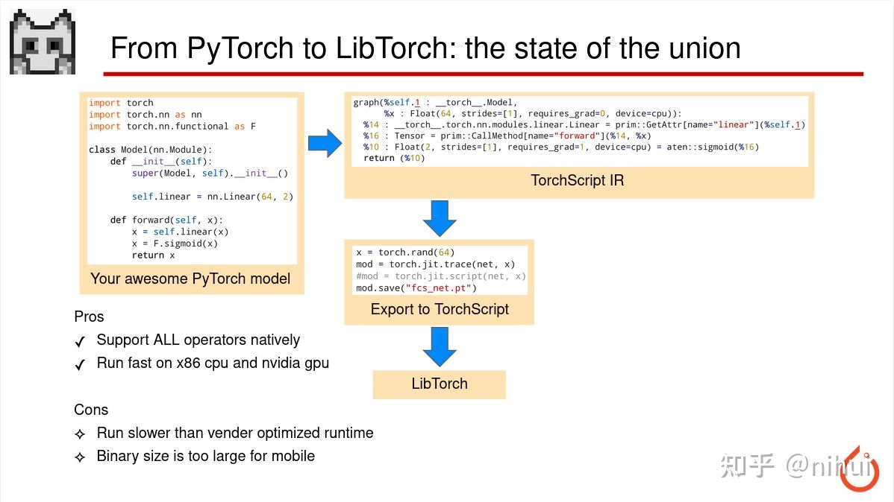

首先是我们看这个 PyTorch 到 libtorch 自有生态圈的部署

这种部署方式可以支持 PyTorch 模型里所有的 op，因为 libtorch 就是 PyTorch 的底层实现，所以只要 PyTorch 能跑的，导出来就一定能跑，然后 libtorch 也支持在 CPU 还有 GPU 上加速的，这是他的一个主要优势

但是他也有缺点，有两个缺点。一个是他的速度没有那些厂商专门优化的库快，比如，CPU 上 libtorch 的速度比 OpenVINO 慢，然后 NVIDIA GPU 上也比 TensorRT 会慢一点。另外这个 libtorch 的库大小非常大，所以如果在移动端上部署的话，这个二进制文件过于庞大可能有十几兆这样，所以也不太适合应用于 APP

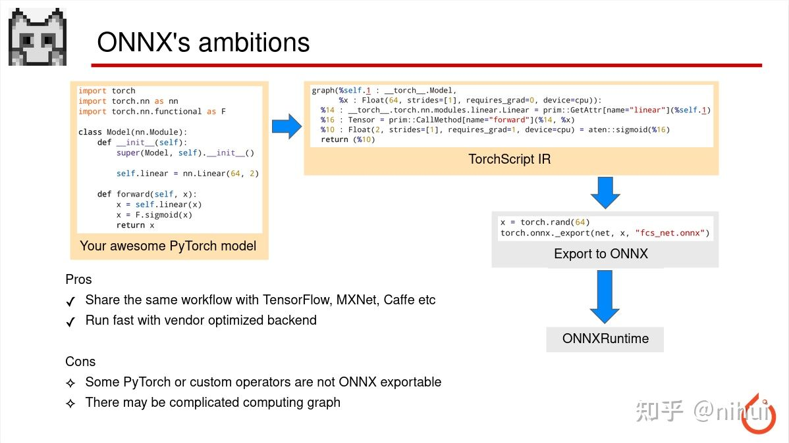

这是通过 ONNXRuntime 部署的方式

是由 PyTorch 先导出 ONNX 文件，然后使用 ONNX 自家的这个 ONNXRuntime 实现模型的推理

他这个方式一个好处是 ONNX 是支持其他一些训练框架，比如 TensorFlow、MXNet、Caffe，这样你可以用同一个 ONNXRuntime 来部署任意一种训练框架导出的模型，这样他的 workflow 是一致的

然后 ONNXRuntime 后端也有一些厂商优化库，比如 GPU 上可能会有 TensorRT，或者 OpenVINO 这样优化的后端，这样他的执行效率也会比较高

但是他有些缺点，比如 PyTorch 一些模型的算子可能在 ONNX 是没有的，这样导出 ONNX 的时候会出错导不出来，以及 PyTorch 导 ONNX，有时候会导出一个非常复杂的计算图，这个情况会导致推理效率的下降

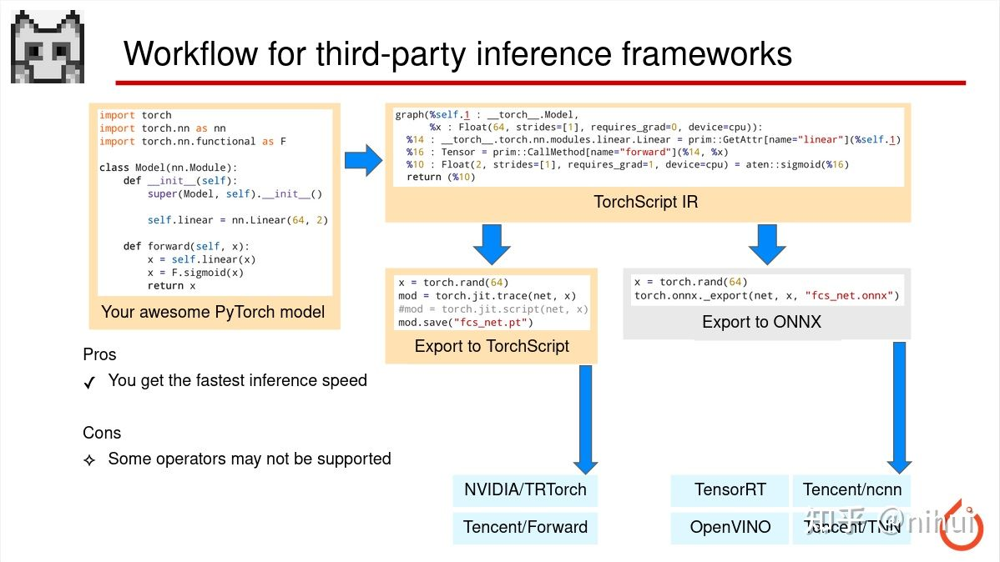

这里说的是第三方库的部署方式

我们比较常规的方式是 PyTorch 导 ONNX，然后再通过 ONNX 转换到我们第三方推理框架的模型，比如我们 ncnn 也是通过 ONNX 来支持 PyTorch 的部署，那其他的比如 TensorRT、OpenVINO，还有腾讯的 TNN 也是通过 ONNX 来做这个部署

torchscript 那一条路呢，目前也看到些开源的框架支持通过 torchscript，比如 TRTorch、Forward，但是这条路目前用的比较少因为大家，ONNX 毕竟是时间比较久，用户也比较多，资料也更多一点

使用第三方库来做 PyTorch 部署优势，一个最主要的优势就是可以在你的目标平台上获得最快的推理速度，TensorRT 在 NVIDIA 的 GPU 上最快，OpenVINO 在 Intel 的 CPU 上最快，那比如可能 ncnn 或者 TNN 在手机端 CPU 会更快一点

但是第三方库有个更严重的问题就是，比如我刚才说的 ONNX，我也说了有一些 PyTorch 的算子导出 ONNX 是不支持的，而第三方库相对 ONNX 可能支持的算子更加有限，有可能 ONNX 转到第三方库还有一部分算子是不支持，所以就只能支持一些比较常规的模型，复杂的话可能会导出不了不支持的情况

这就是目前 PyTorch 模型部署的三种主流的途径吧

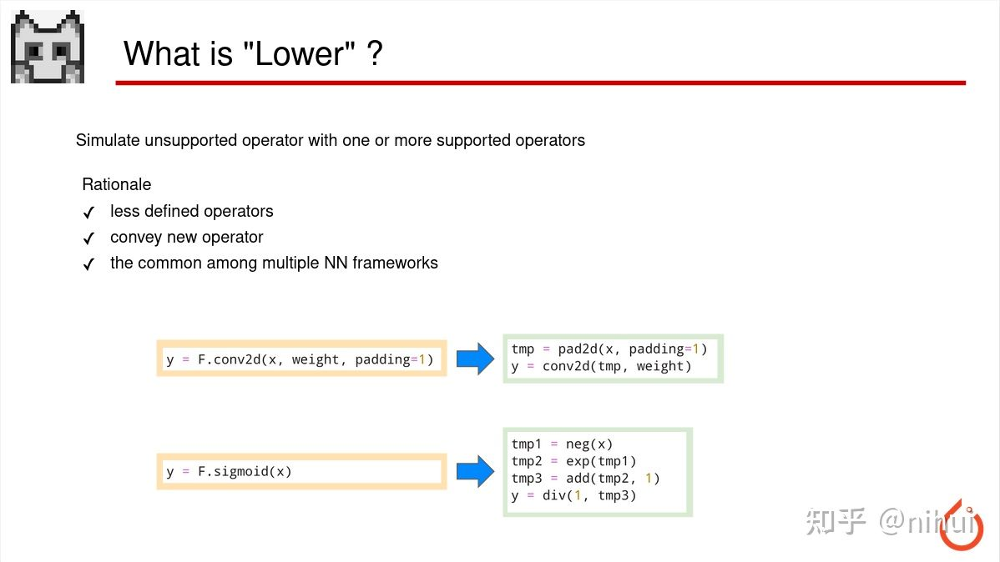

接下来我会介绍一个概念叫 lower

lower 这个概念其实是一个编译器里面的概念，深度学习模型的转换里面也是一个 lower 的概念

这 lower 什么意思啊就是一句话来说：就是用一个或多个框架支持的算子来模拟出模型里面所不支持的算子

下面就有两个例子

比如我的模型里面写了一个 padding=1 的卷积，那可能我的推理库的卷积不支持有 padding

但是他支持一个单独的叫 pad2d 的算子，这时候模型转换过程中就会把 padding=1 的卷积

拆成两个步骤，先做 padding，然后再做一个没有 padding 的卷积，这个过程就是相当于有两个算子来实现了一个不支持的算子参数

下一个例子是 sigmoid

sigmoid 的操作，大部分机器或 GPU 上没有独立的函数叫 sigmoid，一般会拆成，先取负，然后 exp，再加1，最后1除tmp3 的操作，这样就是个数学公式展开，相当于用4个能实现的算子来模拟出 sigmoid。有的时候呢，这个平台可能 exp 也不支持，那可能还会把 exp 用级数展开，用乘法加法的实现

这个过程，总之用多个支持的来模拟不支持的过程就叫 lower，这个箭头从左到右就叫 lower

这个目的也是比较实在的，这样我的后边的推理库只需要支持比较少量的算子，就能实现出很多很多其他的算子，对吧

然后如果我们的模型里面，因为我们的这个深度学习模型，他这个算子啊一直在发展，一直在变化，比如现在可能会出一个新的算子叫 swish，那 swish 激活其实是 x 乘以 sigmoid，如果我们有这种 lower 的方式的话，我们就可以把 swish 拆成 x 乘 sigmoid 的这样两步，这样就可以覆盖到更多新的算子，将来新的算子都可以兼容

第三个就是我们可以用这些支持的少量算子来兼容更多的训练框架，因为训练框架每个高层的算子可能在实现细节上有些不同，那我们拆开之后就可以去兼容这些不同的细节

这就是 lower 的一个概念

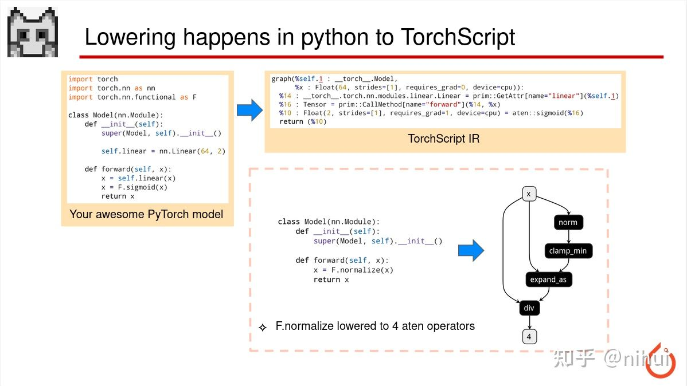

我们刚才 PyTorch 模型部署的流程中有个导出 torchscript 的过程，torchscript 的导出过程中也发生了这个 lower 的事情

比如，这里有个例子 F.normalize，这是一个比较常见的做一个 norm 的算子，这个算子在导出 torchscript 的时候，会因为 aten 没有一个叫 normalize 的算子，所以会用 4 个 aten 的算子去模拟这个 normalize python 的一行

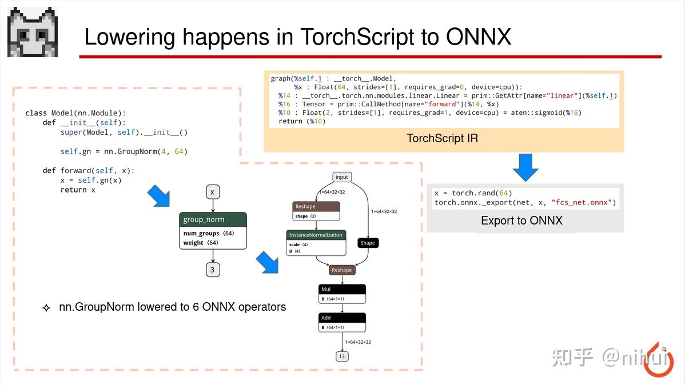

然后我们导出 ONNX 的时候，这里要明白 ONNX 并不是从 python 代码直接转到 ONNX，ONNX 导出时候是先通过导出 torchscript，然后从 torchscript ir 再转 ONNX

所以像左边这个例子也是一个比较常见的操作叫 GroupNorm，这个 op 在 aten 和 torchscript 里面是存在的，所以导出到 torchscript 的时候，没有发生 lower。但是 ONNX 没有一个叫 GroupNorm 算子，所以使用了 6 个 ONNX 支持的算子去模拟了这个 GroupNorm，于是这个 GroupNorm 在 ONNX 被 lower 成了 6 个算子

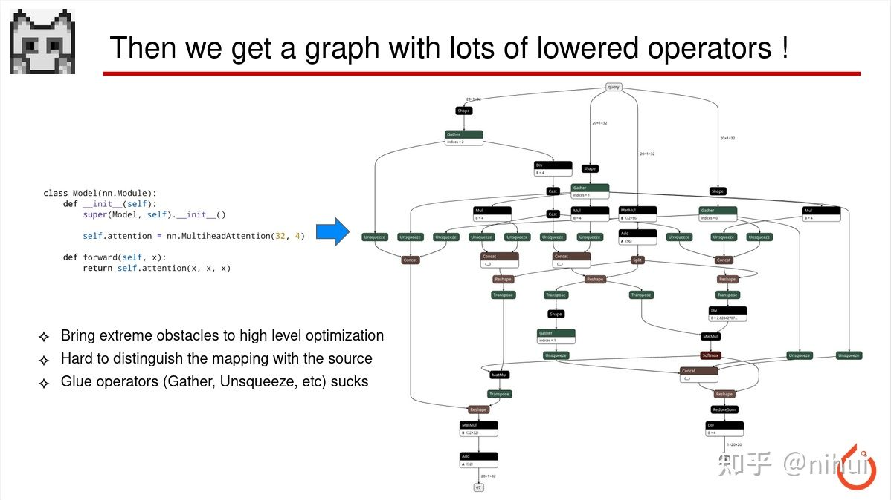

经过这两次的 lower，我们会产生一个问题，就可能我们 PyTorch 里面那很简单的一行，导出 ONNX 之后，经过了两层的层层 lower，最后会出来一个非常非常庞大的计算图

这就是一个比较典型的例子，那这个庞大的计算图会有比较严重的问题

首先，这个图的算子过于细碎，太细碎的算子非常不利于推理的优化，因为每个操作的力度都太细了

第二点是当我们导出这么一个复杂的 ONNX 图的时候，因为 ONNX 不是叫 Open Neural Network Exchange 嘛，ONNX 其实也是个模型文件嘛，我把这个模型文件给，比如我的第二位同事，他也是个算法工程师，他看到这个 ONNX 这个图之后，再也无法对应回原先的原始模型了，就是说你看到这个 ONNX 图后，你不知道原始的网络结构是怎样的了，因为这已经变成一大坨浆糊了

第三个就是这个大的复杂计算图里面有非常多的胶水 op，比如 ONNX 我们所熟知的 Gather、Unsqueeze op，这种 op 比如在 ncnn 里面是没有做支持的，所以会有这个比如你用第三方库，这样 ncnn 里面去转换模型时候会有转不了的情况

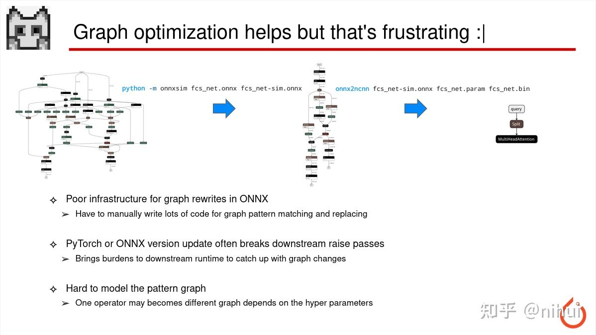

针对这种情况呢，我们 ONNX 社区大缺弦老师有做了 onnx-simplifier，这个工具可以将比较大的复杂计算图做一个简化，去除里面一部分的那些胶水的 op。然后 ncnn 这边的 ONNX 转换工具还会再做一次这种简化，把这种这么多的 op 再捏回到最初的那一个 op

这个把一些细碎的 op 捏回到一个大 op 的过程就叫图优化，这也是很多推理框架本身也会做的一些事情。因为 ONNX 这个图就是非常复杂，所以几乎每个推理框架都会做一些图优化

这个图优化工作主要做法就是模板匹配 pattern matching 对吧，然后再把匹配到的子图用对应的一个大 op 替换掉，这种图优化目前来说，还可以工作的很好，因为这个 pattern 我们可以写一份工具去实现自动化的

但是呢，虽然表面上看上去金玉在外，败絮其中啊。虽然说图优化能做一些这样的好事，但是实际上也非常麻烦

麻烦在哪呢？

首先 ONNX 这个文件是个 protobuf，他本身没有提供任何那种进行图优化一些基础库的工作，不像 MLIR，所以我们工程师在写图优化的时候，要写大量的 if 判断，参数判断来实现图优化

第二点也是比较重要的是，我们 PyTorch 或者 ONNX 每次升级版本，或者 ONNX opset 从 9 变成 11 变成 13，他生成的导出这个 ONNX 的计算图都会发生改变，那一改变之后呢，我们原先写的图优化的 pattern 就不 work，他就无法再匹配到你新的。所以让我们下游的这些推理框架开发者非常麻烦，就每次我们遇到版本升级之后，必须再写一份图优化的一个函数来覆盖到这个新的版本。嗯这个是一个永无止境的坑，因为我们知道 PyTorch 和 ONNX 永远在升级版本

第三点呢就是，有时候一些高层的这个 op 里面一些参数的变化也会导致图的变化。比如我们所熟知的 PyTorch nn.Conv2d 卷积层，它里面有个参数叫 padding 模式，通常我们都是用常量 padding，但是它也支持 replicate 还有 reflect padding 的模式。那如果用这种参数的话，同样是 Conv2d 导出的就会不一样，这样也会增加图优化匹配的复杂性

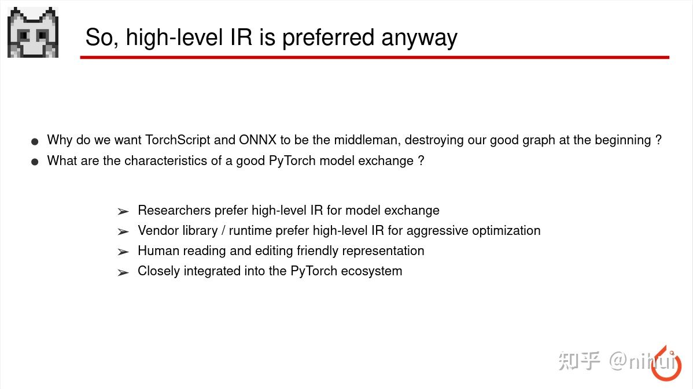

所以其实这个我们可以明白，就是我们当初算法工程师写 python 代码的时候，其实是写的一个比较简单，比较干净的 python 代码，就是因为我们要经过 torchscript 和 ONNX 中间商，通过他们导出之后，这个图才会变得这么复杂。

那我们为什么一定要用他们对吧，我们为什么不直接在原始的 python 图上，直接导出一个比较好的干净的 ir 呢？

这里我思考了一些关于如何做一个比较好的模型交换格式的想法，因为模型交换嘛对吧

我们交换的话是应该以人为本的，就是说我们希望这个模型文件出来之后，给另一位研究员看到的就是我们的 high-level 的

我们希望这个模型文件里面的 op 足够 high-level，以便后端的厂商或者推理库框架开发者能更好的做更激进的优化

我们也希望这个模型格式本身是对人类可读和可编辑都比较友好的，像 torchscript 和 ONNX 里边的二进制是人类不可读的，所以也是想要做一个方便人类去读和编辑的表达形式

最后呢我认为就是，我们主题叫 PyTorch Neural Network Exchange，我们选择 PyTorch 的原因呢，也是因为目前深度学习训练框架中，PyTorch 在行业内使用是最为广泛的，所以在设计模型交换格式也是考虑我们只关注 PyTorch

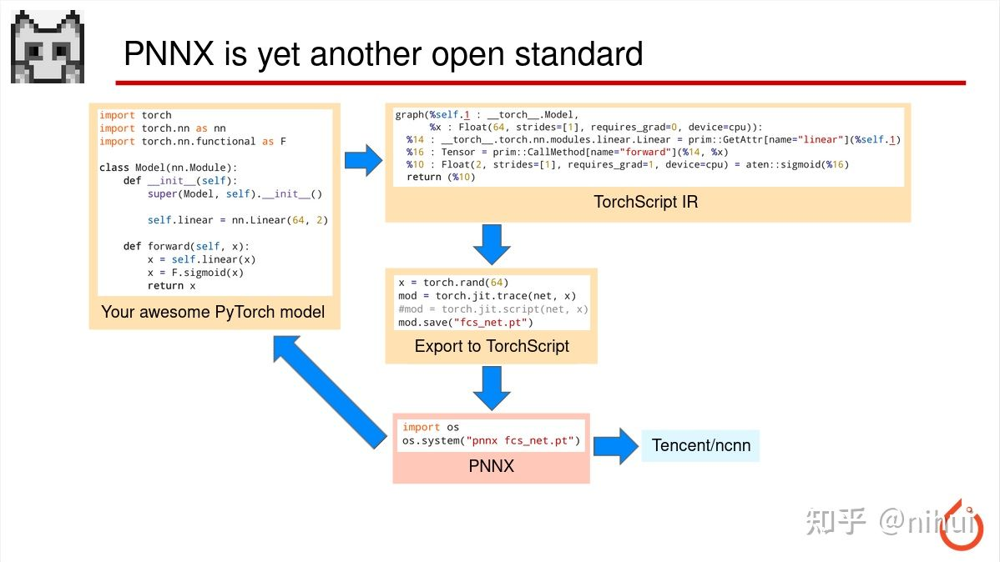

所以今年，在2021年Q3 这是个刚新出炉的东西，叫 PNNX

那 PNNX 位置在整个大的图里面在什么位置，在 torchscript 的下面的位置。我们刚才也说为什么不从 python 代码直接导出 PNNX，还是要经过 torchscript，因为 python 代码其实是一个编程语言，不是一个可以解析的 ir，所以如果用 python 直接起的话会比较复杂，所以还是利用 torchscript，因为 torchscript 的毕竟是 PyTorch 自家生态，他稍微跟原始的 python 代码会比较接近。然后通过 torchscript 里面的 ir 的转换，再把这些 op 来捏回到原始的最高层这个 python 的 op

那这个箭头是什么意思

这个箭头是 torchscript 导 PNNX，这个回去的箭头代表 pt 转出来后也会生成对应的 python 源代码，这个就是相当于转回去了，可以转换成原始的 python，这样就方便就是我们算法研究员去搭模型，对吧

然后右边说这个 PNNX 会直接会导出 ncnn 的模型，这就是一个 PyTorch 模型部署的新途径，是基于 PNNX 来实现

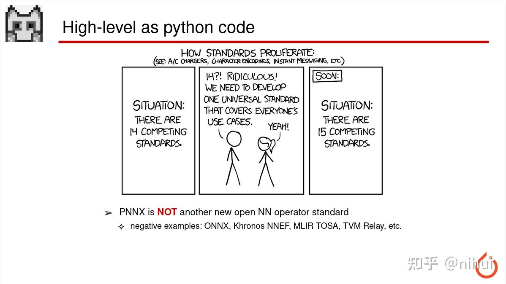

这里要说的一点是 PNNX 他不是一个新的 NN 算子标准

因为我们知道深度学习训练框架每个都有一个自己的算子定义，然后我们的后端推理库或者平台厂商优化的 runtime，他也有自家的一套算子定义

然后针对这种情况，之前有些尝试，比如 ONNX，Khronos NNEF，MLIR TOSA，TVM Relay。他们都会尝试用一个大一统比较覆盖更加全面的算子定义，来兼容所有的这些差异性。但是最后发现其实他们只不过又发明了一套新的算子定义而已，他们并没有做到一个 Universal 的通用的大一统，最后只不过又做了一套新的，这不仅是增加了学习负担，也是进一步导致了算子之间、标准之间的差异和碎片化嘛

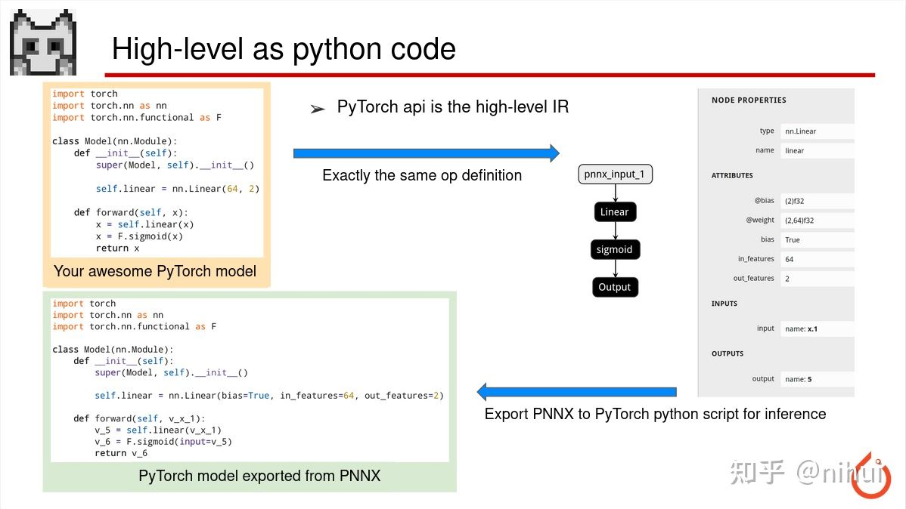

PNNX 这边没有发明新的算子标准

他的算子的定义是直接与 python 的代码算子接口保持一模一样，就是说他是直接利用这个 PyTorch API 就是这个算子。

我们可以看到我们写的一个 nn.Linear，对吧。他转成 PNNX 之后，模型里面写的这个 op 就叫 nn.Linear。然后里面的所有参数都跟原始的 python api 保持一模一样的名字。这样的好处是，当我拿到右边的 PNNX 模型之后，我还可以通过他来转回到原始的 PyTorch 的 python 代码，因为算子定义和参数表达形式一模一样，所以都可以转回去。那这样就相当于是一个循环永动机，甚至你可以把转回去的这个 model 直接拿来用或者直接拿来训练，或者你可以把它再导出成 PNNX，这样就是相当于一个完全一致的对应关系

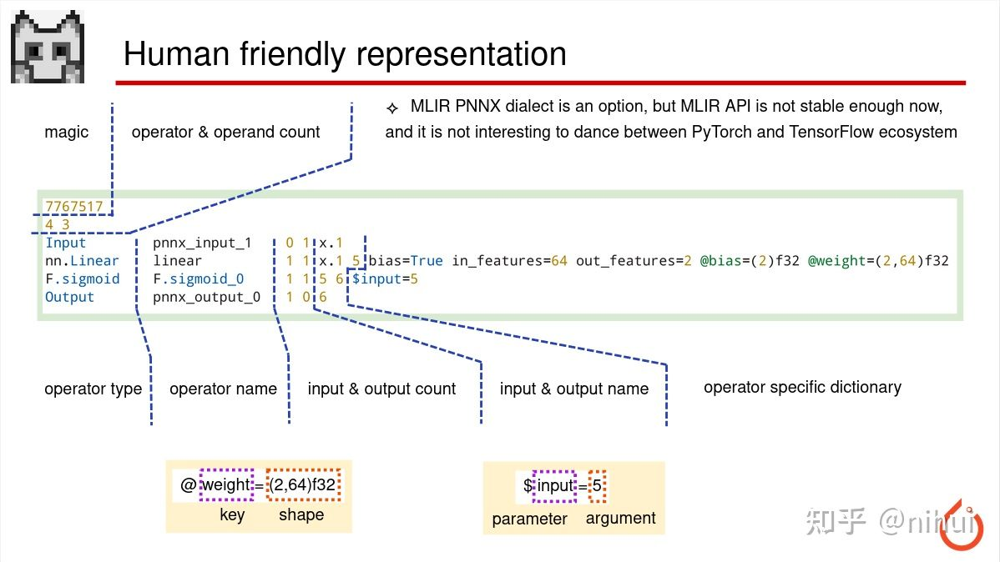

PNNX 的这个模型文件也是征询了一些社区开发者的意见

因为我们 ncnn 的一些开发者对 ncnn 模型写法都比较欢迎，因为他们会觉得 ncnn 文本的形式非常容易修改，非常容易魔改，比如加个 op，改个参数。所以 PNNX 这边也是沿袭了 ncnn 的模型格式。这个格式跟 ncnn 基本是一样的，但是扩展了一些功能，就比如 ncnn 的参数列表，他的 key 只能是 0123 这种数字，那 PNNX 这边就扩展成可以用一个 string 作为 key，那这个和 python API 就可以保持对应的关系

之前也考虑过 MLIR dialect，因为 MLIR 可以兼容万物 op，对吧。但是 MLIR 玩过之后呢，我会觉得他 api 目前还不够稳定，MLIR 在 LLVM 的项目里也没有正式发布一个稳定版本，以及 MLIR 这个库是需要用户自己去 git clone LLVM 项目，然后自己去编译的。这个事情会挡住很大一部分开发者，编译也是比较困难。那还有一点就是 MLIR 我们知道其实是属于 TensorFlow 生态，因为他是 Google 主导的。然后 PyTorch 和 TensorFlow 是完全两个生态。如果基于 MLIR 去做的话，相当于是在两个生态之间牵线，这个事情并不是那么的好玩，所以还是使用了一个更加朴素、更加简单的模型的形式

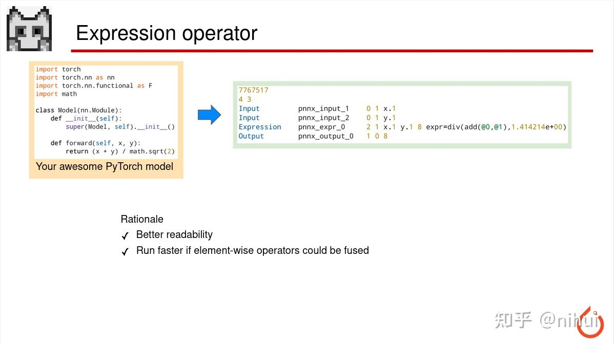

这是一些 PNNX 里面的特性

这里讲的是，比如我 PyTorch 里面写的一个简单的算术表达式，这个表达式转成 PNNX 之后会保留表达式的整体，他们不会被拆成加减乘除很多小算子。这样我们阅读模型本身时候会更加的方便，因为一看就能看出这是一整个表达式算术。另外在一些比如 GPU 或者可编程的硬件上，这种逐像素的操作，多次逐像素的操作他是可以合并出来，这样减少这个层存储访问，可能效率会更高一点

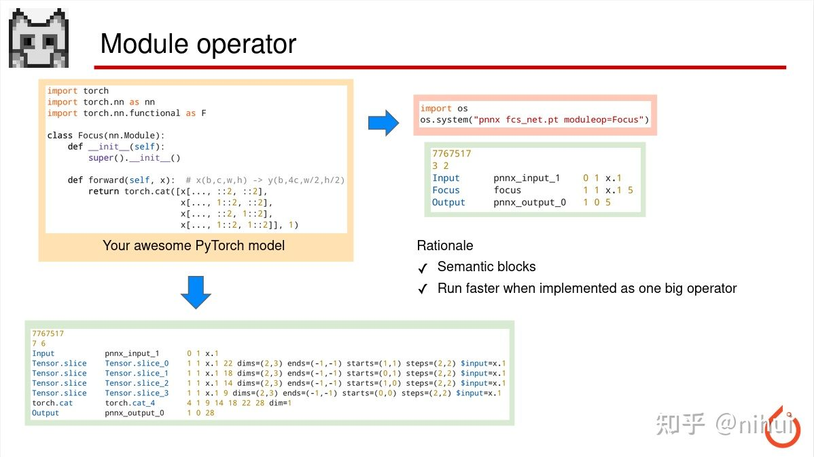

这是 PNNX 第二个功能

我们左边写了一个 YOLOv5 里面的 Focus 模块，当他直接导出成 PNNX 的时候，下面是直接导出的一个状况，他会导出成 4 个 slice 和 1 次 cat，这个图是一个完全正确的表示形式

但是当我们想要实现一个更高效的 Focus 的时候，我们其实不希望他拆成 5 个算子，我们希望让他就一个步骤里去实现出整个 Focus 的过程，那这样相当于用一个大 op 来替换掉原先的一些小的碎 op

PNNX 也支持这种自动根据 Module 来直接合并出一个大算子，当我写增加这个 moduleop=Focus 参数之后，我 PNNX 导出之后就不会再展开 Focus 的 Module，会把这个 Focus 一整块当成一个大 op 导出来

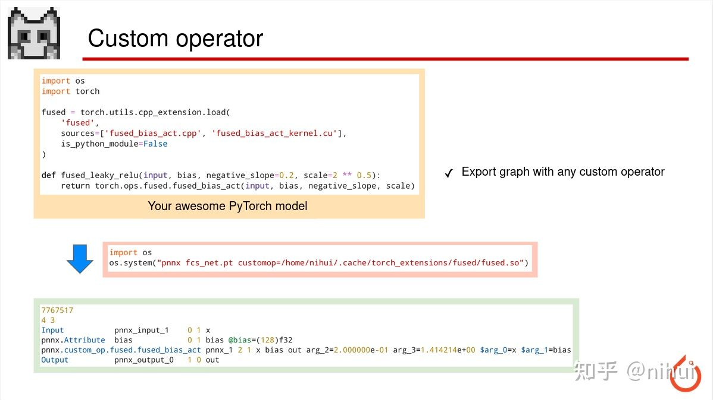

这是另一个特性

就是我们有时候 PyTorch 的一些算法会使用一些自定义 op，自己写一个 cpp，或自己写一个 cuda 的代码实现自定义的 op，但是这种自定义 op 目前 ONNX 那边是导不出来的。你肯定导不了，因为 ONNX 不可能有你这个自定义 op 的东西的

PNNX 是允许你导出这个自定义 op 的，我们加一个 customop 指向编译出来的 torch so 之后，他就会把这个自定义 op 导出成 PNNX.custom_op，然后自定义 op 的名字，然后自定义 op 的参数，比如这个 slope、scale，他都会写在后面，就是参数也会写在后面。

但是具体这个自定义 op 的实现他是没有的，因为你的实现是 cpp 和 cuda 的代码，对吧。但是 PNNX 只能负责这个计算图的导出，后面的话，比如推理库那边可能会支持一些自定义 op 的插件，就可以直接自定义 op 实现了，这样也相当于是解决了自定义 op 导出的问题

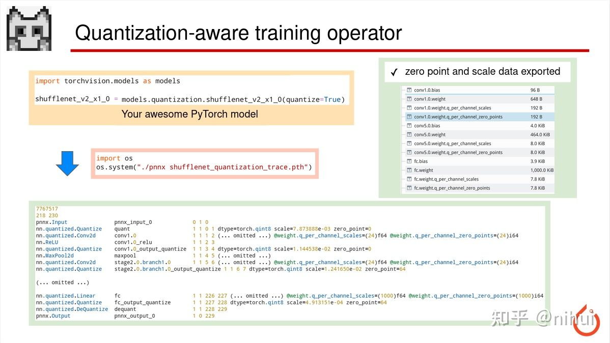

这是另一个主要特性

这是 PyTorch QAT，就是量化感知训练的算子。目前来说，如果你用 ONNX 去导出的话，他可能只支持部分 QAT 的训练策略

然后 PNNX 这边，如果你对量化模型导出，会尝试做一个比较好、比较完整的量化相关的一些参数的处理，比如量化的一些 Quantize、Conv2d 这些层，他会把量化的 scale，还有 zeropoint 这些参数记录下来，以及我们量化的 Conv 的 weight，它也会存成对应的 int8 数据，存在 bin 里，还有 weight 的 per-channel 的 scale，zeropoint 也会记录，这样就解决了导出 QAT op 方法的一个问题，这个也是目前 ONNX 做的还不够好的一方面

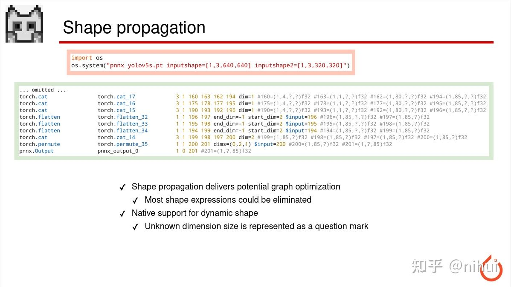

PNNX 在转 torchscript 导出的时候可以写 shape

如果你写下 inputshape 之后，导出的 PNNX 后面会产生每个 feature blob，对应的 shape 信息会写在后面，这样会帮助到一些有 shape 相关信息参与的表达式的常量折叠优化，有时候这种什么 reshape 呀这种的后面参数，就会通过我们 shape 的推断和传播把它变成一个常量。

有的时候我们的模型支持动态 shape，比如这里的 YOLOv5，这种情况我们的工具允许你再写第二个 shape，第二个 shape 可以跟第一个 shape 不一样。那你不一样的时候呢，导出的模型里面就会带有问号，这个 shape 里带有的问号，这位置就代表当前的一维，比如 w h 两个维度，他的尺寸是不固定。这个可能会影响一些后端的优化的策略，但从 PNNX 设计上说，支持静态 shape，也支持动态 shape

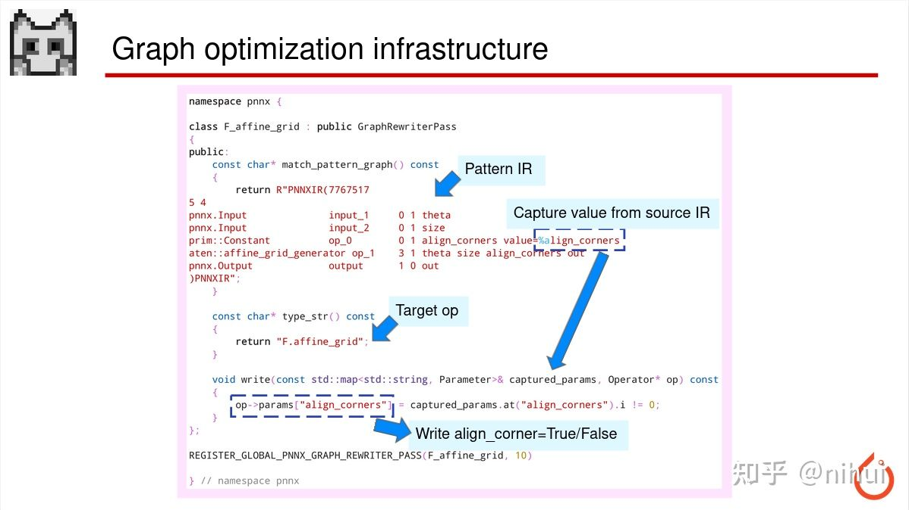

这里稍微提一下这个 PNNX 内部的图优化的技术

一个库，一个基础设施，ONNX 是没有的，对吧。PNNX 刚才也说是从 torchscript 再捏回到原先高层 op，所以还是需要做 torchscript ir 的图优化

这里 PNNX 写了这个叫 GraphRewritter 的类，只要指定我们的 pattern 的 ir，指定好后，就会自动从 torchscript 里找到一个匹配的封闭子图，然后把它替换成我们的 target 的 op，最后这个 target op 的一些参数也可以，从匹配的子图里去获取到原先那个参数，然后写到 target 参数里，PNNX 代码里面就有大量的捏回原始高层算子的这个过程，所以有一个专门做的基础设施，方便做捏算子的图优化过程

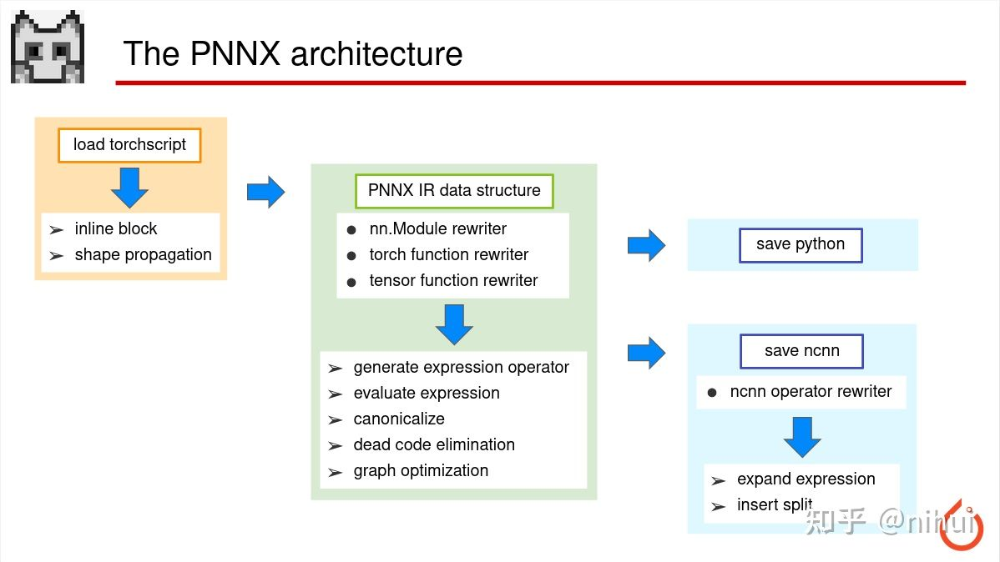

这是 PNNX 代码的整体架构

首先是加载 torchscript，这是用 libtorch 的 api 完成的，里面会做一些 inline 或者 shape 的推断传播，这部分做完后还是 torchscript ir

然后从 torchscript ir 转换成 PNNX 的 ir 数据结构，然后在这个数据结构上去做捏算子，就是把 torchscript ir 一个个捏成 nn 的 Module，或者是 torch 的 function，或是 Tensor 的 function。后面也会做一些比较常规的优化，比如废弃代码的删除，或者一些表达式的折叠这种

那当 PNNX IR 数据结构优化完成之后呢，可以直接产生 python，因为这个 ir 里面已经是最高层的，所以 python 代码我们在转的时候，基本就是1比1的写出来就可以

当我要转成 ncnn 的时候，还需要 ncnn 的对应的算子转换过程。这里需要去写从 nn 的 Module 转换成 ncnn 对应 op 的转换器，每个算子也会实现一个，也会针对 ncnn 模型的特殊的特征加一些 Split 这种层

这就是 PNNX 整体框架的架构设计

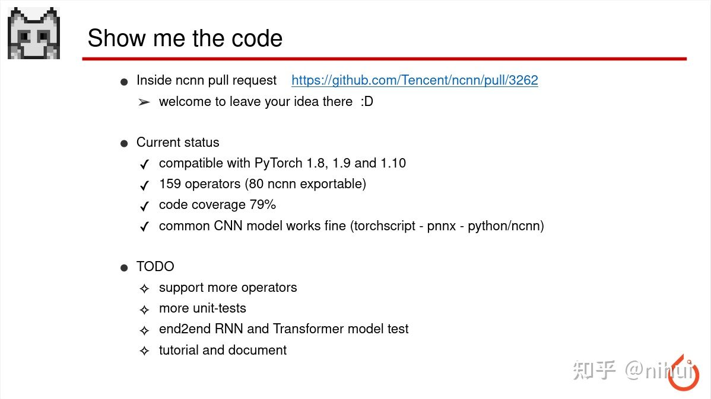

这个代码在哪里呢

这个代码现在目前在 ncnn 的一个 pr 里边。如果听众朋友们想要交流的话，可以直接在 pr 里留下你们的意见

目前 PNNX 兼容 PyTorch 1.8、1.9 和 1.10 版本，也可以导出 159 种 PyTorch 上层 op，其中有 80 个可以导出成 ncnn 对应的 op，也做了自动单元测试，还有代码覆盖率，目前是 79%，也还行，因为这个也是一个比较刚开发不久的项目该 79。目前常用的 CNN 模型，像 resnet，shufflenet 这种模型，都是可以完美工作，就是 torchscript，转 PNNX、转 python 或 ncnn 这些都可以正常搞定，然后出来的推理结果跟原始的 python 是一模一样的

后面呢会打算支持更多的 PyTorch 算子，增加更多的单元测试，增加一些端到端 RNN 或者 Transformer 的模型测试，还会写一些使用教程或者开发文档。因为现在一直致力于 coding，所以这些还比较欠缺

# 参考文献 #

https://zhuanlan.zhihu.com/p/427620428