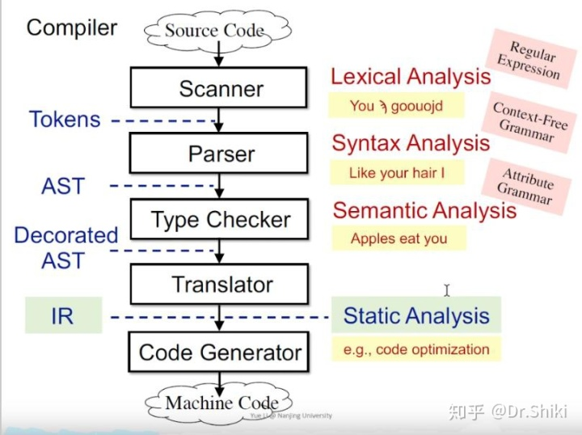
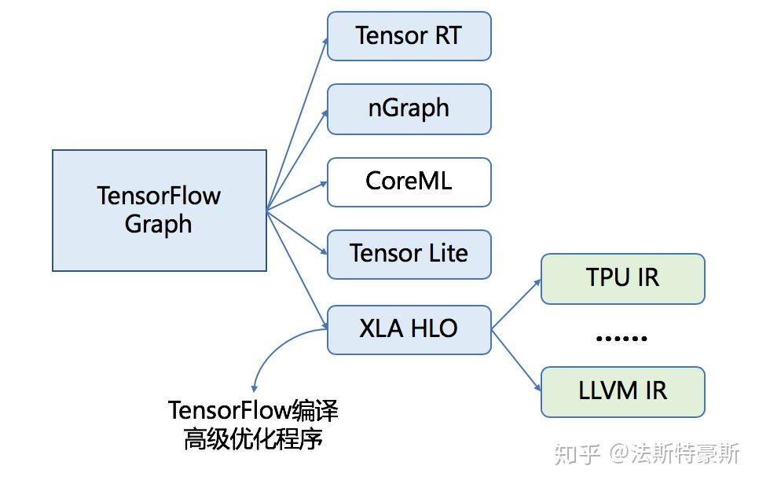
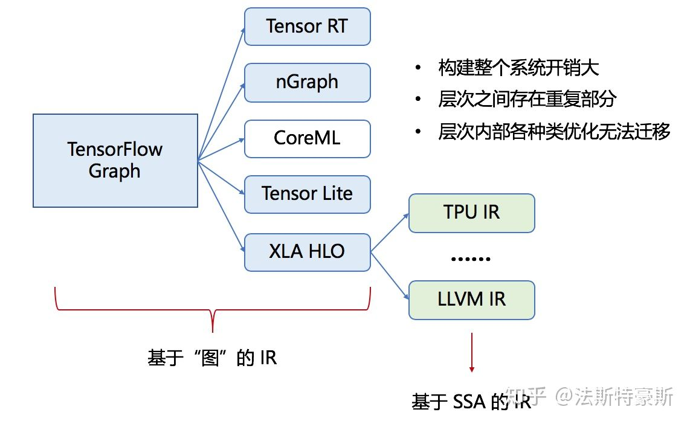
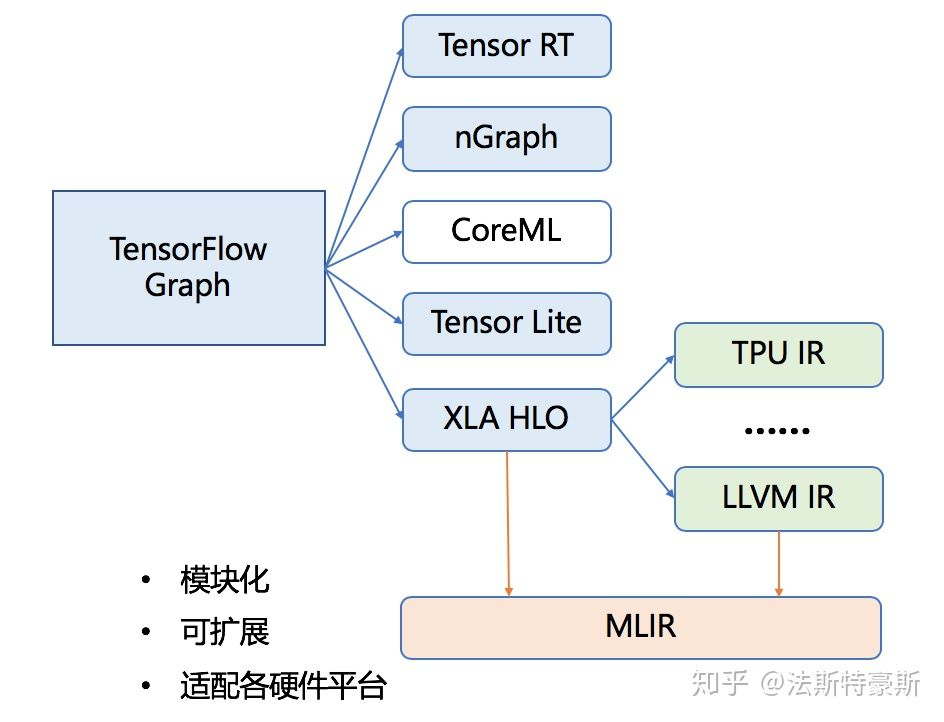
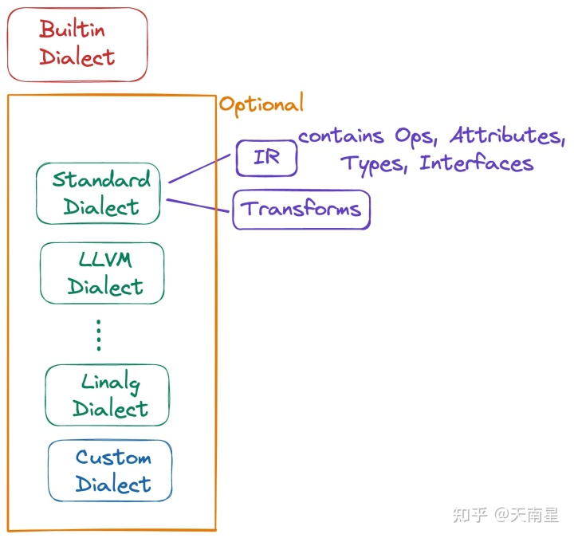

## MLIR解决什么问题？

如上文所说，MLIR中的ML不是Machine Learning，但是Machine Learning确实是是MLIR的一个应用领域。MLIR是LLVM原作者Chris Lattner在Google时候开始做的项目，现在已经合入LLVM仓库。MLIR即Multi-Level Intermediate Representation，多级的中间表示。MLIR目的是做一个通用、可复用的**[编译器](https://www.zhihu.com/search?q=编译器&search_source=Entity&hybrid_search_source=Entity&hybrid_search_extra={"sourceType"%3A"article"%2C"sourceId"%3A"465464378"})框架**，减少构建Domain Specific Compiler的开销。MLIR目前主要用于机器学习领域，但设计上是通用的编译器框架，比如也有FLANG（llvm中的FORTRAN编译器），CIRCT（用于硬件设计）等与ML无关的项目。MLIR现在还是早期阶段，还在快速更新迭代，发展趋势是尽可能完善功能，减少新增自定义feature的工作量。

在了解MLIR是怎么工作之前，我先得弄明白这个IR在解决什么问题。


An **intermediate representation** (**IR**) is the [data structure](https://en.wikipedia.org/wiki/Data_structure) or code used internally by a [compiler](https://en.wikipedia.org/wiki/Compiler) or [virtual machine](https://en.wikipedia.org/wiki/Virtual_machine) to represent [source code](https://en.wikipedia.org/wiki/Source_code). An IR is designed to be conducive for further processing, such as [optimization](https://en.wikipedia.org/wiki/Compiler_optimization) and [translation](https://en.wikipedia.org/wiki/Program_transformation).[[1\]](https://en.wikipedia.org/wiki/Intermediate_representation#cite_note-Walker-1) A "good" IR must be *accurate* – capable of representing the source code without loss of information[[2\]](https://en.wikipedia.org/wiki/Intermediate_representation#cite_note-Chow-2) – and *independent* of any particular source or target language.[[1\]](https://en.wikipedia.org/wiki/Intermediate_representation#cite_note-Walker-1) An IR may take one of several forms: an in-memory [data structure](https://en.wikipedia.org/wiki/Data_structure), or a special [tuple](https://en.wikipedia.org/wiki/Tuple)- or [stack](https://en.wikipedia.org/wiki/Stack_(abstract_data_type))-based [code](https://en.wikipedia.org/wiki/Bytecode) readable by the program.[[3\]](https://en.wikipedia.org/wiki/Intermediate_representation#cite_note-Toal-3) In the latter case it is also called an *intermediate language*.

A canonical example is found in most modern compilers. For example, the CPython interpreter transforms the linear human-readable text representing a program into an intermediate [graph structure](https://en.wikipedia.org/wiki/Graph_(data_structure)) that allows [flow analysis](https://en.wikipedia.org/wiki/Flow_analysis) and re-arrangement before execution. Use of an intermediate representation such as this allows compiler systems like the [GNU Compiler Collection](https://en.wikipedia.org/wiki/GNU_Compiler_Collection) and [LLVM](https://en.wikipedia.org/wiki/LLVM) to be used by many different source languages to [generate code](https://en.wikipedia.org/wiki/Code_generation_(compiler)) for many different target [architectures](https://en.wikipedia.org/wiki/Instruction_set).


从源代码到目标机器码大致上要经历

```text
词法分析->语法分析->语义分析->中间代码生成->目标代码生成
```



一般统称中间代码（IR）之前的编译器部分为前端（front-end），中间代码之后的部分叫后端（back-end），SA一般在中间代码上进行，也有一些SA会在抽象语法树上做，但抽象语法树上不适合做规模过大的分析，这里解释一下为什么一般不在抽象语法树上做，而在中间代码上做:

1.  中间表达往往是语言无关的，不同的上层语言例如Java和JS，都可以转换成同一种中间代码，所以静态分析只需要对这种中间代码实现就可以分析很多不同的前端语言，LLVM和HW的方舟[编译器](https://www.zhihu.com/search?q=编译器&search_source=Entity&hybrid_search_source=Entity&hybrid_search_extra={"sourceType"%3A"article"%2C"sourceId"%3A"129361229"})就是例子
    
2.  中简代码的流程很直观的反映了控制流（control flow）信息


说到机器学习，我们就用TensorFlow这个框架来举例。我们知道TensorFlow是使用数据流图作为数据结构来进行各种数值计算，要让这些计算运行在硬件上，我们需要一个TensorFlow的编译生态系统：



整个编译流程先将TensorFlow的图转化为XLA HLO，即一种类似高级语言的图的中间表达形式，可以基于此进行一些High-Level的优化。接着将XLA HLO翻译为LLVM IR，使用LLVM编译到各种硬件的汇编语言，从而运行在硬件上进行数值计算。

上图的蓝色阴影部分是基于图的IR，绿色阴影部分是基于SSA的IR，然而这样的编译方式的缺点在于构建这样的编译系统的开销比较大，每一层的设计实现会有重复部分，同一个层次的IR彼此之间虽然相似，但是存在天生的“生殖隔离”，升级优化缺乏迁移性，即改变优化一个模块，并不能惠及到同层次的其他模块。因此，目前存在的问题就在于**各种IR之间转换的效率和可迁移性不高**。



对于上述问题，**MLIR希望为各种DSL提供一种中间表达形式，将他们集成为一套生态系统，使用一种一致性强的方式编译到特定硬件平台的汇编语言上**。利用这样的形式，MLIR就可以利用它模块化、可扩展的特点来解决IR之间相互配合的问题。



到此为止，我们大致知道了MLIR的诞生是为了解决什么问题。目前它对我来说还是一个黑盒子，下面的工作就是要去看看MLIR内部究竟是一个什么样的结构，看看它是怎么把各层IR整合到一起，又是如何实现扩展功能的

IR部分（包括builtin dialect）构成了MLIR的核心，这部分接口相对比较稳定。IR里面有Dialect，Operation，Attribute，Type，Context等组成部分。自带的一些Dialect（如std，scf，linalg等）是类似标准库的东西，把一些通用的东西抽象出来，增加复用性，减少开发者的工作量。开发者可以选用自己想要的dialect，而且不同的dialect之间支持混合编程。这样的设计保证了自由度和灵活性。Transforms一般是Dialect内的变换，Conversion是Dialect间的变换，Translation是MLIR与非MLIR（比如LLVM IR，C++ source code, SPIRV）之间的变换。




### 3. 与LLVM区别

个人认为MLIR更适合和LLVM做比较，而不是TVM等dl compiler。LLVM和MLIR的很多概念都比较像，了解LLVM的话MLIR会比较容易上手。

LLVM IR由于当时的历史局限性，类型只设计了标量和定长vector，有个给LLVM加matrix类型的提案目前看来也没有进展。而MLIR自带tensor类型，对深度学习领域更友好。

MLIR有Operation和Dialect的概念，Dialect，Operation，Attribute，Type等都可以通过td文件比较方便地定义出来。而LLVM定义新的intrinsic比较麻烦，定义新的IR就更麻烦了。LLVM IR主要表示硬件指令操作，而MLIR能表示更多东西，比如表示[神经网络](https://www.zhihu.com/search?q=神经网络&search_source=Entity&hybrid_search_source=Entity&hybrid_search_extra={"sourceType"%3A"article"%2C"sourceId"%3A"465464378"})的图结构。因为有Dialect，MLIR是组件化，去中心的，不像LLVM的ir是一种大而全的。

MLIR执行过程和LLVM一样，IR会过由Pass组成的Pipeline，不断地变换生成最终的IR。不同的是MLIR的IR可以是不同dialect的，构成了Multi-Level的效果。

### 4. MLIR开源项目

mlir只是个编译器框架，本身并没有什么完整功能。所以可以参考一些基于MLIR做的开源项目。

- tensorflow：没有tf就没有MLIR
- mhlo：tensorflow组件，相当于支持动态规模的XLA
- tfrt：tensorflow组件，tf新的runtime
- torch-mlir：连接pytorch与mlir生态
- onnx-mlir：连接onnx与mlir生态
- iree：深度学习end2end编译器
- circt：硬件设计及软硬件协同开发
- flang：FORTRAN的编译器前端
- polygeist：C/C++ source code变成mlir Affine


### MLIR dialect
MLIR dialect 中的 dialect 在部分文献中被翻译为“方言”。

MLIR 通过“方言”来定义不同层次的中间表示，每一个“方言”都有自己唯一的名字空间。开发者可以创建自定义“方言”，并在“方言”内部定义操作、类型、属性以及它们的语义。

MLIR 推荐使用“方言”对 MLIR 进行扩展。有一个统一的中间表示框架降低了开发新编译器的成本。

除了可以使用 C++ 语言对“方言”进行定义之外，MLIR 也提供了一种声明式的方式来定义“方言”，即用户通过编写 TableGen 格式的文件来定义“方言”，然后使用 TableGen 工具生成对应的 C++ 头文件、源文件以及对应的文档。

MLIR 也提供了一个框架用于在“方言”之间或者方言内部进行转换。

MLIR 使用“操作”来描述不同层次的抽象和计算，操作是可扩展的，用户可以创建自定义的操作并规定其语义。MLIR 也支持用户通过声明式的方式（TableGen）来创建自定义操作。

MLIR 中的每个值都有对应的“类型”，MLIR 内置了一些原始类型（比如整数）和聚合类型（张量和内存缓冲区）。MLIR 的类型系统也允许用户对其进行扩展，创建自定义的类型以及规定其语义。

MLIR 中，用户可以通过指定操作的“属性”控制操作的行为。操作可以定义自身的属性，比如卷积操作的 stride 属性等。

### MLIR dialect 转换
MLIR 中定义操作的时候可以定义其规范化的行为，以便后续的优化过程更为方便地进行。MLIR 以一种贪婪策略不断地应用规范化变换，直到 IR 收敛为止。比如将 x+2 和 2+x 统一规范化为 x+2。

MLIR 中进行方言内部或之间的转换时：

（1）用户首先要定义一个转换目标。转换目标规定了生成的目标中可以出现哪些操作。

（2）用户需要指定一组重写模式。重写模式定义了操作之间的转换关系。

（3）框架根据用户指定的转换目标和重写模式执行转换。

这个转换过程会自动检测转换方式，例如如果指定了 A → B 和 B → C 的重写模式，框架会自动完成 A → C 的转换过程。

MLIR 也支持用户通过声明式的方式（TableGen）来创建自定义的重写。

### MLIR Users
ONNX MLIR：将 ONNX 格式的深度学习网络模型转换为能在不同二进制执行的二进制格式。

PlaidML：一个开源的 tensor 编译器，允许在不同的硬件平台上运行深度学习模型。

TensorFlow：TensorFlow 项目的 XLA 和 TensorFlow Lite 模型转换器用到了 MLIR。

TensorFlow Runtime (TFRT)：全新的高性能底层进行时。旨在提供一个统一、可扩展的基础架构层，在各种领域特定硬件上实现一流性能。高效利用多线程主机的 CPU，支持完全异步的编程模型，同时专注于底层效率。

Verona：一种新的研究型的编程语言，用于探索并发所有权。其提供了一个可以与所有权无缝集成新的并发模型。


# 参考文献 #

https://zhuanlan.zhihu.com/p/465464378

https://zhuanlan.zhihu.com/p/129361229

https://blog.csdn.net/qq_38844835/article/details/122532997